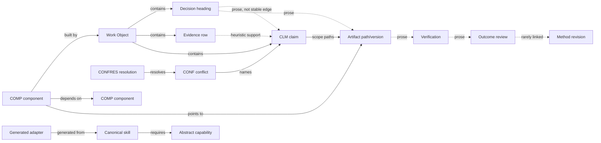
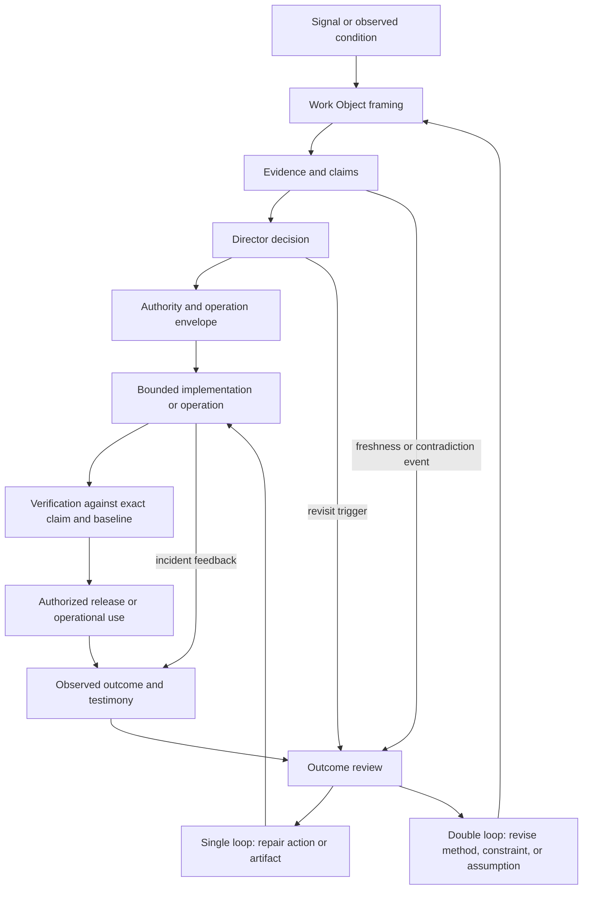
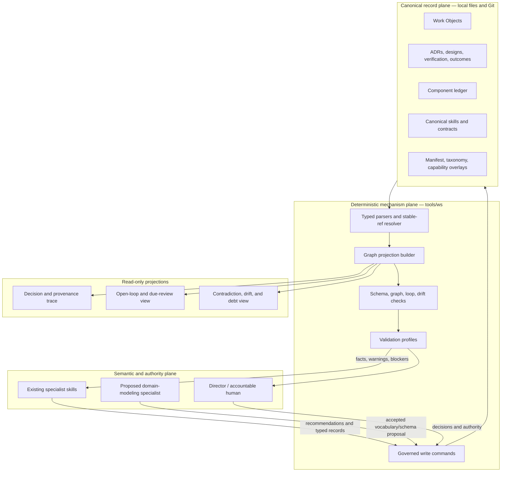
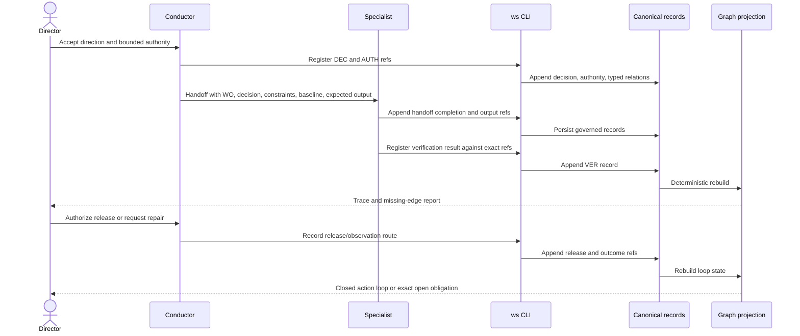
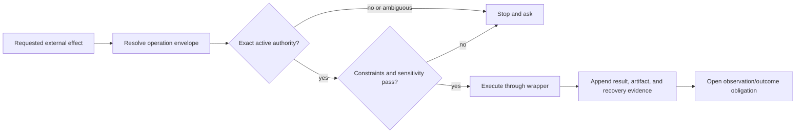
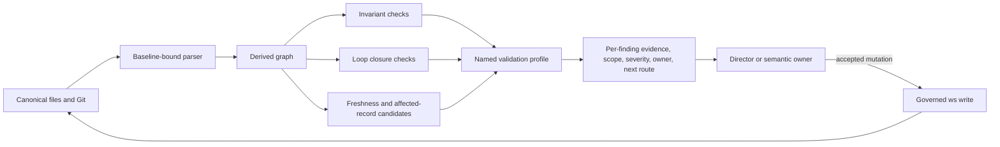
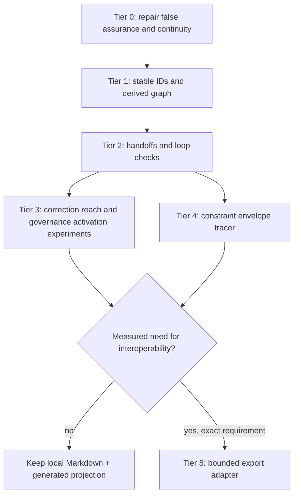

# Epistemic, Graph, and Loop System Improvement Architecture

## Repository-grounded research and implementation guidance for Work Studio

**Research date:** 2026-08-11

**Inspected system:** the current working tree of `andrelawas-work-studio`, including canonical skills, deterministic tools, tests, configuration, ADRs, Work Objects, and the director reference

**Status:** recommendation, not an implemented contract

**Decision horizon:** repair the existing control substrate first; add a thin derived graph second; instrument learning loops third; defer infrastructure until observed use earns it

---

## 1. Executive answer

Work Studio's central weakness is not a lack of concepts. It already has a strong vocabulary for Work Objects, evidence, decisions, authority, lifecycle, verification, outcomes, component debt, and specialist routing. Its weakness is that these concepts are only partially joined.

The system currently behaves like a set of well-designed records connected by prose. Several objects have stable IDs, but many consequential relations do not. A claim can exist without a stable edge to its evidence; a decision can exist without a stable edge to the claim it accepted; implementation, verification, deployment, and outcome records can exist without a single traversable lineage; a correction reaches only dependents that happened to name its premise; a waiting object can lack a machine-readable return trigger; and advisory checks exposing accumulated debt are outside the default validation path.

The best next architecture is therefore:

1. **Repair the control plane already claimed by the system.** Fix vacuous verification, schema/reference drift, unreachable audit branches, contradictory attention checks, stale authority wording, and broken resumption fields before expanding the model.
2. **Add stable IDs and typed edges only where a join changes a decision.** Work Objects, components, claims, and conflicts already have IDs. Add stable IDs for consequential decisions, authority grants, verification records, and typed relationships. Do not ID every sentence or ledger row.
3. **Build a read-only graph projection over canonical Markdown.** The graph is an index, not a new source of truth. Regenerate it from Work Objects, ADRs, component records, Git identity, and promoted sidecars. A missing edge means “not recorded,” never “false.”
4. **Make loop closure a validation profile.** Connect signal → decision → bounded action → verification → release/observation → outcome review → method/constraint revision. Report open loops by exact missing edge. Do not auto-close them or silently revoke authority.
5. **Keep semantics with humans and specialist skills; keep mechanics in `ws`.** Parsing IDs, resolving references, checking reciprocity, deriving freshness, finding unreachable nodes, and producing traces are deterministic. Deciding whether evidence supports a claim, whether a contradiction is material, whether a constraint should relax, and whether an outcome warrants a method change remain human/LLM judgments.
6. **Add at most one new semantic specialist now:** a bounded domain-modeling skill is justified because the Workspace Documentation Contract names `domain-modeling` as owner of `CONTEXT.md`, while no canonical Work Studio skill owns entity, relationship, and vocabulary design. Contradiction review, graph audit, loop health, and provenance checks should begin as profiles or CLI services, not new skills.
7. **Do not adopt RDF, SHACL, OpenTelemetry, OpenLineage, OCEL, a graph database, or an orchestration platform now.** Borrow their distinctions and conformance ideas. Adopt their technologies only after plain-file projections fail a measured need.

### Priority disposition

| Disposition | Work |
|---|---|
| **Repair now** | Kernel verifier's vacuous YAML parsing; manifest truth; `next_action` / `revisit_trigger` schema alignment; `private` sensitivity creation; CLI-only-write contract; decision-audit reachability; attention-limit contradiction; authority prose; canonical citation-root resolution; default/profile validation semantics. |
| **Build now** | Stable consequential record IDs; typed Work Object relationships; `ws graph build/check/trace`; validation profiles; claim lifecycle events; handoff receipts; per-loop missing-edge report. |
| **Test first** | Citation-based correction fan-out; deliberate-governance invocation events; promoted constraint records and operation envelopes; automatic component cascade; graph-derived weekly director view. |
| **Defer** | Accepted-deviation automation until a real deviation exists; scheduled/daemonized loop monitoring; cross-repository graph federation; full event-log standard compatibility. |
| **Reject for now** | Graph database as canonical storage; RDF/SHACL stack; automatic semantic contradiction detection presented as fact; aggregate “epistemic health” score; autonomous authority grant/revocation; one skill per graph operation. |

---

## 2. Scope, evidence, and working-tree qualification

This report distinguishes five kinds of statement:

- **Implemented:** directly present in current code, configuration, or canonical records.
- **Observed:** produced by a command against the inspected working tree.
- **Documented:** asserted by a canonical reference, ADR, skill contract, or Work Object.
- **Inferred:** a conclusion from implemented or observed evidence, explicitly bounded.
- **Proposed:** architecture recommended here; not currently implemented.

The repository was not clean during inspection. Changes to epistemic checks, conflict resolution, the kernel manifest, generated adapters, tests, and README were present. Therefore, passing commands below establish behavior of the **inspected working tree**, not of a tagged release. No unrelated file was changed by this research.

### Baseline observations

- The repository has 22 canonical skills in [`skills/core/`](../../skills/core/), indexed by the generated [`work-studio/skill-map.yaml`](../../work-studio/skill-map.yaml).
- The `ws` CLI exposes Work Object creation and transition, evidence/history append, claim registration/inspection, epistemic lint, authority check, baseline capture/check, conflict registration/resolution, skill-map build, and composed validation through [`tools/ws/__main__.py`](../../tools/ws/__main__.py).
- The canonical Work Object schema, body sections, identity rules, and write-path claim are defined in [`references/WORK-OBJECT.md`](../WORK-OBJECT.md); actual parsing, generation, and checks are distributed across [`tools/ws/schema.py`](../../tools/ws/schema.py), [`tools/ws/template.py`](../../tools/ws/template.py), [`tools/ws/sections.py`](../../tools/ws/sections.py), and [`tools/ws/validate.py`](../../tools/ws/validate.py).
- The evidence model declares projections read-only and warns that an absent edge means “not recorded,” not “false” in [`references/EVIDENCE-MODEL.md`](../EVIDENCE-MODEL.md). That rule is foundational for the proposed graph.
- The existing applied research already recommends a two-plane epistemic model and promoted sidecars only for consequential records in [`references/epistemic/epistemic-engineering-research-and-applied-architecture.md`](../epistemic/epistemic-engineering-research-and-applied-architecture.md), and an operation-envelope/constraint layer in [`references/constraints/constraint-driven-studio-operating-system-research-and-applied-architecture.md`](../constraints/constraint-driven-studio-operating-system-research-and-applied-architecture.md). This report integrates those proposals with the system that actually exists now.

### Corpus and check results

At final validation time, the canonical corpus contained 100 Work Object Markdown files: 50 closed, 46 active, two paused, and two waiting. The state distribution was 35 close, 22 observe, 21 verify, ten notice, four design, three build, three explore, and two release. Of these, 89 were meaningful consequence, ten low, one high, and all were ordinary sensitivity. Two notice-state objects were created by other concurrent work after the first 98-object snapshot; this is why some cited live Work Objects and check outputs describe the slightly earlier corpus.

The connectivity is sparse:

- only five Work Objects had a non-empty `## Relationships` section;
- only four had a `## Claims` section;
- only one had a `## Grilling Session` section;
- none had a `## Workflow Candidates` section;
- none had a body section named `## Observed outcome`—although outcome review evidence can also appear in History or the Evidence Ledger, so absence of that section does **not** prove absence of review;
- no Work Object used the optional campaign anchor.

These counts were derived from the local corpus under [`.work-studio/objects/`](../../.work-studio/objects/), not from the web or an external index.

Current checks showed:

- `python3 -m tools.ws validate` passed its default checks, while warning that four claims were below the current support-adequacy heuristic and one low-consequence object may be implausibly classified.
- `python3 -m tools.ws validate outcome-review` reported 19 observe/close objects without a recorded outcome review across July and August.
- `python3 -m tools.ws validate ledger` reported `COMP-001` stale against its declared location.
- `python3 -m tools.ws validate attention` reported 18 active objects missing from `active.md`.
- `python3 -m tools.ws validate attention-limits` rejected 28 Supporting entries and 29 total active entries, directly conflicting with accepted ADR 0018's no-numeric-cap decision in [`docs/adr/0018-attention-register-is-advisory-not-a-cardinality-constraint.md`](../../docs/adr/0018-attention-register-is-advisory-not-a-cardinality-constraint.md).
- `python3 -m tools.ws validate evidence-freshness` exited successfully and surfaced ten moved/unresolved citations for re-reading.
- `python3 -m tools.ws epistemic lint` reported 53 findings across 11 files, including legacy Work Objects, deliberate fixture cases, research prose that resembles tags, and at least one canonical skill. The result shows both real token debt and an overly broad/noisy lint surface; it is not a count of 53 semantic defects.
- `python3 tools/verify-append-only.py` passed.
- `python3 tools/generate-adapters.py --check` passed against the inspected tree.
- 341 Python unit tests ran; 337 passed and four dashboard-server tests initially failed because the sandbox denied loopback socket binding. The complete dashboard module was then rerun with loopback access and all six tests passed. These results qualify the inspected working tree, not a clean or tagged release.

The director reference's existing gap register in [`references/director/work-studio-director-system-reference.md`](../director/work-studio-director-system-reference.md) remains useful, but current Work Objects are more recent and reveal further drift. In particular:

- [`2026-08-10-013`](../../.work-studio/objects/2026/08/2026-08-10-013-kernel-manifest-omits-3-canonical-skills-verifier-has-no-reverse-check-for-undeclared-skills.md) demonstrates that `verify-kernel.py`'s minimal YAML parser swallows the kernel `entries` list into a block scalar, making path verification vacuous. The inspected code still contains the faulty block-scalar indentation comparison in [`tools/verify-kernel.py`](../../tools/verify-kernel.py). Its “PASS” therefore cannot yet be treated as path-integrity evidence.
- [`2026-08-10-014`](../../.work-studio/objects/2026/08/2026-08-10-014-work-object-schema-drift-next-action-and-revisit-trigger-required-by-reference-but-never-implemented-in-frontmatter-validator-or-ws-create.md) records that `next_action` and `revisit_trigger` are required by prose but absent from generator and validator behavior, while the resume probe depends on `next_action`.
- [`2026-08-11-001`](../../.work-studio/objects/2026/08/2026-08-11-001-fix-unreachable-decision-side-epistemic-audit.md) records that the epistemic audit maps a `decision` target that the eight-state lifecycle cannot enter.
- [`2026-08-11-002`](../../.work-studio/objects/2026/08/2026-08-11-002-update-authority-prose-for-ws-without-execution-mediation.md) records that a CLI now exists, but it still does not mediate the five external-effect classes described by the authority contract.
- [`2026-08-10-011`](../../.work-studio/objects/2026/08/2026-08-10-011-a-correction-only-reaches-dependents-that-named-the-corrected-premise-unnamed-dependents-are-missed.md) measured that only about 11% of non-template revisit triggers named a machine-matchable referent, leaving correction propagation mostly dependent on prose discipline.
- [`2026-08-10-008`](../../.work-studio/objects/2026/08/2026-08-10-008-do-governance-paths-that-require-deliberate-invocation-ever-fire-in-this-studio.md) found governance pathways whose invocation is not observable and proposed a five-event prospective tracer rather than speculative automation.

Two additional contract gaps are directly visible in current source. [`tools/ws/schema.py`](../../tools/ws/schema.py) accepts `ordinary`, `private`, and `restricted`, while the `ws create` parser in [`tools/ws/__main__.py`](../../tools/ws/__main__.py) offers only `ordinary` and `restricted`; a new private Work Object therefore cannot be created through the declared write path. In addition, [`references/WORK-OBJECT.md`](../WORK-OBJECT.md) says all `.work-studio/` mutations go through `ws`, while [`skills/core/governance-conduct-work-object/SKILL.md`](../../skills/core/governance-conduct-work-object/SKILL.md) instructs direct file editing for next-action and body changes that lack commands. This is not merely missing convenience: the normative write boundary and operational instructions disagree.

---

## 3. What graph engineering means here

Graph engineering for Work Studio does **not** mean converting the repository to a knowledge graph. It means ensuring that consequential entities have stable identities, consequential relationships are typed and resolvable, and useful projections can answer bounded questions without inventing absent relationships.

The W3C provenance model offers a useful minimal distinction among **Entity**, **Activity**, and **Agent**, connected through usage, generation, derivation, association, and attribution. It explicitly supports building provenance chains without requiring every possible detail ([W3C PROV-O Recommendation](https://www.w3.org/TR/prov-o/)). Work Studio should borrow this mental model, not its RDF encoding.

OpenLineage similarly separates a durable job from a particular run and its input/output datasets, while attaching extensible facets to Run, Job, and Dataset ([OpenLineage object model](https://openlineage.io/docs/spec/object-model/), [facet model](https://openlineage.io/docs/spec/facets/)). For Work Studio, this validates distinguishing a **skill contract** from a **skill invocation/handoff**, and an **artifact path** from a particular version used or generated. It does not justify installing OpenLineage.

OCEL 2.0 shows why one event may legitimately concern several objects and why event-to-object and object-to-object relationships need qualifiers ([OCEL 2.0 specification](https://www.ocel-standard.org/2.0/ocel20_specification.pdf)). That is relevant because one Work Studio event may touch a Work Object, a decision, a claim, a component, an artifact, and an agent handoff. Again, borrow the distinction; do not adopt the exchange format until a real interchange requirement exists.

### 3.1 Existing node types

| Node | Stable identity now | Canonical surface | Current limitation |
|---|---|---|---|
| Work Object | `YYYY-MM-DD-NNN` | `.work-studio/objects/...` | Relationships usually empty or prose-only. |
| Component | `COMP-NNN` | `.work-studio/component-ledger.md` | Edges are declared manually; ledger check reports current staleness. |
| Claim | `CLM-<WO>-NNN` | Work Object `## Claims` | Registration exists; lifecycle transitions and evidence links are incomplete. |
| Conflict | `CONF-<WO>-NNN` | Work Object `## Claims` | Version tuples exist; only one resolution disposition is implemented. |
| Conflict resolution | `CONFRES-<WO>-NNN` | Work Object `## Claims` | New in the working tree; not yet a general contradiction model. |
| Work Object state transition | timestamped History heading | Work Object `## History` | No event ID; only partially typed. |
| Evidence row | timestamp/source/text, sometimes SHA | Work Object Evidence Ledger | No stable row ID; support relation is inferred by a heuristic. |
| Decision | local heading or timestamp | Decisions section | No globally stable decision ID; edges to claims, authority, work, and outcome are prose. |
| Authority grant | History heading | Work Object History | Readable by `ws authority check`; no stable grant ID or mediated execution edge. |
| Artifact | path, sometimes Git SHA | Work Object Artifacts / docs / Git | Identity conflates logical artifact with version unless the author pins it. |
| Verification record | path or inline prose | Work Object / `docs/verification/` | No stable verification ID or uniform `verifies` edge. |
| ADR/design/runbook/outcome review | path | registered documentation surfaces | Registry defines types, but cross-record edges are not mechanically complete. |
| Skill | canonical name | `skills/core/*/SKILL.md` | Skill-map indexes responsibility/capabilities, not complete handoff graph. |
| Agent/platform/capability | names in adapters/manifests | overlays and generated adapters | No per-run invocation record; provider runtime traces are outside the canonical record. |
| Constraint/deviation | narrative only | Work Object sections/research proposal | No implemented stable ID, scope resolver, or operation envelope. |

### 3.2 Existing edge types

The repository already contains several graph fragments:

- Work Object `campaign` → design document through [`tools/ws/schema.py`](../../tools/ws/schema.py) and `ws set-campaign`;
- Work Object → contained decisions, evidence, claims, conflicts, History, and artifacts through section structure;
- claim → structured defeater scope paths and optional Git/dirty identity through [`tools/ws/claim.py`](../../tools/ws/claim.py);
- conflict → claim and conflict → version tuples through [`tools/ws/conflict.py`](../../tools/ws/conflict.py);
- resolution → conflict through the appended `CONFRES` record;
- component → locations, building Work Objects, declared dependencies, dependents, and owning skill through the component ledger contract in [`skills/core/design-track-components/SKILL.md`](../../skills/core/design-track-components/SKILL.md);
- generated adapter → canonical skill/reference closure through [`tools/generate-adapters.py`](../../tools/generate-adapters.py) and manifests;
- skill → required abstract capabilities through [`work-studio/skill-map.yaml`](../../work-studio/skill-map.yaml);
- authority grant → action token through [`tools/ws/authority_check.py`](../../tools/ws/authority_check.py);
- Work Object → active attention role through `.work-studio/active.md`.

These edges are not uniformly represented, validated, or traversable. The current shape is a set of disconnected subgraphs:



### 3.3 Missing high-value edges

Implement these before adding more node types:

| Edge | Why it matters | Minimum representation |
|---|---|---|
| `resulted_in` / `responds_to` / `supersedes` between Work Objects | Enables lineage, incident-to-change routing, and successor closure. | Typed Relationship record with source/target IDs. |
| `supports` / `counters` evidence → claim | Makes support coverage and contradiction review explicit. | Consequential evidence reference or derived content hash plus relation type. |
| `accepts` decision → claim/option | Explains what a decision treated as actionable. | Stable `DEC-*` plus referenced claim/option IDs. |
| `authorized_by` activity → authority grant | Separates capability from permission and lets audits verify exact scope. | Stable `AUTH-*` for gated actions. |
| `uses` activity → entity/version | Pins the inputs a specialist or tool actually used. | Handoff receipt with input refs and baseline. |
| `generates` activity → artifact/version | Distinguishes logical output from its producing invocation. | Output refs and commit/fingerprint. |
| `verifies` verification → decision/constraint/artifact version | Prevents a passing proxy from floating free of the claim it supports. | Stable `VER-*`, result, scope, method, baseline. |
| `observes` outcome → released artifact/decision | Closes the empirical loop. | Stable `OUT-*` or outcome-review path with reviewed refs. |
| `revises` outcome → method/constraint/decision | Distinguishes action repair from governing-rule revision. | Typed proposal edge; human acceptance remains separate. |
| `invalidates` change/correction → evidence/claim | Lets affected-record queries surface dependents. | Explicit supersession plus derived co-citation candidates. |
| `hands_off_to` invocation → invocation | Makes multi-agent routes inspectable and detects dropped work. | Minimal handoff receipt: from, to, task, inputs, expected output, completion. |
| `applies_to` constraint → operation/artifact | Required for operation envelopes and constraint-addressed verification. | Deferred promoted constraint record. |
| `deviates_from` deviation → constraint + authority | Prevents exceptions becoming invisible policy. | Deferred until first real deviation. |

### 3.4 Graph invariants

The graph checker should enforce only mechanics:

1. Every edge endpoint resolves or is explicitly external.
2. Every edge type has declared source and target kinds.
3. Reciprocal fields, where retained for human readability, agree.
4. Terminal records are not mutated; supersession is append-only.
5. A derived edge records its extraction rule and never masquerades as asserted truth.
6. A missing edge is reported as missing coverage, not a negative semantic finding.
7. Graph rebuilds are deterministic for the same repository tree and Work Object corpus.
8. The projection stores source locators and content/version identity so every edge is auditable.
9. Sensitive source bodies, prompts, and hidden reasoning are excluded.
10. Graph conformance does not imply evidence adequacy, correctness, safety, readiness, or authority.

W3C PROV distinguishes valid provenance constraints from domain truth ([PROV constraints](https://www.w3.org/TR/prov-constraints/)). Work Studio should make the same separation: `ws graph check` validates record structure and temporal/reference consistency, not the truth of the linked claims.

---

## 4. What loop engineering means here

A loop is closed only when an action has a feedback channel, the feedback reaches the accountable controller, and the result can change either the action or the rule governing future actions.

The STPA control-structure model explicitly requires control actions and feedback paths and uses missing or inadequate control/feedback to find unsafe scenarios ([MIT STPA Handbook](https://psas.scripts.mit.edu/home/get_file.php?name=STPA_handbook.pdf)). Applied proportionately, Work Studio's director is the accountable controller, specialist/CLI actions are control actions, runtime and user observations are feedback, and Work Objects are the durable control record.

Argyris's original double-loop learning distinction is also useful: correcting an action inside existing governing variables is different from revising the governing variables themselves ([Argyris, “Double Loop Learning in Organizations,” 1977](https://hbr.org/1977/09/double-loop-learning-in-organizations)). Work Studio already has the right semantic split between outcome repair, working-method adaptation, and proposed constraint revision. It lacks reliable activation and connection between them.

### 4.1 Target operating loops



### 4.2 Current loop closure failures

| Loop | Current mechanism | Observed break | Recommended closure |
|---|---|---|---|
| Resume loop | `next_action`, active register, resume skill | 22 of 50 open objects lacked frontmatter `next_action` at final validation; direct execution of `_resume_probe.py` also failed when run as a file because its package import expects module context. | Align schema/generator/resume read path; provide supported `ws resume` or `ws status` command; test end to end. |
| Waiting loop | `revisit_trigger` | Both waiting and both paused objects lacked frontmatter `revisit_trigger`; prose requires it but validator does not. | Require object-level trigger when entering waiting/paused; derive due status at read time. |
| Creation/persistence loop | `ws create` → append History → activate | Starting one object takes several writes and can leave a created object without creation History or attention registration if interrupted; no transaction joins Work Object and register. | Add one composite `ws work start` operation or an explicit recoverable transaction journal; preserve the lower-level commands. |
| Decision loop | structured Decisions + post-transition epistemic audit | `decision` audit branch is unreachable because `decision` is not an eight-state lifecycle target. | Fire decision audit on decision-record append or before build; do not add a ninth state without an ADR. |
| Verification loop | state gates + verification skill | Verification results lack uniform IDs/edges to the exact decision, artifact version, and constraint. | Add `VER-*` records and `verifies` edges; release profile requires trace completeness. |
| Outcome loop | observe/close route + outcome review skill | Explicit check found 19 observe/close objects without recorded outcome review. | Include outcome-review coverage in director-weekly profile; close reports the missing review, while only high consequence should block on explicit policy. |
| Method-learning loop | Workflow Candidates + maintain-working-method | Zero corpus sections; governance path appears dependent on deliberate invocation. | First instrument prospective invocation events; then add an outcome-to-method-candidate handoff receipt. |
| Component loop | component ledger sweep and cascade | `COMP-001` is stale; sweep is deliberately manual. | Add deterministic drift projection and director-weekly signal; preserve human selection. |
| Correction loop | append-only supersession + revisit triggers | Only about 11% of sampled triggers name machine-matchable referents; unnamed dependents are missed. | Test co-citation fan-out as candidate edges; show coverage boundary and false-positive rate. |
| Constraint loop | narrative constraints | No promoted constraints, deviation records, effective-scope resolver, or operation envelope. | Test a minimal constraint sidecar on one meaningful change after repair tier. |
| Authority loop | History grants + read-only `authority check` | `ws` does not mediate export, destructive action, migration, external write, or deployment. | Correct prose now; later wrap only repeated in-scope execution paths, never claim universal prevention. |
| Governance-invocation loop | manual nomination/routing | No reliable fire count for several governance paths. | Complete the five-event manual tracer from `2026-08-10-008` before automation. |

### 4.3 Soundness tests, adapted rather than imported

Workflow-net research defines soundness in terms of reaching proper completion without dead tasks or residual tokens; it demonstrates that workflow structure can be checked for control-flow defects ([van der Aalst, “Workflow Verification: Finding Control-Flow Errors”](https://www.vdaalst.com/publications/p98.pdf)). Work Studio is deliberately permissive, so it should not become a Petri-net engine. It can still borrow four questions:

- **Reachability:** Is the recorded next action actually executable from the current state and authority?
- **Completion:** Can the object reach a legitimate close path?
- **No orphaned obligations:** Does close leave required outcome, recovery, or revisit work unrepresented?
- **No dead routes:** Does every declared skill/audit route have a real activation path?

These should become graph/loop checks, not lifecycle rigidity. The director can accept a visible open loop; the system must not silently call it closed.

---

## 5. Contradiction, drift, and debt taxonomy

The system currently uses these terms loosely. They should become distinct because each demands a different response.

### 5.1 Definitions

| Class | Definition | Example in current tree | Correct response |
|---|---|---|---|
| **Contradiction** | Two simultaneously applicable records make materially incompatible claims. | ADR 0018 removes numeric attention caps while `check_attention_limits` still enforces them. | Preserve both sources, open/attach a conflict, identify owner/precedence, obtain disposition. |
| **Contract drift** | Implementation and its declared normative contract no longer match. | `next_action` and `revisit_trigger` are absent from generator/validator; `private` is valid in schema but unavailable in `ws create`; the CLI-only write rule conflicts with direct-edit instructions. | Repair implementation or supersede prose through an explicit decision; add regression test. |
| **Generated drift** | Deterministic output differs from canonical input. | Adapter generator detects this class; inspected tree passed. | Regenerate only after source validation; fail CI on mismatch. |
| **Reference drift** | A locator no longer resolves to the identity it claimed. | Ten evidence-freshness warnings; some use ambiguous roots such as `AGREEMENT-LOOP.md`. | Surface for re-read; improve canonical root resolution; never mark claim false automatically. |
| **Dependency drift** | A source/contract changed but declared dependents were not reopened. | `COMP-001` behind HEAD; correction fan-out only reaches named dependents. | Derive candidate affected edges, mark coverage, require human re-review for material cases. |
| **State/register drift** | A projection disagrees with canonical object state. | 18 active objects absent from `active.md`; duplicate entries are also present. | Rebuild/reconcile projection through the conductor; do not make the projection canonical. |
| **Lifecycle debt** | Work remains in a state/status with no valid next or return edge. | Open objects without `next_action`; waiting/paused objects without `revisit_trigger`. | Require closure metadata at transition time; report orphaned nodes. |
| **Outcome debt** | Action/decision reached observe or close without recorded evaluation. | 19 objects reported by the explicit outcome-review check. | Schedule bounded review; distinguish unavailable observation from skipped review. |
| **Epistemic debt** | Consequential claim lacks adequate attributable support, counterevidence review, scope, or freshness. | Four claims below current support-adequacy heuristic; unresolved legacy tag debt. | Show exact missing support; avoid composite score; strengthen or scope claim. |
| **Authority debt** | An action's permission, scope, expiry, or execution mediation is absent/ambiguous. | Read-only grants exist; external-effect tools are not mediated. | Deny or ask on ambiguity where runtime wrapper exists; otherwise disclose auditable-only status. |
| **Component debt** | A durable capability has stale pointers, unresolved findings, or dependency changes since last review. | Ledger check reports `COMP-001` stale. | Re-grill selected component; do not auto-create work. |
| **Governance activation debt** | A useful governance path has no evidence it is encountered or used. | Memory candidate, grilling nomination, method promotion, and revisit pathways have weak/zero fire data. | Instrument encounter states prospectively before redesign. |
| **Constraint debt** | A required boundary is unaddressable, unvalidated, silently relaxed, or lacks expiry/revisit behavior. | Constraints are narrative; accepted-deviation schema is deferred. | Promote only consequential constraints; record deviations explicitly after real need appears. |
| **Verification debt** | A check passes without testing the claimed property or is vacuous. | Kernel path verification passes while parser yields no entries. | Mutation test the verifier; require proof that a deliberately broken fixture fails. |
| **Research/proposal debt** | A proposed architecture is spoken of as shipped or has no disposition. | Epistemic/constraint research contains unimplemented schemas and services. | Label status; map each proposal to repair/build/test/defer/reject. |

### 5.2 Coverage matrix

| Defect class | Detection now | Blocking now | Coverage gap | Recommended owner |
|---|---|---:|---|---|
| Schema/section/lifecycle structure | Default `ws validate` | Yes | Reference-to-code contract drift not comprehensively checked. | `ws validate --profile system-integrity` + conductor. |
| Append-only mutation | CLI checks + `verify-append-only.py` | Commit/check dependent | Structural and Git-history mechanisms are separate. | Deterministic verifier. |
| Adapter drift | Generator `--check` | CI | Good current coverage; kernel manifest verifier remains suspect. | Generator/verifier. |
| Evidence tag syntax | Evidence-lane check + epistemic lint | Mixed | Default scopes and research/fixture false positives are noisy. | Deterministic linter profiles. |
| Citation freshness | Explicit advisory check | No | Ambiguous path roots; no affected co-citer projection. | Deterministic resolver; semantic re-read by research/owner. |
| Claim support adequacy | Dashboard heuristic | No | Token overlap is a proxy; support/counter edges not explicit. | Graph service + investigate/decision owner. |
| Conflicts | `CONF`/`CONFRES`, dashboard count | No | Only one disposition; only claims represented. | CLI mechanics + pressure-test/human disposition. |
| Authority | `ws authority check`, default high-consequence checks | Partial | No external-effect mediation; grants lack stable IDs. | CLI + conductor/director. |
| Attention accuracy | Explicit attention check | No | Numeric check contradicts ADR; register remains stale. | Repair validator + conductor. |
| Component drift | Explicit ledger check | No | Manual invocation; no unified weekly profile. | `track-components` + deterministic projection. |
| Outcome review | Explicit outcome-review check | No | Not included in default/director routine; no typed outcome edge. | `review-outcome-and-adapt`. |
| Workflow candidate promotion | Skill prose | No | Zero observed sections/events; activation not measurable. | `maintain-working-method`; prospective event tracer. |
| Constraint compliance | Narrative only | No | No schema, resolver, envelope, or verification relation. | Test-first deterministic constraint layer. |
| Graph completeness | None globally | No | No unified inventory, edge schemas, orphan/cycle checks, or traces. | New deterministic graph projection. |

---

## 6. Target architecture

### 6.1 Architectural principle: canonical records, derived graph, profile views



The graph projection may be a generated JSON file in a temporary/cache location or generated on demand. It must not become a hand-edited canonical artifact. A checked-in projection should be added only if offline review or cross-tool consumption demonstrates value; otherwise it is ephemeral.

### 6.2 Minimum domain model

Use these broad kinds; avoid a deep ontology:

- **Entity:** Work Object, claim, decision, constraint, artifact version, evidence reference, component, skill contract, plan, verification record, outcome review, authority grant.
- **Activity:** investigation, handoff, implementation, verification, deployment, incident containment, observation, review, method trial.
- **Agent:** director/human, specialist skill invocation, deterministic tool, platform adapter.
- **Event:** transition, supersession, correction, handoff start/complete, verification result, release, observation, review, deviation, re-open.

This mirrors PROV's minimal Entity/Activity/Agent separation without importing OWL or RDF. It also separates OpenLineage-like stable process definitions from specific runs and OCEL-like events from the several objects they concern.

### 6.3 End-to-end decision trace



### 6.4 Handoff contract

Provider runtimes already expose handoffs as explicit tools with optional input schemas, callbacks, and input filters; the OpenAI Agents SDK warns that guardrail scope is not uniform across a chain and lets a handoff control what history the next agent receives ([official handoff documentation](https://openai.github.io/openai-agents-python/handoffs/)). This supports a provider-neutral Work Studio handoff receipt:

```yaml
handoff_id: HOF-2026-08-11-001
work_object_id: 2026-08-11-001
from_role: governance-conduct-work-object
to_role: design-design-tracer-bullet
task: design the smallest repair for the unreachable decision audit
input_refs:
  - DEC-2026_08_11_001-001
  - tools/ws/epistemic_controls.py@<baseline>
expected_output: accepted-or-rejected tracer proposal with activation point and tests
authority_ref: null
baseline_ref: git:<sha>+dirty:<fingerprint>
sensitivity: ordinary
status: requested
created_at: <RFC3339>
```

The completion record appends `status: completed|blocked|cancelled`, output refs, verification gaps, and timestamps. Do not store the transcript or chain of thought. Start this as a manual/tracer record on meaningful/high Work Objects; do not instrument every chat turn.

OpenTelemetry traces offer spans, events, and links, including links across traces and immutable span contexts ([OpenTelemetry tracing specification](https://opentelemetry.io/docs/specs/otel/trace/api/)). Work Studio can borrow `trace/run`, `span/activity`, `event`, and `link` semantics while retaining local Markdown. Export to OpenTelemetry should be deferred until a real operational backend exists.

---

## 7. Proposed data and schema changes

### 7.1 Repair the existing Work Object contract

Choose and implement one source of truth for continuity:

```yaml
next_action: "Concrete action or route"
revisit_trigger: "Required only when status is waiting or paused"
```

Recommended decision: make these real frontmatter summaries because the reference and resume skill already treat them that way; keep `## Next move` as the expanded explanation. Add CLI commands rather than direct editing:

```text
ws next set <wo> --action <text> --route <skill> --expect-updated <ts>
ws wait <wo> --trigger <event-or-date> --expect-updated <ts>
ws pause <wo> --trigger <event-or-date> --expect-updated <ts>
```

Backward compatibility: legacy objects may omit the fields until their next meaningful transition; the projection falls back to body `## Next move` and reports `legacy_fallback`, not `valid current schema`.

### 7.2 Stable consequential IDs

Add IDs only when a record is referenced by another record or participates in an authority/closure decision.

```yaml
decision_id: DEC-2026_08_11_001-001
authority_id: AUTH-2026_08_11_001-001
verification_id: VER-2026_08_11_001-001
outcome_id: OUT-2026_08_11_001-001
handoff_id: HOF-2026_08_11_001-001
relationship_id: REL-2026_08_11_001-001
```

Do **not** retrofit IDs onto every Evidence Ledger row. For ordinary rows, compute a projection-local reference from Work Object ID, section, source timestamp/ordinal, and content hash. Promote a stable evidence ID only when a claim, decision, authority record, or verification explicitly depends on it.

### 7.3 Typed Relationship block

Use an append-only, CLI-generated block in `## Relationships`:

```yaml
REL-2026_08_11_001-001:
  type: responds_to
  from: wo:2026-08-11-001
  to: wo:2026-08-10-014
  asserted_by: DEC-2026_08_11_001-001
  created_at: 2026-08-11T09:00:00Z
  note: "Repairs a continuity contract defect discovered by the predecessor."
```

Initial edge vocabulary:

```text
responds_to resulted_in supersedes depends_on blocks
implements verifies observes revises supports counters
authorized_by generated_by used invalidates hands_off_to
```

Do not allow arbitrary relation strings at first. Vocabulary changes require the proposed domain-modeling owner plus an accepted decision.

### 7.4 Decision record extension

Keep the readable Markdown table, adding fields:

```text
Decision ID
Accepted claim/option refs
Input evidence refs
Constraint refs (when implemented)
Authority ref (when gated)
Expected outcome
Outcome review ref (added append-only through a separate link record)
```

Do not edit the original decision to add later outcomes. Append a `REL` or decision-event record linking the outcome back.

### 7.5 Claim lifecycle events

`ws claim register` currently creates `state: captured`, but there is no complete append-only command surface for support, acceptance, contradiction, or supersession. Add event records rather than mutating the claim block:

```yaml
CLMEVT-2026_08_11_001-001:
  claim_id: CLM-2026_08_11_001-001
  transition: captured -> supported
  evidence_refs: [EVD-...]
  counterevidence_refs: []
  scope: "only this repository baseline"
  decided_by: DEC-...
  at: <RFC3339>
```

The graph computes current claim state from the append-only event stream. Semantic support remains a human/specialist judgment; the CLI validates references and allowed transitions only.

### 7.6 Verification record

```yaml
verification_id: VER-2026_08_11_001-001
work_object_id: 2026-08-11-001
verifies:
  - DEC-2026_08_11_001-001
  - artifact:tools/ws/epistemic_controls.py@<sha-or-dirty-fingerprint>
method: "end-to-end CLI transition test"
environment: "local Python <version>"
result: pass | fail | inconclusive | not_run
independence:
  author_relation: same_agent | different_agent | human | tool
limitations: []
evidence_refs: []
at: <RFC3339>
```

The CLI can validate schema, references, result enum, and baseline identity. It cannot certify that the method is adequate.

### 7.7 Constraint and deviation records

Do not build them in the repair tier. After one successful graph/decision tracer, test the minimal schemas already proposed by the constraint research:

- stable constraint ID;
- force (`must`, `should`, `preference`), scope, owner, source phrase, validation method, lifecycle;
- exact `applies_to` relations;
- operation envelope compiled for one action;
- accepted deviation with authority, expiry/revisit trigger, and closure evidence.

[`2026-08-10-009`](../../.work-studio/objects/2026/08/2026-08-10-009-design-decisions-for-the-accepted-deviation-expiry-mechanism-blocked-until-a-first-deviation-exists.md) correctly defers deviation automation until a real deviation exists. Preserve that decision.

---

## 8. Deterministic service and CLI plan

### 8.1 Repair existing commands first

| Repair | Acceptance evidence |
|---|---|
| Fix `verify-kernel.py` block-scalar parsing. | Parsed `kernel.entries` is non-empty; clean manifest passes; deliberately removed path and undeclared skill each fail. |
| Reconcile manifest after parser becomes live. | Missing `SHARED-PROTOCOL.md`, install-target drift, all 22 skills, files, directories, and reverse inventory are resolved or explicitly removed by decision. |
| Align `next_action`/`revisit_trigger`. | Newly created/resumed/waiting objects round-trip through CLI; legacy fallback test passes. |
| Reconcile sensitivity creation. | `ws create --sensitivity private` succeeds and validates, or the canonical three-class schema is explicitly superseded. |
| Make the write boundary true. | Every prescribed `.work-studio/` mutation has a CLI command, or the contract precisely names permitted direct-edit exceptions and their concurrency behavior. |
| Close partial-start windows. | An interrupted object start is either atomic or deterministically recoverable; tests cover failure between create, History, and activation. |
| Repair decision audit activation. | End-to-end command—not direct function call—fires the audit on the accepted activation point. |
| Remove or redefine `attention-limits`. | Validator agrees with ADR 0018; exactly-one-Primary and register consistency remain checkable. |
| Correct authority wording. | Docs distinguish audit/check from execution mediation; no CLI-existence claim implies runtime prevention. |
| Improve citation root resolver. | `references/AGREEMENT-LOOP.md`, `.work-studio/component-ledger.md`, explicit repository paths, external paths, and unresolvable ambiguous locators are classified correctly. |
| Make lint scopes explicit. | Canonical-source profile, Work Object migration profile, and deliberate-negative-fixture profile produce interpretable counts. |

### 8.2 Add validation profiles

The current registry already has default and explicit-only checks. Connect them through named profiles rather than another conversational skill:

```text
ws validate --profile commit
ws validate --profile director-weekly
ws validate --profile release --work-object <id>
ws validate --profile system-integrity
ws validate --profile migration
```

Proposed contents:

| Profile | Blocking checks | Advisory checks |
|---|---|---|
| `commit` | schema, sections, append-only, lifecycle, protected fields, file integrity, generated drift | consequence plausibility. |
| `director-weekly` | malformed records only | active-register drift, due revisit triggers, outcome-review debt, component drift, support adequacy, citation freshness, open contradictions, open-loop count by kind. |
| `release` | exact authority where required, artifact/baseline identity, verification trace, recovery prerequisites, sensitivity policy | unresolved gaps, independence limitations, open dependents, outcome observation due date. |
| `system-integrity` | live kernel verifier, manifest inverse completeness, skill map/adapters, canonical references, contradictory active rules | documentation freshness and research/proposal dispositions. |
| `migration` | schema parser, before/after invariant checks, idempotence, append-only preservation | legacy fallback count and manual-review queue. |

Profiles should list each included check and whether it blocked, warned, was skipped, or was not applicable. Never hide opt-out checks behind “all validation passed.”

### 8.3 Add graph commands

```text
ws relation add <from> --type <type> --to <to> --basis <ref>
ws relation list <ref> [--incoming|--outgoing]
ws graph build [--format json|markdown]
ws graph check [--profile provenance|workflow|system]
ws graph trace <ref> [--direction upstream|downstream] [--depth N]
ws graph affected <ref> [--reason correction|drift|supersession]
ws loop check [<work-object>] [--profile director-weekly|release]
```

`graph build` parses canonical records and returns deterministic nodes, asserted edges, and derived candidate edges. `graph check` validates reference and structural invariants. `graph affected` never mutates dependents; it reports asserted dependents separately from inferred co-citation candidates.

### 8.4 Add consequential record commands

```text
ws decision register/link/inspect
ws authority register/check/inspect
ws claim transition
ws verification register/inspect
ws handoff request/complete/inspect
ws outcome link
```

These commands must reuse optimistic concurrency and append-only conventions. Do not create a parallel service process.

Add a composite start command only after specifying recovery semantics:

```text
ws work start --title ... --type ... --consequence ... --sensitivity ...
              --assessment <file-or-structured-args> [--activate primary|supporting]
```

It should stage content in the target directory, validate the complete object, atomically replace the Work Object file, then update the advisory register with an explicit recovery record if the second file write fails. “Atomic” must not be claimed across two files unless the implementation really provides a transaction; recoverable and detectable is sufficient for this local-first system.

### 8.5 Test-first commands

```text
ws graph affected --by-citation <locator>
ws governance-event append/list
ws constraint register/inspect/envelope/validate
ws deviation register/inspect/due
```

Each stays behind a tracer until observed records show acceptable precision and ceremony.

### 8.6 Do not build

- a daemon that watches files and rewrites state;
- automatic semantic entailment or contradiction resolution;
- automatic Work Object creation from debt signals;
- automatic authority grants, relaxation, release, or revocation;
- one global “health” number;
- a long-running graph server;
- cross-platform runtime tracing that exports sensitive prompts by default.

---

## 9. Skill impact across all current skills

Existing skills remain the behavioral owners. The graph and loop layer supplies typed inputs, write commands, and read-only checks.

| Canonical skill | Graph/loop role | Recommended change | Disposition |
|---|---|---|---|
| `design-apply-design-direction` | Converts confirmed creative direction into concrete changes. | Require accepted decision ref, baseline, exact change-set outputs, and handoff completion; preserve its explicit confirmation boundary. Clarify when it may implement directly versus routing through bounded implementation to avoid two parallel mutation pipelines. | **Amend after repair.** |
| `design-audit-product-interface` | Discovers routes/components/layouts. | Keep output ephemeral by default. When another decision depends on the snapshot, promote a baseline-pinned discovery artifact and `used_by` edge rather than rerunning silently. | **Retain; add optional promotion.** |
| `design-build-design-foundation` | Discovers design tokens/themes. | Same snapshot rule as interface audit; link token evidence to accepted design decisions and later design verification. | **Retain; add optional promotion.** |
| `design-design-tracer-bullet` | Designs smallest end-to-end uncertainty test. | Require one risk/assumption ref, expected observation, rollback, target edges, and exact loop exit. Emit a proposed trace, not a framework. | **Amend now with stable refs.** |
| `design-track-components` | Maintains component lineage/dependency subgraph. | Move ID allocation, pointer resolution, reciprocity, Git-drift detection, and cascade candidate generation into CLI; keep semantic grilling and user-selected promotion in skill. | **Amend after graph tracer.** |
| `design-verify-design-implementation` | Compares confirmed design with rendered result. | Emit `VER-*` linked to confirmed design decision, artifact baseline, browser/environment evidence, and dimensions not verified. | **Amend now.** |
| `engineering-implement-bounded-change` | Executes accepted tracer within authority. | Consume a compiled handoff/operation envelope; emit activity, changed-artifact, deviation, and direct-check refs. Final diff must map to allowed paths/constraints. | **Amend now.** |
| `engineering-verify-release-evidence` | Judges evidence for consequential release claims. | Own semantic adequacy of `VER-*`; require trace to decision/artifact/version/constraints and state independence limitations. `ws` validates structure only. | **Amend now.** |
| `governance-conduct-work-object` | Sole continuity/routing custodian. | Own typed record write path, relation registration, handoff receipts, next/revisit fields, and loop-state checkpoint. Do not make it a graph analyst or domain modeler. | **Repair first; then amend.** |
| `governance-govern-scorecards` | Interprets outcome evidence across dimensions. | Consume graph-derived counts/traces but keep dimensions disaggregated. Add coverage denominators and missingness; prohibit aggregate authority or agent ranking. | **Retain; amend after instrumentation.** |
| `governance-maintain-working-method` | Performs double-loop adaptation of reusable working rules. | Require outcome/incident/contrary-evidence refs and record whether response repairs execution or revises governing variables. Add a method-candidate relation; do not auto-promote. | **Amend after invocation tracer.** |
| `governance-review-outcome-and-adapt` | Closes empirical loop. | Register/link `OUT-*` to prior decision, expected outcome, release/artifact version, subgroup/testimony evidence, and attribution limits. Route action repair separately from method/constraint revision. | **Amend now.** |
| `operations-deploy-with-recovery` | Performs authorized release with rollback/observation. | Require authority, verification, artifact, environment, recovery, and observation refs. Emit release activity and scheduled outcome/revisit edge. | **Amend now.** |
| `operations-diagnose-production-incident` | Controls harm and learns from operational feedback. | Represent containment as bounded control action with target/duration/blast radius, feedback, restoration evidence, causal hypotheses, and successor/prevention edges. Keep emergency deviation semantics human-authorized. | **Amend after authority repair.** |
| `research-investigate-live-question` | Establishes attributable evidence for one falsifiable question. | Produce source snapshot/ref, claim, support/counter relation candidates, observed-at/freshness metadata, and explicit contradiction/gap records. Never register policy directly. | **Amend now.** |
| `thinking-develop-idea` | Generates differentiated directions. | Keep branches ephemeral until selection. On selection, register option/decision relation and preserve rejected alternatives only when their rationale matters to revisit. | **Retain; light amendment.** |
| `thinking-diagnose-homogenization` | Diagnoses generic/unearned creative output. | Link diagnosis to exact draft/artifact version and evidence, then route accepted revision. Do not convert stylistic judgment into a universal metric. | **Retain; light amendment.** |
| `thinking-grilling-session` | Explores one Decision Frontier. | Complete prospective invocation-event tracer; when active, link frontier, questions, accepted decisions, and owning skill. Persist compact state only. | **Test first.** |
| `thinking-inquire-system` | Read-only grounded system inquiry. | Let it query graph traces and profile results, but preserve its mandatory stop at decision/mutation boundaries. It should not own contradiction disposition. | **Retain.** |
| `thinking-pressure-test-decision` | Adversarially tests one material decision. | Consume explicit claims, assumptions, constraints, candidate options, and counterevidence; emit decision recommendation and unresolved conflict refs. Keep final authority human-owned. | **Amend now.** |
| `thinking-resume-work` | Read-only resumption orientation. | Replace unsupported private probe dependence with a supported `ws status/resume` projection over next actions, blockers, due triggers, and open loops; show grounds, no numeric score. | **Repair now.** |
| `thinking-turn-signal-into-work` | Classifies signals and activation. | Give durable inbox signals stable IDs only on capture; register `activated_as` edge when promoted to Work Object. Instrument memory/governance nomination encounters without capturing sensitive contents. | **Test first.** |

### Cross-skill handoff rule

Every consequential handoff should carry:

1. Work Object ID and current state;
2. exact task and expected output;
3. accepted decision/claim refs;
4. applicable authority and constraints;
5. baseline/artifact refs;
6. sensitivity and capability degradation;
7. stop conditions;
8. completion receipt with outputs, gaps, and proposed next route.

The handoff does not transfer authority unless the authority record explicitly delegates the action.

---

## 10. New-skill and capability assessment

### 10.1 One justified new semantic specialist

| Candidate | Decision | Reason |
|---|---|---|
| `design-model-domain` | **Add after repair tier** | [`WORKSPACE-DOCUMENTATION-CONTRACT.md`](../../WORKSPACE-DOCUMENTATION-CONTRACT.md) assigns `CONTEXT.md` to `domain-modeling`, but no canonical skill owns vocabulary, entity boundaries, relationship semantics, or schema-language reconciliation. This is distinct semantic work: it asks what kinds and relations mean, not whether files resolve. The skill should propose bounded changes to `CONTEXT.md`, relation vocabulary, and schema invariants; the director accepts, and deterministic tools enforce. |

Boundaries:

- does not build the graph projection;
- does not adjudicate factual claims or authority;
- does not introduce a term without corpus examples and a query/decision it enables;
- must compare existing language across reference, code, fixtures, and Work Objects;
- every breaking vocabulary change requires migration evidence and accepted authority.

### 10.2 Candidates that should not become skills yet

| Candidate | Decision | Existing owner/mechanism |
|---|---|---|
| `audit-graph-integrity` | **Reject as skill.** | Deterministic `ws graph check`; semantic anomalies route to `inquire-system` or owner. |
| `review-loop-health` | **Reject as skill.** | Validation profile + conductor routing + outcome/method skills. |
| `audit-claim-provenance` | **Reject as skill.** | Graph/epistemic checks plus `investigate-live-question` for semantic evidence. |
| `reconcile-system-contradiction` | **Test as pressure-test lens.** | `inquire-system` detects/grounds, `pressure-test-decision` compares, director decides, conductor persists. Split only if repeated sessions show a distinct durable workflow. |
| `prepare-operation-envelope` | **Reject as skill.** | Deterministic compiler plus conductor; semantic constraint ambiguity routes to decision. |
| `assess-evidence-freshness` | **Reject as skill.** | Deterministic locator check; human/specialist re-reads meaning. |
| `govern-agent-evaluations` | **Defer.** | `verify-release-evidence` and `govern-scorecards` cover current needs; add only after repeated agent-run datasets exist. |
| `manage-technical-debt` | **Reject as omnibus skill.** | Debt is typed and routed to component, outcome, method, incident, or system owner. |

### 10.3 Abstract capabilities to add or clarify

These are system capabilities, not necessarily platform-native tool capabilities:

| Capability | Status | Implementation boundary |
|---|---|---|
| `typed_reference_resolution` | **Build now** | Local CLI resolves Work Object, decision, claim, conflict, component, artifact/version, and external refs. |
| `graph_projection` | **Build now** | Deterministic read-only projection from canonical files. |
| `graph_trace_query` | **Build now** | Local CLI; no graph server. |
| `handoff_receipt` | **Build now for meaningful/high** | CLI-generated append-only record, provider-neutral. |
| `validation_profiles` | **Build now** | Composition over existing checks. |
| `execution_mediation` | **Test per action class** | Wrapper must actually invoke/gate an external effect; a read-only check is not mediation. |
| `event_trigger_evaluation` | **Test first** | Read-time due/revisit resolution; no scheduler initially. |
| `constraint_envelope_compilation` | **Test first** | Deterministic exact-scope compilation over promoted constraints. |
| `semantic_conflict_detection` | **Human/LLM, advisory** | Never present model output as a proven contradiction. |
| `cross_repository_federation` | **Defer** | Needs real multi-repo decision trace use. |

---

## 11. Authority, privacy, and security boundaries

### 11.1 Authority

The graph may show that an authority record covers an action token, but it cannot create authority. A stable `AUTH-*` record should include:

- grantor;
- exact action class and target;
- artifact/baseline scope;
- constraints;
- start/expiry or revisit condition;
- delegation, if any;
- evidence reviewed;
- revocation/supersession relation.

`ws authority check` may return structural `GRANTED`, `DENIED`, or `AMBIGUOUS` for a proposed operation envelope. Only a wrapper that mediates the actual effect can prevent execution. Update [`references/CONSEQUENCE-AUTHORITY.md`](../CONSEQUENCE-AUTHORITY.md) so “CLI exists” is never confused with “effect is mediated.”

Recommended runtime order for a mediated action:



Do not claim universal enforcement: agents can still invoke platform tools outside `ws` unless the host platform itself restricts them.

### 11.2 Privacy

- Canonical storage remains local-first; `.work-studio/` stays Git-excluded for private material.
- Restricted material remains pointer-only and must not enter graph node labels, event payloads, traces, dashboards, prompts, or exported telemetry.
- Store minimum necessary metadata: IDs, hashes, classification, role, timestamps, and sanitized result—not full source bodies.
- Handoff filters must remove unrelated sensitive history and tool outputs. Provider tracing may contain model/tool data; OpenAI's Agents SDK exposes controls for sensitive logging and tracing configuration ([official configuration documentation](https://openai.github.io/openai-agents-python/config/)). Default Work Studio posture should be no external trace export and no model/tool payload capture.
- Graph projections inherit the highest sensitivity of included source metadata. A “count-only dashboard” can be ordinary only if identifiers and labels are not exposed.
- Personal archive access remains outside Work Studio. A user-approved redacted summary may enter with provenance; graph relationships point to that summary, never crawl the archive.

### 11.3 Prompt injection and evidence laundering

External sources are evidence entities, not instructions. The investigation and handoff envelope should distinguish:

- source content;
- system/director instruction;
- tool output;
- proposed action;
- authority.

No retrieved document, web page, repository issue, or agent message can grant authority. A graph edge extracted from untrusted content must be marked candidate/derived until an accountable actor asserts it.

---

## 12. Observability and evaluation

### 12.1 What to measure

Use counts with denominators and traces, not a single score.

| Dimension | Measure | Interpretation limit |
|---|---|---|
| Identity coverage | consequential decisions/authority/verifications with stable IDs ÷ eligible records | Does not show semantic quality. |
| Edge coverage | decisions with claim/evidence/action/outcome edges ÷ eligible decisions | Missing edge means unrecorded. |
| Reference resolution | resolved asserted refs ÷ all asserted refs | Resolution does not mean support. |
| Open-loop coverage | objects missing next/revisit/verification/outcome/method edge, by state and consequence | Open loop may be accepted or awaiting reality. |
| Outcome review coverage | reviewed observe/close objects ÷ eligible objects, by cohort | Review existence does not mean attribution quality. |
| Correction reach | asserted dependents + hand-confirmed true candidate dependents ÷ sampled affected records | Candidate recall is unknowable for unnamed semantic dependencies. |
| Handoff completion | completed/blocked/cancelled receipts ÷ requested consequential handoffs | Completion does not establish correctness. |
| Verification trace | `VER` records resolving exact artifact+decision+baseline ÷ eligible release claims | Trace does not establish adequate method. |
| Authority ambiguity | ambiguous checks ÷ gated action requests | Only measured for actions routed through the check. |
| Citation freshness | moved/unresolved locators ÷ parseable locators | Non-locators and semantic drift remain outside scope. |
| Component debt | stale or needs-regrill components ÷ non-retired components | Manual edge coverage may miss dependencies. |
| Governance activation | encountered/accepted/declined/bypassed/not-applicable events per named path | Requires prospective instrumentation; absence before it is unknown. |
| Ceremony cost | median fields/actions added per ordinary vs consequential flow | Use to remove low-value recording. |

NIST's AI RMF emphasizes context-specific governance, mapping, measurement, and management rather than one universal safety score ([NIST AI RMF](https://www.nist.gov/itl/ai-risk-management-framework)). Work Studio should similarly keep epistemic, operational, privacy, human-agency, and creative-quality measures separate.

### 12.2 Evaluation design

For every new mechanism:

1. state the failure it is meant to reduce;
2. establish a pre-change baseline;
3. create positive, negative, malformed, legacy, and adversarial fixtures;
4. prove the checker fails on a deliberately broken case, not only that it passes a clean case;
5. test end-to-end command reachability;
6. record false positives, false negatives known by hand review, and ceremony cost;
7. run on a bounded subset before repository-wide migration;
8. retain a rollback path;
9. perform outcome review after lived use;
10. retire the mechanism if it produces more routing-around than useful signal.

### 12.3 Observability architecture



OpenTelemetry's span/event/link model and OpenLineage's run/job/input/output model are useful comparison points, but Work Studio should first emit its own local, sanitized projection. If a future need requires operational correlation across provider runtimes, define a versioned export adapter from Work Studio records rather than making vendor traces canonical.

---

## 13. Migration roadmap

### Tier 0 — Freeze false assurance and repair continuity

**Goal:** make existing claims true before creating new architecture.

1. Repair `verify-kernel.py`; prove it catches a missing path and undeclared skill.
2. Reconcile newly exposed manifest failures and install-target drift.
3. Decide and implement `next_action` / `revisit_trigger` source of truth with legacy fallback.
4. Reconcile the three-class sensitivity schema with `ws create`.
5. Reconcile the CLI-only write contract and remove unsupported direct-edit instructions.
6. Repair decision-audit activation without changing the eight-state lifecycle.
7. Remove numeric attention enforcement or supersede ADR 0018 explicitly.
8. Correct authority prose to “execution mediation absent.”
9. Split lint and validation scopes into canonical, migration, and negative-fixture profiles.
10. Fix canonical citation-root resolution and classify remaining moved citations.

**Exit evidence:** each repair has a red test on the old failure, green end-to-end test on the new path, and no generated-adapter drift. Default validation output identifies skipped explicit-only checks.

### Tier 1 — Stable joins and thin graph projection

**Goal:** answer “what led to this?” and “what is missing?” without a new truth store.

1. Accept a minimal relation vocabulary and stable ID policy.
2. Add `REL-*`, `DEC-*`, `VER-*`, and gated `AUTH-*` registration.
3. Add claim lifecycle events.
4. Build `ws graph build/check/trace` over Work Objects, component ledger, skill map, registered docs, and Git identity.
5. Add `director-weekly`, `release`, and `system-integrity` validation profiles.
6. Backfill only a small, high-value slice—one recent decision-to-outcome chain and current active Work Objects. Do not rewrite all 98 objects.

**Exit evidence:** deterministic rebuild; all asserted refs resolve; one end-to-end trace crosses decision, action, verification, and outcome; malformed/cyclic/orphan fixtures fail correctly; graph rebuild never edits canonical files.

### Tier 2 — Handoff and loop closure

**Goal:** make every consequential pipeline legible across specialist boundaries.

1. Add provider-neutral handoff request/completion receipts for meaningful/high work.
2. Add loop checks for next action, waiting trigger, verification, observation, outcome review, and method/constraint proposal.
3. Amend skills according to section 9, beginning with conductor, tracer, implementation, verification, deployment, and outcome review.
4. Integrate component drift and outcome-review coverage into weekly director profile.
5. Evaluate ceremony on five real flows.

**Exit evidence:** no dropped handoff in the tracer set; every consequential handoff terminates completed/blocked/cancelled; open loops name exact missing edge and owner; ordinary low-consequence work remains lightweight.

### Tier 3 — Epistemic reach experiments

**Goal:** reduce silent dependency and governance-activation gaps without pretending completeness.

1. Complete the five-event governance invocation tracer.
2. Test co-citation affected-record fan-out on real supersessions/moved citations.
3. Measure precision through human review; show asserted versus inferred candidates separately.
4. Add `design-model-domain` and govern relation-vocabulary changes.
5. Trial author-side nudges for concrete revisit referents where possible.

**Exit evidence:** observed event counts, measured false-positive rate, explicit uncovered residue, and a director decision to retain/revise/retire each mechanism.

### Tier 4 — Constraint envelope tracer

**Goal:** connect constraints to one operation and its verification.

1. Promote only the consequential constraints of one meaningful change.
2. Compile an ephemeral operation envelope with authority, capability, baseline, allowed paths, constraints, and stop conditions.
3. Pass it through one handoff to implementation and verification.
4. Record any real deviation; only then revisit the deferred deviation schema.

**Exit evidence:** exact constraint-to-action-to-verification trace, no silent relaxation, measured overhead, and outcome review of whether the envelope prevented or merely documented drift.

### Tier 5 — Optional interoperability

Consider external standards only if a concrete need appears:

- OpenTelemetry export for multi-runtime operational correlation;
- OpenLineage-style export for pipeline/run interoperability;
- OCEL export for multi-object process analysis;
- RDF/PROV-O and SHACL only for interoperable semantic graphs with third parties;
- graph database only when on-demand file projection cannot meet measured query/scale needs.

No Tier 5 technology is a prerequisite for Tiers 0–4.

### Dependency view



---

## 14. Tracer bullets

### Tracer 1 — Make kernel verification non-vacuous

**Question:** Does the path verifier actually inspect declared entries and reverse inventory?

**Path:** fix block-scalar parsing → parse real manifest → pass clean → remove one declared file in a temporary fixture → fail → add an undeclared skill fixture → fail.

**Success:** the check demonstrates sensitivity to both forward and reverse defects.

**Failure:** only clean pass is shown, or parser remains hand-rolled without adversarial fixtures.

**Rollback:** revert parser change; retain Work Object evidence and stop treating the check as assurance.

### Tracer 2 — Close one decision lineage

**Question:** Can the system trace one real decision to evidence, action, verification, and outcome?

**Path:** choose one current meaningful Work Object → register `DEC`, evidence refs, implementation activity/output refs, `VER`, and `OUT` → build graph → trace upstream/downstream.

**Success:** every hop resolves to canonical source and baseline; graph identifies one deliberately omitted edge.

**Failure:** authors must duplicate content or hand-edit the projection.

**Rollback:** retain human-readable records; remove generated projection and revise schema.

### Tracer 3 — Handoff receipt across two specialists

**Question:** Does a minimal receipt prevent loss of task, input, authority, or expected output?

**Path:** conductor → tracer designer → implementer or verifier on one meaningful change.

**Success:** requested handoff terminates with completion state and exact output/gap refs; no transcript stored.

**Failure:** receipt adds more than one extra deliberate action per handoff or duplicates the Work Object.

**Rollback:** keep the fields as a checklist in existing skill output, no new record type.

### Tracer 4 — Waiting object re-entry

**Question:** Can a waiting/paused object become due without polling prose or a daemon?

**Path:** set trigger by date or named repository event → `ws loop check` derives not-due/due → director-weekly profile shows due → conductor resumes.

**Success:** trigger is machine-readable, derived at read time, and never auto-resumes.

**Failure:** requires background scheduler or silently changes state.

**Rollback:** retain trigger as visible structured field and manual review.

### Tracer 5 — Correction fan-out by shared citation

**Question:** Does shared exact citation identify genuinely affected records at useful precision?

**Path:** take one moved/superseded locator → find exact co-citers → label asserted dependents versus candidate co-citers → hand-review.

**Success:** precision threshold is accepted by director and uncovered residue is explicit.

**Failure:** noisy bare-filename matches or candidate edges shown as proven dependencies.

**Rollback:** retain only exact asserted edges; show “coverage unknown.”

### Tracer 6 — Governance invocation events

**Question:** Are deliberate governance paths encountered, accepted, declined, bypassed, or not applicable?

**Path:** execute the existing five-event prospective manual design from `2026-08-10-008`.

**Success:** attributable encounter events exist without recording sensitive content or adding a second approval step.

**Failure:** no eligible encounters; result is insufficient observation, not zero use.

**Rollback:** stop after five events as already designed.

### Tracer 7 — One constraint operation envelope

**Question:** Does compiling one exact constraint set reduce scope/authority drift enough to justify the record?

**Path:** promote constraints → compile envelope → implement → verify per constraint → review outcome.

**Success:** at least one prevented/clarified deviation or faster verification is attributable; overhead is acceptable.

**Failure:** envelope merely repeats the Work Object and no consumer reads it.

**Rollback:** preserve narrative constraints and the tracer's evidence; do not generalize.

---

## 15. Risks and anti-overengineering criteria

| Risk | Early signal | Control |
|---|---|---|
| Graph bureaucracy | More IDs than cross-record questions answered. | ID only consequential/referenced records; remove unused kind after review. |
| False completeness | Green graph check interpreted as true/safe/ready. | Every report states structural scope and missing-edge semantics. |
| Semantic laundering | LLM-inferred edge stored as asserted fact. | Separate `asserted` and `candidate`; human/owner promotes. |
| Ceremony drives bypass | Users edit Markdown directly or stop recording. | Measure added actions; low-consequence profile stays minimal. |
| Projection becomes competing truth | Manual edits or decisions cite generated JSON rather than sources. | Regenerate/read-only; every node/edge carries source locator. |
| Privacy leakage | Trace includes prompts, source bodies, or sensitive labels. | Metadata-only default; sensitivity inheritance; no external export. |
| Tool proliferation | One subcommand/service per concept with duplicated parsers. | Shared typed parser/ref resolver; grouped command families. |
| Skill proliferation | Mechanical audits gain conversational personas. | New skill only for distinct semantic ownership and repeated durable workflow. |
| Stale stored status | Freshness/due/affected flags require background mutation. | Derive at read time; store events and triggers, not computed truth. |
| Automated authority | A relation or score triggers release/revocation. | Human authority remains explicit; graph supplies facts only. |
| Over-rigid lifecycle | Workflow-net ideas become mandatory sequential stages. | Preserve permissive eight-state model; check obligations and reachability, not one path. |
| Premature standards adoption | RDF/telemetry infrastructure appears before local query need. | Require measured interoperability/scale need and reversible export adapter. |

### A proposed addition fails the architecture test if any answer is “no”

1. Does it eliminate a defect observed in this repository or answer a repeated director question?
2. Can its output point back to a canonical record?
3. Is it smaller than extending an existing record/check/profile?
4. Is the deterministic/semantic boundary explicit?
5. Can it surface uncertainty without converting absence into falsehood?
6. Does it preserve director authority and sensitivity rules?
7. Can it be tested with a deliberately broken case?
8. Can it be removed without rewriting canonical history?
9. Is its ceremony scaled by consequence?
10. Is there an outcome/review trigger deciding whether it stays?

---

## 16. Recommended first implementation campaign

Do not begin by creating the graph schema. Begin with a **System Integrity and Continuity Repair Campaign** containing separate bounded Work Objects linked by a campaign anchor:

1. **Kernel verifier truthfulness:** repair parser and manifest, with mutation tests.
2. **Continuity schema alignment:** implement `next_action` and waiting/paused triggers or explicitly supersede the prose contract; repair supported resume command.
3. **Audit/profile reconciliation:** fix decision audit reachability, remove attention-cap contradiction, and make opt-in checks visible through profiles.
4. **Authority wording:** distinguish audit from execution mediation.
5. **Reference/lint scoping:** fix root resolution and split canonical versus migration/negative-fixture lint.

Only after those five exit should the studio run **Decision Trace Tracer 1** with stable IDs and typed edges.

### Director decision card

| Question | Recommended answer |
|---|---|
| What do we repair before expanding? | False assurance, continuity, unreachable checks, contradictory policy/checks, stale authority claims. |
| What is the graph's canonical store? | None. Canonical Markdown/files/Git remain the store; graph is derived. |
| What gets stable IDs? | Consequential records referenced across boundaries: decision, gated authority, verification, outcome, handoff, relationship; evidence only on promotion. |
| Do we add a graph database? | No. Revisit only after on-demand projection fails a measured query/scale need. |
| Do we add new skills? | One domain-modeling specialist after repair; all other candidates start as CLI/profile/lens. |
| Do loops block work? | Only existing consequence/authority/release policies block. Other loop gaps surface with owner and disposition. |
| How do corrections propagate? | Asserted edges first; test exact co-citation candidates; human re-review; never auto-revoke. |
| When do constraints become structured? | After one stable decision-trace tracer, on one meaningful operation. |
| When do deviations become automated? | After the first real deviation provides an instance to design against. |
| How do we know the architecture helps? | Fewer orphaned obligations, better trace coverage, measured correction reach, faster resumption/verification, acceptable ceremony, lived outcome review. |

---

## 17. Primary external source register and design translation

| Source | Owned claim used here | Work Studio translation |
|---|---|---|
| [W3C PROV-O](https://www.w3.org/TR/prov-o/) | Provenance can be modeled with entities, activities, agents, usage, generation, derivation, and responsibility. | Borrow minimal kinds/relations; keep plain files. |
| [W3C PROV Constraints](https://www.w3.org/TR/prov-constraints/) | Provenance records have structural/temporal validity constraints distinct from domain truth. | Graph checker validates record consistency, not semantic correctness. |
| [OpenLineage object model](https://openlineage.io/docs/spec/object-model/) and [facets](https://openlineage.io/docs/spec/facets/) | Jobs, runs, inputs/outputs, and versioned/extensible metadata are distinct. | Separate skill contract from invocation and artifact from version. |
| [OpenTelemetry Trace API](https://opentelemetry.io/docs/specs/otel/trace/api/) | Traces contain spans, events, and links with identity and temporal semantics. | Borrow local handoff/activity/event/link model; defer export. |
| [OCEL 2.0 specification](https://www.ocel-standard.org/2.0/ocel20_specification.pdf) | One event can relate to several objects with qualified relationships. | Handoff/release/review events may concern several Work Studio objects. |
| [van der Aalst workflow verification paper](https://www.vdaalst.com/publications/p98.pdf) | Workflow structure can be checked for completion and dead/control-flow defects. | Check reachability, orphan obligations, and dead routes without imposing a rigid net. |
| [MIT STPA Handbook](https://psas.scripts.mit.edu/home/get_file.php?name=STPA_handbook.pdf) | Control structures require control actions, feedback, and analysis of inadequate/missing control. | Model director authority, bounded action, observation, and missing feedback links. |
| [Argyris 1977](https://hbr.org/1977/09/double-loop-learning-in-organizations) | Correcting action differs from revising governing variables. | Separate artifact repair from method/constraint revision. |
| [OpenAI Agents SDK handoffs](https://openai.github.io/openai-agents-python/handoffs/) and [tracing](https://openai.github.io/openai-agents-python/tracing/) | Handoffs and runtime traces require explicit inputs/context/roles; guardrail and privacy scope need care. | Provider-neutral handoff receipts and metadata-only local traces. |
| [NIST AI RMF](https://www.nist.gov/itl/ai-risk-management-framework) | AI risk management is contextual and separates governance, mapping, measurement, and management. | Use disaggregated profiles and context-specific evidence; no universal epistemic score. |
| [W3C SHACL](https://www.w3.org/TR/shacl/) | RDF graphs can be validated against declared shapes with conformance reports. | Useful comparison only; defer because Work Studio has no demonstrated RDF need. |

### Research limitations

- The live Work Object corpus is Git-excluded runtime state and may differ across machines or backups.
- Several current repairs were in an uncommitted working tree. This report treats them as inspected state, not shipped release.
- Citation freshness tests locator resolution, not semantic continued support.
- Support-adequacy heuristics use source/content matching and are not proof of evidence quality.
- The graph architecture has not yet been implemented or evaluated for ceremony, precision, or lived director usefulness.
- External standards were used as design comparisons, not compliance targets.

---

## 18. Final synthesis

Work Studio already has the beginnings of an epistemic operating system: provenance lanes, append-only correction, consequence-scaled gates, authority records, claim/conflict tracers, component lineage, outcome review, generated adapters, and a director-owned workflow. Its next level is not more prose and not more agent personas. It is **connection with honest limits**.

The first obligation is to remove false assurance: a verifier that passes vacuously, a continuity field that nothing writes, an audit branch nothing can reach, a limit that contradicts its ADR, and authority prose that confuses checking with mediation. Once repaired, stable consequential IDs and typed relationships can turn the repository's existing records into a traversable graph without replacing them. Named validation profiles can then make open loops, contradictions, drift, and debt visible at the right rhythm.

The governing rule for the whole architecture is:

> Persist facts, decisions, authority, and consequential relationships; derive freshness, graph views, due state, and debt at read time; keep semantic judgment and authority human-owned; expand only when a tracer demonstrates value.

That is the smallest architecture capable of connecting the pipeline while preserving the qualities that make Work Studio useful: local-first records, explicit uncertainty, bounded action, reversible change, creative authority, and learning from outcomes rather than from procedural confidence.
