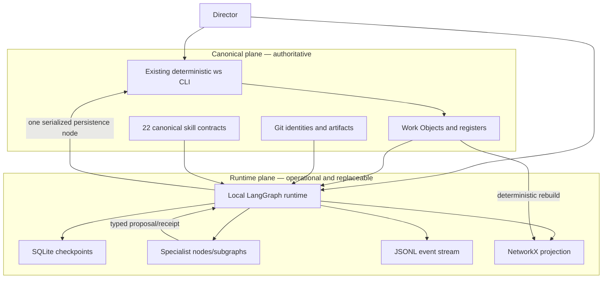
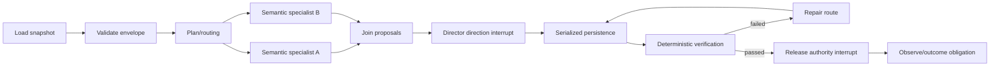

# Work Studio Local Runtime: Integrated LangGraph Build Plan

**Status:** Proposed architecture and implementation plan  
**Baseline inspected:** `8e827ae27caf8c8c9495427549e33619c1348c4c`, 2026-08-14  
**Deployment priority:** local development, then bounded single-host local production  
**Canonical authority:** Markdown, Git, and the existing `python3 -m tools.ws` write path

## Executive decision

Build a second, bounded **runtime plane beneath Work Studio**, without replacing the studio's deterministic kernel.

The immediate stack should be:

- **LangGraph OSS** for execution control, checkpoints, interrupts, bounded parallel branches, retries, and event streams;
- **Pydantic** for strict runtime-neutral contracts;
- **NetworkX** for a rebuildable epistemic relationship projection;
- **pytest plus Hypothesis** for example, invariant, state-machine, replay, and failure-sequence tests;
- **SQLite** for local checkpoint state only;
- **the existing Markdown/Git corpus and `ws` CLI** for canonical records and every governed mutation.

Do not initially add LangSmith Deployment, LangGraph Store, DSPy, OPA, FastAPI, Redis, Kafka, Temporal, OpenTelemetry, PostgreSQL, a graph database, containers, or distributed workers. These are promotion options, not prerequisites.

The architecture is deliberately asymmetric:



LangGraph may decide **when execution proceeds**. It must not decide **what counts as canonical truth, adequate evidence, granted authority, or an accepted governing change**.

## 1. Live baseline: what exists and what does not

This plan is grounded in the inspected tree, not only in the earlier research architecture.

### Shipped foundations to retain

- `tools/ws/` is a Python-standard-library CLI with lifecycle, schema, sensitivity, authority, claim, conflict, baseline, attention, and validation behavior.
- `ws start` now composes creation, initial evidence, creation History, transition to `explore`, and attention activation.
- `next_action` is generated and checked for forward-motion states; `revisit_trigger` is advisory for waiting/paused states.
- sensitivity values are aligned at `ordinary`, `private`, and `restricted`.
- the unreachable decision-side epistemic audit was repaired by attaching it to a reachable lifecycle boundary.
- `AUTH-*` allocation/reuse and artifact content fingerprints exist.
- `ws inputs` derives cited inputs read-only.
- evidence relation candidates, outcome coverage/verdicts, and verification freshness are read-time projections.
- kernel path/boundary/version/bootstrap verification passes.
- all generated adapters match their 22 canonical core skills.
- CI already uses Python 3.11.

### Important non-capabilities

Do not describe these as already implemented:

- evidence `supports`/`counters` relations are candidate warnings from shared-file citations, not asserted typed edges;
- outcome reporting has no durable `OUT-*` record;
- verification freshness has no durable `VER-*` identity or complete artifact/decision/constraint binding;
- no general handoff-receipt mechanism was accepted or shipped;
- there is no runtime execution queue, checkpointer, scheduler, compensation engine, agent-provider adapter, or distributed worker;
- there is no fully materialized typed relationship graph or automatic loop-state reducer.

### Current integrity evidence

On the inspected tree:

- `python3 tools/verify-kernel.py` passes all four checks;
- `python3 tools/generate-adapters.py --check` passes;
- `python3 -m tools.ws validate attention-limits` passes, reflecting ADR 0018's Primary-only cardinality rule;
- the full unit discovery ran 402 tests; 398 completed successfully and four dashboard tests could not bind loopback sockets in the sandbox;
- default `ws validate` reports 56 existing corpus errors, dominated by append-only/timestamp and closed-status/non-terminal-state debt;
- explicit checks report 16 active objects absent from `active.md`, one stale component-ledger entry, and 25 observe/close objects without outcome review;
- verification freshness warns that three historical verification commands no longer pass.

Therefore, unattended canonical mutation must not be enabled immediately. A read-only tracer can start before debt cleanup, but local production mutation requires the release gates in Phase 1.

## 2. Truth and ownership boundaries

| State class | Owner | Storage | Recovery rule |
|---|---|---|---|
| Work Object facts, evidence, decisions, authority, lifecycle, artifacts, outcome reviews | Work Studio | Markdown and Git | Repair/supersede through existing governance |
| Skill definitions and routing obligations | Work Studio | `skills/core`, manifests, generated adapters | Regenerate and verify |
| Execution cursor, completed nodes, interrupts, retry state, transient errors | LangGraph | local checkpoint database | Resume, replay, fork, or discard |
| Typed epistemic relationships and loop states | projection code | in-memory NetworkX; optional generated snapshot | Rebuild from canonical sources |
| Runtime diagnostics | local runtime | append-only JSONL with retention | Rotate/delete without changing canonical truth |

Checkpoint loss may cost execution progress, but it must never erase accepted studio evidence or decisions. Projection loss must be repairable by rebuilding. Conversely, a checkpoint or graph edge must never silently create a canonical claim.

## 3. Python and dependency boundary

The default local `python3` is 3.8.5. Current LangGraph requires Python 3.10 or later, and current NetworkX requires Python 3.11 or later. The workstation already has `/Users/andrelawas/.local/bin/python3.11` (3.11.15), `uv`, and SQLite 3.53.1; CI also uses Python 3.11.

Keep the current CLI importable and testable under its existing compatibility boundary. Put new dependencies behind an isolated runtime package and Python 3.11 environment:

```text
pyproject.toml
uv.lock
src/work_studio_runtime/
  contracts/
  canonical/
  orchestration/
  projection/
  providers/
  telemetry/
tests/runtime/
```

Initial dependency groups:

```toml
[project]
requires-python = ">=3.11,<3.13"
dependencies = [
  "langgraph>=1.2,<1.3",
  "langgraph-checkpoint-sqlite>=3.1,<3.2",
  "pydantic>=2.13,<3",
  "networkx>=3.6,<4",
]

[dependency-groups]
dev = ["pytest", "hypothesis"]
```

Resolve and commit exact versions with `uv.lock`; do not hand-maintain transitive pins. Before adoption, confirm the exact resolver output and licenses. Upgrade dependencies only in bounded Work Objects with replay and contract tests.

## 4. Proposed local repository layout

```text
src/work_studio_runtime/
  contracts/
    common.py             # enums, refs, identifiers, sensitivity
    operation.py          # OperationEnvelope and authority decision
    handoff.py            # HandoffEnvelope and HandoffReceipt
    event.py              # DomainEvent and compensation records
    relationship.py       # node/edge schemas and assertion mode
    loop.py               # LoopStateReport
  canonical/
    reader.py             # pure reads using/reusing tools.ws parsers
    commands.py           # typed adapter to existing CLI/domain commands
    snapshot.py           # baseline and content identity
  orchestration/
    state.py              # small checkpoint-safe StudioRunState
    graph.py              # parent StateGraph
    routing.py            # deterministic routing conditions
    nodes/
      load.py validate.py plan.py specialize.py
      direction_gate.py persist.py verify.py
      release_gate.py compensate.py outcome.py
  projection/
    extract.py            # source locators -> typed records
    graph.py              # NetworkX MultiDiGraph builder
    invariants.py         # mechanical graph checks
    loops.py              # pure loop-state reducer
    queries.py
  providers/
    protocol.py
    primary.py            # one provider only
  telemetry/
    events.py
    jsonl.py
tests/runtime/
  contracts/ orchestration/ projection/ replay/ properties/
.work-studio-runtime/     # gitignored generated operational state
  checkpoints.sqlite3
  events/
  projections/
  backups/
```

Do not move `tools/ws` into this package during the runtime build. First wrap existing read and write behavior. Extract shared pure functions later only when duplication is measured and tests pin parity.

## 5. Runtime-neutral contracts first

Use Pydantic strict models with `extra="forbid"` at every model/tool/runtime boundary. Generate JSON Schema and snapshot it in tests so provider changes cannot silently alter contracts.

Minimum contracts:

- `EntityRef(kind, id, source_locator, fingerprint?)`;
- `OperationEnvelope(execution_id, work_object_id, baseline, sensitivity, requested_effects, authority_refs, constraints, idempotency_key)`;
- `HandoffEnvelope(handoff_id, from_role, to_skill, task, input_refs, expected_output, authority_scope)`;
- `HandoffReceipt(status, output_refs, verification_gaps, proposed_next_skill, started_at, completed_at)`;
- `DomainEvent(event_id, execution_id, node, kind, payload_ref, timestamp)`;
- `Relationship(edge_id, source, relation, target, assertion_mode, source_locator, extraction_rule?)`;
- `CompensationRecord(effect_id, attempted_action, recovery_action, result)`;
- `LoopStateReport(loop_id, state, missing_edges, due_at, evidence_refs)`.

Only references and bounded summaries enter checkpoints. Prompts, private/restricted bodies, hidden reasoning, credentials, and large artifacts do not.

## 6. One first graph, not 22 autonomous agents

The first graph should automate one bounded Work Object pass:



Map the existing skills by behavior:

- **deterministic nodes:** load, validate, status, baseline, inputs, graph checks, freshness checks;
- **semantic nodes/subgraphs:** inquiry, develop idea, pressure test, research, design direction, implementation proposal, incident diagnosis, outcome interpretation;
- **director interrupts:** direction selection, high-consequence creation, restricted-content handling, release/deployment authority, accepted governing-rule changes;
- **external-effect nodes:** deployment or external writes only after explicit authority and with recovery/compensation;
- **persistence node:** the only runtime node allowed to invoke governed canonical writes.

Parallel branches may read and propose. They must not mutate `.work-studio/` or the same artifact concurrently. This preserves ADR 0020's single-session/single-writer assumption. Distributed or multi-process canonical mutation requires an explicit ADR revisit, not an incidental runtime setting.

Use `thread_id = work_object_id` and a separate `execution_id = EXEC-<WO>-NNN`. A Work Object may have several execution attempts without conflating the durable subject with a run.

## 7. Durability, retry, replay, and compensation

### Checkpoints

Start with `AsyncSqliteSaver` for development and the bounded single-host profile. The official reference calls SQLite savers lightweight and not recommended for general production. Accordingly, “local production” here means one trusted workstation, one runtime process, low throughput, recoverable checkpoint loss, and no network filesystem.

SQLite WAL permits readers alongside a writer but only one writer at a time. Use the workstation's fixed SQLite version, one runtime owner, clean connection shutdown, integrity checks, and database backups that keep the database/WAL state consistent. Do not place the database in Git or cloud-synchronized storage.

### Retry policy

Classify failures:

- transient provider/network/rate-limit failures: bounded exponential retry with jitter;
- invalid contract or authority: no retry; interrupt or fail closed;
- deterministic validation failure: route to repair, not blind retry;
- canonical concurrency mismatch: stop, reload, and require reconciliation;
- external partial effect: record effect identity, then compensate or escalate.

Every side-effecting task needs an idempotency key and an effect journal. A retry is not compensation. Compensation is a domain action such as restore prior deployment, revert a generated artifact through an authorized path, or mark manual recovery required.

### Replay semantics

LangGraph replay resumes from a checkpoint but re-executes downstream LLM calls, APIs, and interrupts. It is not Temporal-style deterministic event replay. Tests and director tooling must say **re-execute/fork**, not “roll back reality.” External-effect nodes require idempotency or an interrupt before replay.

## 8. Epistemic graph and automatic loop derivation

Use a `networkx.MultiDiGraph` because two entities can have several distinct, independently sourced relations. Separate:

- execution edges: LangGraph control flow;
- epistemic edges: `supports`, `counters`, `accepts`, `uses`, `generates`, `verifies`, `observes`, `revises`, `authorized_by`, `supersedes`, `hands_off_to`;
- inferred candidates: extraction-rule outputs requiring confirmation.

Every projected node and edge carries a source locator and assertion mode: `asserted`, `derived`, or `external`. Never promote a shared citation directly to `supports` or `counters`.

The projection builder must be deterministic for the same repository baseline. Its first invariants should implement the ten mechanics already recorded in Work Object `2026-08-11-017`: endpoint resolution, allowed type pairs, reciprocal consistency where duplicated, append-only terminal behavior, disclosed extraction rules, deterministic rebuild, auditable version/source identity, and exclusion of sensitive bodies.

Derive loop state with pure functions over canonical frontmatter, typed edges, timestamps, and runtime receipts:

```text
unframed -> framed -> evidenced -> decided -> authorized
-> acting -> verified -> released -> observing -> reviewed
-> closed | repair_due | method_revision_proposed | blocked
```

The reducer reports missing prerequisites and due obligations; it does not manufacture transitions. Examples:

- a decision without sufficient explicit support edges: `evidence_link_due`;
- release without matching authority/version verification: `blocked`;
- observed artifact without outcome review by its trigger: `review_due`;
- correction with reachable dependents: `revisit_due`;
- failed governing assumption: `method_revision_proposed`, pending human acceptance.

## 9. Local streaming, telemetry, scheduling, and process model

Use LangGraph's local async event stream to render node start/end, updates, retries, interrupts, and custom domain events in the terminal. Also write redacted structured JSONL locally:

```text
event_id, execution_id, work_object_id, node, event_type,
started_at, duration_ms, attempt, status, error_class,
input_ref_count, output_ref_count, model/provider, token/cost totals
```

Do not log prompt bodies, Work Object bodies, credentials, or private/restricted payloads. Add retention and a `ws runtime purge-telemetry` recovery command before calling telemetry production-ready.

LangGraph OSS is not a scheduler or distributed queue. Initially provide explicit commands:

```sh
uv run ws-runtime run <work-object-id>
uv run ws-runtime resume <execution-id>
uv run ws-runtime inspect <execution-id>
uv run ws-runtime sweep --read-only
uv run ws-runtime graph build
uv run ws-runtime graph check
```

After manual reliability is proven, one macOS `launchd` job may run a read-only daily sweep. It should emit a director queue, not autonomously mutate Work Objects. Weekly review remains director-invoked. A long-running worker, durable job queue, cron API, or multiple workers is deferred.

## 10. Phased build plan

### Phase 0 — Architecture decision and tracer boundary

**Deliver:** one ADR accepting the runtime plane, truth table, Python 3.11 environment, single-writer rule, SQLite limitation, and deferrals. Create one runtime Work Object/campaign.

**Exit evidence:** director accepts the boundaries; no claim that LangGraph replaces governance; runtime storage paths are gitignored and sensitivity-reviewed.

### Phase 1 — Restore release baseline

Resolve or explicitly baseline the 56 default validation errors, 16 attention mismatches, component staleness, lifecycle repair Work Object `2026-08-14-007`, and stale historical verification commands. Decide which legacy append-only findings are immutable debt versus repairable defects.

**Gate for automated mutation:** kernel, adapter drift, default validation, focused runtime tests, and non-socket unit tests pass; any accepted legacy exceptions are machine-readable and bounded.

### Phase 2 — Runtime skeleton and contracts

Add `pyproject.toml`, `uv.lock`, package skeleton, strict Pydantic contracts, JSON Schema snapshots, provider protocol, redaction policy, and a no-op graph with in-memory checkpoints.

**Tracer:** load one ordinary/low Work Object, validate an envelope, stream events, interrupt for direction, and finish without writing.

**Exit evidence:** malformed/extra fields fail; restricted data never appears in checkpoint/event fixtures; Python 3.11 and existing CLI suites both pass.

### Phase 3 — SQLite durability and recovery

Add `AsyncSqliteSaver`, stable `thread_id`/`execution_id`, inspect/resume/fork commands, crash-restart tests, checkpoint backup/restore procedure, strict MessagePack deserialization configuration, and idempotency records.

**Exit evidence:** kill after each graph node and resume; successful sibling work is not repeated; replay documentation proves downstream effects re-execute; corrupted/missing DB recovery does not alter canonical records.

### Phase 4 — Serialized canonical persistence

Build the typed canonical adapter. The persistence node invokes existing CLI/domain operations and revalidates the baseline immediately before writing. Begin with one append-only, ordinary/low action such as an execution History receipt; do not begin with deploy or release.

**Exit evidence:** duplicate invocation is idempotent; stale `updated_at` fails closed; partial multi-write `ws start` recovery is tested; no other runtime node can write `.work-studio/`.

### Phase 5 — Typed projection and loop reducer

Implement Pydantic node/edge records, deterministic Markdown extraction, NetworkX projection, graph checks, explanation-path queries, and loop-state reports. Keep the first projection in memory with optional generated JSON for debugging.

**Exit evidence:** same tree produces byte-stable sorted projection; seeded dangling endpoints, illegal edge pairs, cycles where forbidden, stale locators, and sensitive-body leakage are caught; deleting generated state and rebuilding produces the same result.

### Phase 6 — Bounded specialist concurrency and reliable handoff

Add two read-only specialist branches and a join. Persist `HandoffEnvelope` before dispatch and `HandoffReceipt` after completion; record input and output refs, baseline, completion status, gaps, and proposed route. Limit concurrency explicitly.

**Exit evidence:** crash before dispatch, during one branch, after one branch, and before join all resume without dropped or duplicated canonical effects; unordered branch outputs are normalized before comparison.

### Phase 7 — Retry, compensation, and director gates

Add error classes, bounded retry policies, timeouts, recovery subgraph, effect journal, and interrupts for direction, restricted handling, high consequence, and release authority.

**Exit evidence:** Hypothesis generates pause/resume/retry/reject/replay/compensate sequences without violating invariants; irreversible effects without authority are unreachable.

### Phase 8 — Bounded local production

Package a local CLI service, health/inspection commands, log rotation, backup verification, read-only `launchd` sweep, dependency/security update procedure, and runbook.

**Promotion gate:** 30 real low/ordinary runs; zero duplicate canonical effects; 100% interrupt recovery; measured checkpoint restore; director confirms status view usefulness; no unresolved high-severity contract, authority, or sensitive-data defects.

## 11. Test strategy

Use four layers:

1. existing deterministic CLI/unit tests;
2. contract and projection example tests;
3. replay/crash/idempotency integration tests with temporary workspaces and SQLite databases;
4. Hypothesis properties and `RuleBasedStateMachine` sequences.

Core invariants:

- canonical state changes only through the authorized persistence boundary;
- no terminal record is edited in place;
- every effect has authority, baseline, idempotency identity, and outcome;
- successful resume never duplicates an already-recorded effect;
- every asserted edge resolves and has an allowed type pair;
- derived edges disclose their extraction rule;
- checkpoint/projection loss cannot lose canonical truth;
- rejected/invalid director input cannot cross an interrupt;
- private/restricted content is absent from checkpoint and telemetry stores;
- loop state is a pure, deterministic function of its declared inputs.

## 12. Deferral register and promotion triggers

| Deferred capability | Why now | Promote when |
|---|---|---|
| LangSmith tracing/deployment | service cost and external data boundary; local JSONL is sufficient for proving value | local traces are inadequate or team/remote observability is required |
| PostgreSQL checkpointer | operational burden exceeds one-host need | SQLite contention, corruption/recovery limits, multi-host access, or vendor production requirements appear |
| LangGraph Store | would duplicate a projection that is cheaply rebuilt | durable cross-thread runtime memory is proven necessary |
| FastAPI/SSE UI | terminal streaming serves one director | a second client or remote control surface is required |
| Redis/task queue/distributed workers | conflicts with current single-session boundary and has no measured load need | backlog/throughput or multiple hosts are real and ADR 0020 is revisited |
| Temporal | duplicates orchestration before compensation semantics are proven | workflows outgrow LangGraph durability and require stronger activity/workflow guarantees |
| OpenTelemetry | structured local events are enough initially | several services need trace-context interoperability |
| DSPy | no evaluated prompt dataset yet | stable semantic node, labeled cases, and target metric exist |
| OPA | Python authority policy is small and local | several services/languages need one centrally tested policy |
| Neo4j/RDF graph database | NetworkX projection fits in memory and canonical source is file-based | graph size, shared querying, or independent persistence becomes a measured constraint |

## 13. Cost and risk assessment

Framework licenses and local libraries add no service fee. Initial recurring cost is primarily model/API usage. Engineering cost is concentrated in contracts, idempotency, canonical adapters, testing, and recovery—not in drawing the LangGraph.

The major risks are:

- **false assurance:** treating checkpoint durability as canonical durability;
- **replay duplication:** re-firing downstream APIs or LLM calls;
- **sensitivity leakage:** checkpointing/logging content rather than refs;
- **dual truth:** treating NetworkX or runtime Store as authoritative;
- **premature concurrency:** violating ADR 0020 through parallel writers;
- **framework coupling:** importing LangGraph types into domain contracts;
- **automation before debt control:** making existing contradictions execute faster.

The mitigations are the truth table, strict contracts, one persistence node, reference-only state, idempotency/effect journals, property tests, and phase gates.

## 14. Recommended first three Work Objects

1. **Accept the local runtime plane and compatibility boundary.** Decide Python 3.11, `uv`, local operational storage, single-writer policy, SQLite risk profile, and exact deferrals.
2. **Restore a trustworthy release baseline.** Finish the lifecycle/corpus repair and classify remaining legacy validation debt before enabling mutation.
3. **Build the read-only runtime tracer.** One Work Object, one strict envelope, one semantic node, one director interrupt, local event streaming, and in-memory checkpoints—no canonical writes.

Only after tracer evidence should the director authorize SQLite durability and a persistence node.

## Primary sources

- [LangGraph overview and package reference](https://reference.langchain.com/python/langgraph/overview)
- [LangGraph persistence and pending-write recovery](https://docs.langchain.com/oss/python/langgraph/persistence)
- [LangGraph checkpoint saver reference](https://reference.langchain.com/python/langgraph/checkpoints)
- [SQLite checkpointer API and deserialization security note](https://reference.langchain.com/python/langgraph.checkpoint.sqlite)
- [LangGraph interrupts](https://docs.langchain.com/oss/python/langgraph/interrupts)
- [LangGraph graph API, parallel branches, `Send`, and concurrency limits](https://docs.langchain.com/oss/python/langgraph/use-graph-api)
- [LangGraph fault tolerance and retry policies](https://docs.langchain.com/oss/python/langgraph/fault-tolerance)
- [LangGraph replay and fork semantics](https://docs.langchain.com/oss/python/langgraph/use-time-travel)
- [LangGraph event streaming](https://docs.langchain.com/oss/python/langgraph/event-streaming)
- [LangGraph MIT license](https://github.com/langchain-ai/langgraph/blob/main/LICENSE)
- [Agent Server architecture, queue, workers, and persistence](https://docs.langchain.com/langsmith/agent-server)
- [LangSmith Deployment cron jobs](https://docs.langchain.com/langsmith/cron-jobs)
- [Pydantic strict mode](https://pydantic.dev/docs/validation/latest/concepts/strict_mode/)
- [Pydantic JSON Schema generation](https://pydantic.dev/docs/validation/latest/concepts/json_schema/)
- [NetworkX `MultiDiGraph`](https://networkx.org/documentation/stable/reference/classes/multidigraph.html)
- [NetworkX directed-graph algorithms](https://networkx.org/documentation/stable/reference/algorithms/dag.html)
- [Hypothesis stateful testing](https://hypothesis.readthedocs.io/en/latest/stateful.html)
- [SQLite write-ahead logging and concurrency](https://www.sqlite.org/wal.html)

## Final recommendation

Proceed, but in this order:

```text
accept boundaries
-> clean or explicitly baseline deterministic integrity debt
-> read-only LangGraph tracer
-> strict contracts
-> SQLite resume/replay
-> one serialized canonical persistence path
-> typed NetworkX projection and loop reducer
-> bounded specialist concurrency and receipts
-> retries, compensation, and authority gates
-> measured single-host local production
```

This preserves what makes Work Studio distinct: LangGraph supplies a durable execution mechanism; Pydantic, NetworkX, and Hypothesis strengthen its contracts and assurance; the studio itself remains the epistemic and governance system.
