# Constraint-Driven Studio Operating System

## Deep research and applied architecture for Work Studio

**Research date:** 2026-07-28

**Repository baseline inspected:** commit `3918719` plus the working-tree state described in section 14

**Status:** research and recommendation; not an accepted architecture decision

### How to read epistemic labels

- **Research finding** — supported by a linked primary source, official standard, first-party specification, or original research publication.
- **Repository observation** — established by inspecting or executing the current Work Studio repository.
- **Inference** — a bounded interpretation connecting evidence to this system.
- **Recommendation** — a proposed design choice that still requires accountable acceptance.

The report deliberately does not claim that ordinary studio direction is a mathematical constraint-satisfaction problem. Formal constraint programming, systems engineering, control theory, organizational design, safety engineering, human factors, and agent orchestration each illuminate only part of the problem. The architecture below borrows their useful structures while refusing their unjustified machinery.

## 1. Executive synthesis

The provisional definition is directionally sound but too broad. A more precise one is:

> A constraint-driven studio operating system is a human-directed governance layer that preserves intent, promotes decision-relevant boundaries into inspectable constraint records, compiles those records into the smallest applicable work envelope, uses deterministic mechanisms where truth is machine-checkable, delegates bounded search and execution to replaceable specialists, escalates semantic conflicts and deviations to accountable authority, and revises both work and method from attributable outcomes.

This is **established in parts**, not as one settled field. Requirements engineering establishes traceable, verifiable requirements; constraint programming establishes feasibility, preference, conflict, and relaxation concepts; systems engineering separates verification from validation; safety engineering contributes proportional assurance, control structures, and recovery; human–automation research warns against both indiscriminate automation and permanent human micromanagement; mission command contributes bounded initiative under intent; policy-as-code and repository controls show how selected rules can become executable. No primary source establishes the full “studio operating system” as a mature technical discipline. That term is therefore a useful architectural metaphor, not a scientific category.

The best fit for Work Studio is a **thin, promoted constraint layer**, not a new platform:

1. Preserve the existing narrative `## Constraints and non-goals` section as the low-friction capture plane.
2. Promote only consequential, reused, conflicted, or mechanically enforced constraints into small YAML sidecars attached to a Work Object.
3. Keep six categories: `invariant`, `obligation`, `prohibition`, `preference`, `assumption`, and `experiment`.
4. Keep strength orthogonal to category: `must`, `should`, or `may`; time-bounded behavior belongs in lifecycle fields, not a fourth strength.
5. Compile an **operation envelope** on demand: applicable constraints, authority grant, capabilities, accepted deviations, verification obligations, and unresolved conflicts.
6. Let LLMs interpret, extract, compare, and explain. Let deterministic code validate schema, inheritance, authority, provenance, expiry, and machine-checkable predicates. Let the director decide value tradeoffs, hard relaxations, high-consequence actions, and residual risk.
7. Add no general rules engine, universal ontology, formal solver, autonomous supervisor, or multi-agent platform until tracer evidence proves a need.

The director’s governing surface should be deliberately narrow:

- intended outcome and non-negotiable values;
- the few constraints that materially shape architecture;
- conflicts requiring a tradeoff;
- new operational obligations and failure modes;
- deviations, uncertainty, and verification gaps;
- the decision requested and its reversibility.

The director should not have to inspect every tool call or line. That is not blind trust if three controls hold: the envelope is bounded before action, important claims point to direct evidence, and independently produced or deterministic verification covers the consequential path.

### Recommended operating loop

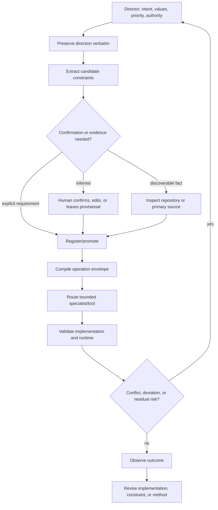

**Recommendation confidence:** high for the thin-layer direction; medium for the exact schema until tracer bullets exercise it.

## 2. Definition and field map

### What is established, emerging, and metaphorical

| Claim | Status | Basis | Work Studio translation |
|---|---|---|---|
| Requirements should be clear, consistent, traceable, and verifiable. | Established | The current [ISO/IEC/IEEE 29148:2018](https://www.iso.org/standard/72089.html) specifies requirements-engineering processes and information items; the [NASA Systems Engineering Handbook](https://www.nasa.gov/reference/system-engineering-handbook-appendix/) defines validated requirements as clear, complete, consistent, verifiable, and traceable. | A promoted constraint needs identity, source, scope, lifecycle, and a validation disposition. |
| Goals can be refined into requirements, responsibilities, and specifications. | Established requirements-engineering approach | Van Lamsweerde’s original [goal-oriented requirements survey](https://webperso.info.ucl.ac.be/~avl/files/RE01.pdf) treats goals as objectives to elicit, refine, assign, and operationalize. | Preserve director intent above the derived constraint layer; maintain trace links rather than pretending the derivation is unique. |
| Verification and validation answer different questions. | Established | NASA distinguishes establishing compliance with requirements from establishing that the system meets customer expectations in its [V&V guidance](https://www.nasa.gov/reference/system-engineering-handbook-appendix/). | `verify-release-evidence` checks compliance; `review-outcome-and-adapt` checks whether the chosen constraints produced the intended outcome. |
| Hard feasibility and soft preference are distinct. | Established in formal domains | Constraint solvers distinguish infeasible models and preference-guided conflict refinement; IBM’s [CP Optimizer conflict refiner](https://www.ibm.com/docs/en/icos/22.1.1?topic=concepts-conflict-refiner-in-cp-optimizer) can identify a minimal conflicting subset and weight preferred explanations. | Do not encode all guidance as `must`. Preserve preferences and show a small human-readable conflict set. |
| A controller needs enough response variety for disturbances it must regulate. | Established as a formal cybernetic result within its assumptions | Ashby derives the law of requisite variety in [*An Introduction to Cybernetics*](https://ashby.info/Ashby-Introduction-to-Cybernetics.pdf). | Capability routing and escalation paths must cover the consequence classes the system claims to govern; this does not imply a central omniscient controller. |
| Levels and types of automation should be selected, not maximized. | Established human-factors model | Parasuraman, Sheridan, and Wickens propose a staged model of automation in their [2000 paper](https://doi.org/10.1109/3468.844354). | Automate extraction and checks differently from final value judgment or irreversible action. |
| Delegation creates monitoring and information-asymmetry costs. | Established economic theory; analogy only for AI | Jensen and Meckling’s [agency-cost theory](https://papers.ssrn.com/sol3/papers.cfm?abstract_id=94043) models costs arising from separation of ownership and control. | Require economically useful evidence at handoffs; do not pretend agents have human incentives or legal accountability. |
| Mission orders can enable local initiative inside intent and boundaries. | Established organizational doctrine; domain analogy | U.S. Army [ADP 6-0](https://www.moore.army.mil/mssp/security%20topics/global%20and%20regional%20security/content/pdf/adp6_0_new.pdf) describes intent as limits for disciplined initiative. | Specialists choose implementation detail while meaningful departures are reported. The director remains accountable; software work is not warfare. |
| Risk governance should be contextual and continuous. | Established first-party framework | NIST AI RMF 1.0 organizes work as Govern, Map, Measure, Manage and calls for risk management throughout the lifecycle in the [AI RMF Core](https://airc.nist.gov/airmf-resources/airmf/5-sec-core/). | Scale the constraint burden by consequence, reversibility, novelty, sensitivity, and reach. |
| Agent workflows benefit from interleaving plans, actions, and observations. | Emerging research | [ReAct](https://arxiv.org/abs/2210.03629) reports benefits from interleaving reasoning and environment action; [AutoGen](https://arxiv.org/abs/2308.08155) demonstrates configurable multi-agent conversations. | Compile only the current bounded move by default; replan when evidence changes. Multi-agent conversation is an optional mechanism, not kernel architecture. |
| A “constraint compiler” can make studio governance coherent. | Architectural metaphor | No cited field establishes a natural-language studio compiler with deterministic semantics. | Use “compiler” to name a staged, traceable transformation. Do not imply complete formalization, soundness, or optimization. |

### System context view

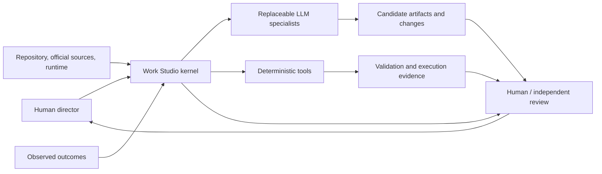

### Research-to-architecture translations

The required translation fields are consolidated here for the major findings; later sections give implementation detail.

| Research finding | Discipline | Evidence strength | Work Studio problem | Constraint implication | Architectural implication | Possible implementation | Tradeoff / failure risk | Recommendation / confidence |
|---|---|---|---|---|---|---|---|---|
| Requirements need source, consistency, verification, and traceability. | Requirements / systems engineering | Strong standard and agency handbook | Narrative constraints are not individually traceable. | Promote only constraints whose consequences justify structure. | Stable IDs link intent → decision → check → outcome. | YAML sidecar plus references into Work Objects. | Over-structuring every sentence creates bureaucracy. | Build promotion, not replacement. **High** |
| Infeasibility explanations should expose a small conflict set. | Constraint programming | Strong in formal models; analogical outside them | Semantic conflicts can be hidden in prose. | Never silently relax `must`; show involved constraints and options. | Conflict object is human-readable and does not claim mathematical minimality. | Pairwise/declared dependency checks, then LLM explanation. | False precision if “minimal” is claimed without formal proof. | Use “smallest identified conflict set.” **High** |
| Automation level should depend on function and consequence. | Human factors | Strong research tradition | One global autonomy ladder can overgrant or overburden. | Capability, permission, expertise, and accountability remain separate. | Authority is granted per operation and scope. | Extend existing authority records with constraint refs. | Repeated success can become unjustified global trust. | No global trust score. **High** |
| Baselines and change control need proposal, impact analysis, approval, test, and history. | Configuration management | Strong official guidance | Repository state and constraint state can drift. | A compiled envelope names baseline identity; changes supersede, not overwrite. | Existing baseline capture and append-only history become enforcement anchors. | `constraint validate --baseline-ref`. | Too many approvals slow harmless work. | Apply only to promoted constraints. **High** |
| Safety constraints arise from unacceptable losses and unsafe control actions. | STPA / assurance | Strong method, domain-tailored | High-consequence work needs more than checklists. | High profiles require hazards, recovery, and independent evidence. | Compact assurance record, not universal safety case. | Add strict-profile fields to verification output. | Cargo-cult safety templates. | Test only on high-consequence tracers. **Medium-high** |
| Intent enables local initiative when boundaries and risk ownership are clear. | Mission command | Strong doctrine; metaphorical transfer | Director cannot specify all implementation detail. | State purpose, end condition, boundaries, and escalation triggers. | Operation envelope leaves mechanism choice to the specialist. | Director Contract + Decision Card. | Militarized language can conceal collaborative judgment. | Borrow structure, avoid command mythology. **Medium-high** |
| Monitoring is only useful when it changes a decision. | Agency theory / observability | Strong theory plus engineering practice | Full tool-call review would overwhelm the director. | Collect evidence at consequence-bearing boundaries. | Human-attention projection filters exceptions and gaps. | Derived dashboard from canonical records. | Metrics invite gaming and surveillance. | Prefer exception views and qualitative agency checks. **High** |
| Feedback can correct action, governing rules, or the rule-making method. | Cybernetics / organizational learning | Strong conceptual foundation; triple-loop is less standardized | Outcome review and method maintenance are currently separate but not constraint-linked. | Every temporary or experimental constraint has an outcome and revisit trigger. | Route single-, double-, and method-loop changes to existing skills. | Constraint outcome event with `disposition`. | Outcome bias can rewrite rules after one result. | Require bounded evidence and contrary-evidence review. **High** |

## 3. Director operating model

The director is neither an external omniscient controller nor a passive approver. The director is a participant who owns purpose and residual authority, receives compressed but inspectable decision evidence, and corrects the system’s interpretation.

### Director contract

```yaml
director_contract:
  schema_version: 1
  director_owns:
    - intent
    - values_and_exclusions
    - priority
    - acceptable_tradeoffs
    - consequence_acceptance
    - final_authority_for_meaningful_deviations
    - residual_risk_acceptance
  director_must_be_shown:
    - material_architecture_change
    - new_operational_obligation
    - irreversible_or_expensive_commitment
    - security_privacy_or_data_exposure
    - hard_constraint_conflict
    - proposed_deviation
    - unverified_assumption_affecting_the_decision
    - verification_failure_or_scope_limit
    - material_complexity_increase
  director_may_delegate:
    - repository_inspection
    - candidate_constraint_extraction
    - technically_coherent_option_generation
    - bounded_reversible_implementation
    - deterministic_validation
    - evidence_collection_within_granted_scope
  director_may_not_delegate:
    - definition_of_personal_values
    - final_high_consequence_approval
    - acceptance_of_irreversible_residual_risk
    - durable_inferred_personal_constraint
    - authority_to_expand_authority
  explanation_level: architecture_and_consequence
  required_visualizations:
    - candidate_constraint_matrix_when_options_are_materially_distinct
    - complexity_impact_map_when_operational_obligations_change
    - decision_trace_for_meaningful_or_high_consequence_work
  required_evidence:
    low: direct_check_or_explicit_gap
    meaningful: baseline_bound_evidence_plus_verification
    high: independent_or_deterministic_evidence_plus_recovery_and_residual_risk
  escalation_conditions:
    - must_constraint_cannot_be_satisfied
    - inferred_constraint_would_become_durable
    - authority_or_capability_is_missing
    - deviation_changes_architecture_data_security_privacy_or_external_effect
    - complexity_budget_threshold_is_crossed
    - evidence_is_materially_conflicted_or_stale
```

### Director Decision Card

```yaml
decision_card:
  decision: "What exact branch requires authority?"
  why_now: "What prevents safe continuation?"
  intended_outcome: "What human-valued result is sought?"
  constraints:
    must: []
    should: []
    assumptions: []
  options:
    - id: option-a
      architectural_shape: ""
      satisfies: []
      violates_or_deviates: []
      operational_burden: []
      failure_modes: []
      reversibility: ""
  recommendation:
    option_id: ""
    reason: ""
  tradeoffs: []
  new_responsibilities_for_director: []
  evidence_refs: []
  unknowns: []
  verification_plan: []
  authority_requested:
    action: ""
    scope: []
    expires_when: ""
```

**Human-factors finding.** Parasuraman, Sheridan, and Wickens separate information acquisition, analysis, decision selection, and action implementation when choosing automation levels ([paper](https://doi.org/10.1109/3468.844354)). Work Studio should therefore automate evidence retrieval and structural checks more readily than value judgments and consequential action. Research on out-of-the-loop performance reports slower or poorer recovery when automation failures leave operators with weak situation awareness ([Endsley and Kiris, 1995](https://doi.org/10.1518/001872095779064555)). The implication is not “keep the human clicking”; it is “preserve the human’s decision model.”

**Recommendation.** Director comprehension is a system acceptance criterion. For every major component, the director should be able to answer: why it exists, what constraint it satisfies, what obligation it adds, what can fail, and how to reverse or supersede it.

For creative direction, principles should constrain without imposing uniformity. The UK Government Design Principles explicitly say “be consistent, not uniform” and describe principles as changeable when better patterns or user needs emerge ([first-party guidance](https://www.gov.uk/guidance/government-design-principles)). Google’s Material 3 presents an adaptable system of guidelines, components, and tools rather than one fixed composition ([official design system](https://m3.material.io/)). **Inference:** Work Studio should store “calm and authoritative” as intent, then test alternative observable translations instead of canonizing one visual recipe.

## 4. Core principles

The brief’s proposed principles mostly survive, with five qualifications.

| Principle | Verdict | Qualification |
|---|---|---|
| Preserve intent before interpretation. | Retain | Preserve exact direction plus context; verbatim language is evidence of intent, not automatically a requirement. |
| Make constraints explicit and typed. | Narrow | Type only promoted constraints. Narrative boundaries remain valid capture. |
| Never silently relax hard constraints. | Retain | Emergency containment may temporarily violate an ordinary rule only under an explicit, expiring deviation; safety or platform prohibitions still stop. |
| Do not let preferences masquerade as requirements. | Retain | Strength and category must be independent. |
| Confirm inferred constraints before durability. | Retain | An observed technical invariant can be registered as `observed` without pretending it is a user value; inferred value or policy still requires authority. |
| Keep provenance inspectable. | Retain | Reference shared evidence objects rather than copying epistemic detail into every constraint. |
| Separate strength from confidence. | Retain | `must` says normative force; confidence says epistemic support. |
| Separate semantic constraint from mechanism. | Retain | A mechanism is replaceable and may only partially enforce a semantic rule. |
| Make agents search inside an envelope. | Retain | The envelope may contain ambiguity and unresolved conflicts; it is not a mathematically closed feasible region. |
| Turn conflicts into visible decision objects. | Retain proportionally | Record only material conflicts. Routine preference tradeoffs can remain in a Decision Card. |
| Justify operational complexity. | Retain | Use deltas and obligations, not a universal scalar score. |
| Scale authority with consequence and reversibility. | Retain and extend | Also include sensitivity, external reach, novelty, constraint clarity, and verification independence. |
| Show meaningful tradeoffs, not every detail. | Retain | Preserve drill-down links so compression does not become concealment. |
| Verify outcomes, not only plans. | Retain | Separate plan, implementation, runtime, and value validation. |
| Give temporary assumptions revisit triggers. | Retain | Expire or deactivate them deterministically. |
| Make deviations explicit and often expiring. | Retain | A deviation never edits the original constraint away. |
| Keep the repository canonical. | Retain | Runtime or external truth still needs fresh observation; repository canon is not universal reality. |
| Derive visualizations from governed records. | Retain | Manual diagrams may explain but cannot claim live status. |
| Teach only what the active decision needs. | Retain | Provide a route to deeper evidence so simplification remains inspectable. |

### Additional principles

1. **No constraint without a subject and observable consequence.** “Keep it simple” is intent until translated into what must remain true and where.
2. **No mechanism gets more authority than the constraint it implements.**
3. **Negative evidence is first-class.** Failed checks, unavailable capabilities, and unsatisfied candidates narrow the next decision.
4. **Independence is a property of a verification path, not an agent title.**
5. **Bureaucracy is a failure mode.** Governance cost is measured and can trigger simplification.
6. **Constraint deletion is exceptional.** Prefer supersession, expiry, or retirement so learning remains visible.

NIST’s configuration-management guidance defines a baseline as an agreed specification changed through control and describes change control as proposal, justification, impact analysis, implementation, testing, review, and disposition ([SP 800-128](https://doi.org/10.6028/NIST.SP.800-128)). This strongly supports Work Studio’s append-only and baseline-oriented design, but the same source says rigor can vary with risk. That proportionality is essential.

## 5. Constraint taxonomy

### Minimal categories

Six categories are sufficient:

| Category | Meaning | Typical example |
|---|---|---|
| `invariant` | A state that must remain true across the declared scope. | Work Object IDs remain immutable. |
| `obligation` | A required positive action, artifact, or evidence condition. | A production deployment has a rollback reference. |
| `prohibition` | An action or state that must not occur. | A read-only review does not mutate artifacts. |
| `preference` | A desired property that may be traded with consequences shown. | Prefer filesystem-readable state. |
| `assumption` | A provisional condition relied on but not established. | One session per workspace remains sufficient. |
| `experiment` | A temporary rule or boundary used to test a hypothesis. | Use a local SQLite index for this tracer only. |

`value`, `quality attribute`, `functional requirement`, `resource limit`, `domain rule`, and `architecture principle` are useful semantic facets, not top-level categories. Store them in optional `facets`; otherwise the taxonomy becomes a universal ontology. `Accepted deviation` and `revisit trigger` are lifecycle/governance objects, not constraint categories.

### Strength

Use three operational strengths aligned with the distinction in [RFC 2119](https://www.rfc-editor.org/rfc/rfc2119):

| Strength | Required behavior |
|---|---|
| `must` | Stop or obtain the specifically authorized deviation. A `prohibition + must` is a stop rule. |
| `should` | The candidate may depart only after the implications are surfaced and recorded at the consequence-appropriate level. |
| `may` | Optional search-space guidance; no deviation object is needed. |

Do not use `absolute`, `required`, `strong preference`, `weak preference`, `temporary`, and `experimental` as one mixed ladder. “Temporary” and “experimental” describe lifecycle/purpose, not force. An experimental constraint can still be `must` within its experiment boundary.

### Scope and inheritance

#### Constraint inheritance view

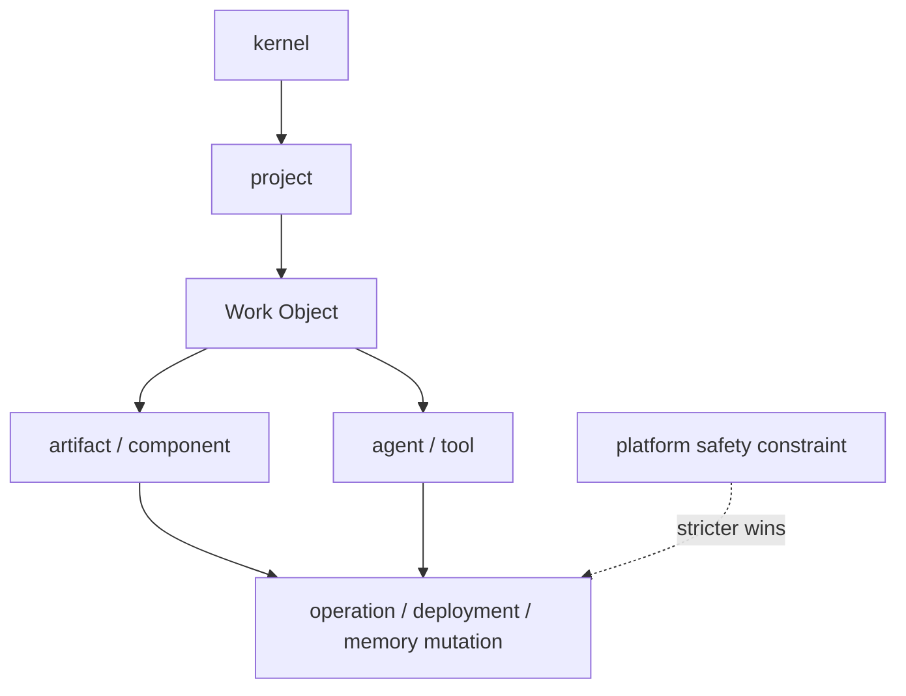

Scopes:

```text
kernel | project | work_object | component | artifact | actor | tool | operation | environment | memory
```

Inheritance rules:

1. Applicable higher-scope `must` constraints flow downward.
2. A lower-scope record may narrow but not silently weaken a higher-scope `must`.
3. A lower-scope conflict creates a conflict or deviation request; it does not override by recency.
4. Platform safety may be stricter than Work Studio policy and wins for that execution.
5. Preferences do not automatically flow into unrelated components; inherited applicability must be declared or compiled from an exact scope selector.
6. Actor/tool constraints add to, rather than replace, operation constraints.

### Lifecycle

#### Constraint lifecycle

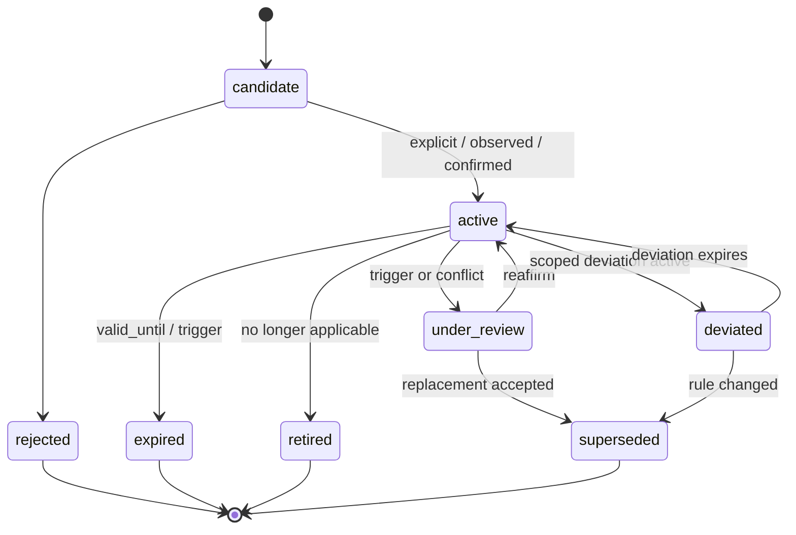

The lifecycle must preserve lineage. `candidate` constraints cannot gate work unless they reflect an already-applicable external/platform prohibition; an inferred candidate cannot manufacture authority.

## 6. Stable kernel

The stable kernel should add only four first-class ideas to what Work Studio already has:

1. `Constraint` — promoted boundary with source, force, scope, and lifecycle.
2. `AcceptedDeviation` — scoped authority to depart from one or more active constraints.
3. `ConstraintValidation` — a result linked to method, baseline, and evidence.
4. `OperationEnvelope` — an ephemeral compilation of applicable constraints, authority, capability, and gaps.

`ConstraintConflict` can initially be a structured view/event in the existing conflict register rather than a new durable aggregate. `ConstraintSet` is a projection. `RevisitTrigger` and `AuthorityGrant` already exist conceptually in Work Objects and authority History records and should be referenced, not duplicated.

### Kernel invariants, critically tested

| Candidate invariant | Decision |
|---|---|
| No consequential operation without a constraint envelope. | Retain for meaningful/high consequence; routine low-consequence exploration may use an inline envelope. |
| No inferred constraint becomes durable without required authority. | Retain for inferred values/policies; observed system constraints can be recorded with `origin.kind: observed` and remain revisable. |
| No hard constraint may be silently relaxed. | Retain universally. |
| No deviation without an explicit record. | Retain for `must`; `should` departures can be recorded in the decision or operation record unless material. |
| No agent capability implies decision authority. | Retain universally. |
| No validation result without evidence. | Retain; `not_run`, `unavailable`, and `inconclusive` are valid results. |
| No temporary assumption becomes permanent without review. | Retain with deterministic expiry/deactivation. |
| No tool-specific mechanism becomes a universal principle. | Retain as an architecture-governance rule. |

### Container view

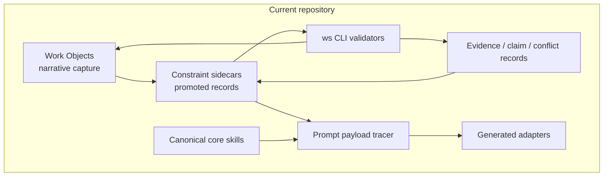

**Repository observation.** `work-studio/kernel-manifest.yaml` already exists, declares canonical portable inputs and the `ws` CLI as the sole `.work-studio/` write path, and `python3 tools/verify-kernel.py` passes path existence, boundary integrity, version consistency, and bootstrap completeness on the inspected tree. The constraint layer should be registered through the existing documentation contract only after an accepted architecture decision; it should not create a second kernel.

## 7. Constraint extraction

Natural-language extraction is a proposal pipeline, not registration by transcription.

### Natural-language extraction flow

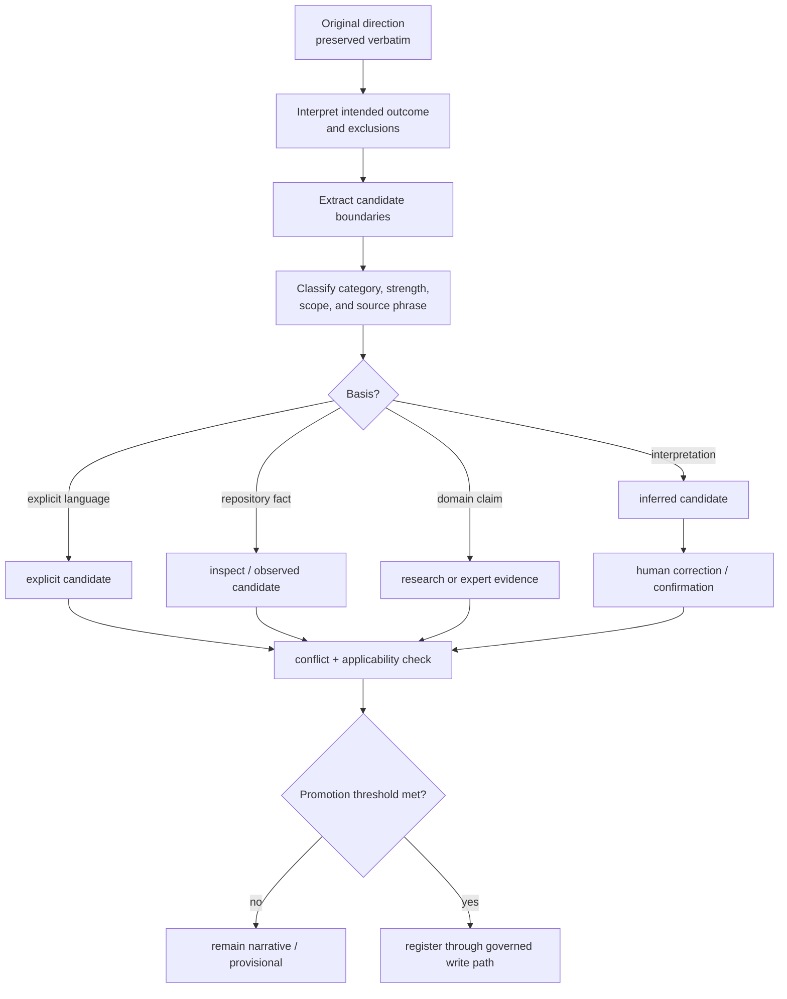

### Extraction rules

1. Preserve the exact direction before parsing.
2. Extract outcome, exclusions, and emotional/creative qualities separately.
3. Every candidate cites a `source_phrase` or evidence reference.
4. Never infer `must` solely from emphatic prose unless the speaker is the accountable authority and the meaning is unambiguous.
5. Label architectural translations of creative direction as inferred. “Calm” is not mechanically equivalent to “one dominant action”; the latter is a testable design hypothesis.
6. Search the registered repository and environment before asking the director a discoverable factual question.
7. Route legal, safety, privacy, or specialist domain claims to primary-source research or expert review; do not let model familiarity become evidence.
8. Promote only if the candidate is consequential, reused, conflicted, temporary with an expiry need, or mechanically enforced.

### Machine-readable extraction result

```yaml
schema_version: 1
extraction_id: CEX-20260728-001
original_direction:
  text: "I want the system to remain easy for me to govern."
  actor: director
  source_ref: conversation:message-id
intended_outcome: "Director can understand and control consequential changes."
extracted:
  - candidate_id: c1
    statement: "Meaningful architecture changes expose their purpose and consequences."
    category: obligation
    proposed_strength: must
    proposed_scope:
      kind: project
      ref: work-studio
    source_phrase: "easy for me to govern"
    basis: inferred
    inference_explanation: >
      Architectural explanation is one observable contributor to governability;
      the original phrase does not uniquely require this mechanism.
    confidence: medium
    requires_confirmation: true
    proposed_validation:
      kind: human_review
      criterion: "Director Decision Card answers the required architecture questions."
ambiguities:
  - "Does governability prioritize inspectability, reversibility, low operations, or all three?"
conflicts: []
discoverable_questions:
  - question: "What explanation artifacts already exist?"
    source_to_inspect: "WORKSPACE-DOCUMENTATION-CONTRACT.md and docs/"
human_tradeoff_questions:
  - "Which burden is less acceptable: an extra review step or a less inspectable architecture?"
unverified_domain_claims: []
promotion_recommendation: confirm_then_register
```

`confidence` is extraction confidence, not normative strength and not a probability that the constraint is “true.” Use `high | medium | low`, with a reason, rather than a pseudo-precise number.

### Hidden-constraint discovery triage

| Discovery | Treatment | Example |
|---|---|---|
| Directly observable current condition | Record `origin.kind: observed`; cite baseline and source. | The CLI is the sole `.work-studio/` write path. |
| Existing documented project rule | Reference canonical document; test freshness and conflict. | Generated adapters are not canonical. |
| Technical consequence of a candidate | Present as inference and candidate obligation. | A remote database implies credentials and operations. |
| Human value tradeoff | Ask director one decision-bearing question. | Local ownership versus simultaneous remote access. |
| Domain fact | Research primary source or obtain expert review. | Retention law for a specific jurisdiction. |
| Tool or platform restriction | Treat as execution constraint for that platform; do not universalize. | Sandbox blocks a filesystem path. |

## 8. Constraint conflict handling

Formal solvers provide a useful vocabulary: infeasible set, conflicting subset, relaxation, and preference. IBM’s conflict-refiner documentation carefully notes that a minimal conflict is not necessarily the only conflict, and fixing one does not guarantee full feasibility ([official CP Optimizer documentation](https://www.ibm.com/docs/en/icos/22.1.1?topic=concepts-conflict-refiner-in-cp-optimizer)). Work Studio should preserve that humility.

### Constraint conflict flow

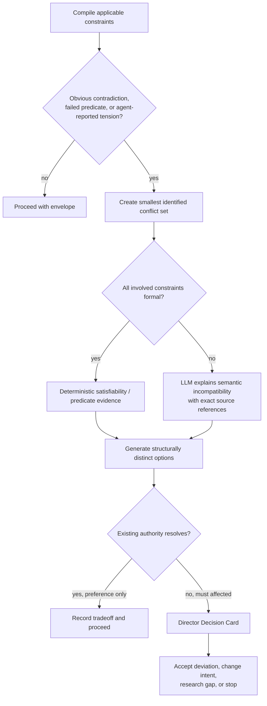

### Conflict record

```yaml
schema_version: 1
conflict:
  id: CNF-20260728-001
  constraint_refs: [CON-local, CON-shared, CON-no-server]
  baseline_ref: BLN-20260728T091500Z
  incompatibility:
    kind: semantic
    statement: >
      Simultaneous remote shared mutation requires an accessible coordination
      mechanism, while current must constraints prohibit both remote state and
      a server.
    evidence_refs: [CLM-41, CLM-42]
  identified_set_claim: "smallest found by current analysis; not proven globally minimal"
  consequences_if_unresolved:
    - remote agents cannot share live mutable state
  options:
    - id: a
      change: "retain local-only/no-server; use asynchronous Git handoff"
      relaxes: [CON-shared]
    - id: b
      change: "permit a local peer coordinator reachable through an approved tunnel"
      relaxes: [CON-no-server]
    - id: c
      change: "permit managed remote state with local export"
      relaxes: [CON-local, CON-no-server]
  recommendation:
    option_id: a
    reason: "Preserves ownership and avoids new standing operations."
  authority_required:
    actor: director
    action: relax_must_constraint
  disposition: open
```

### Refuse, ask, or relax

- **Refuse/stop** when a safety/platform prohibition applies, authority is absent, the only plan violates a `must`, or a required capability is unsupported.
- **Ask for tradeoff authority** when two legitimate `must` constraints are incompatible, or satisfying one changes architecture, exposure, or operational burden materially.
- **Propose a relaxation** when a specific constraint change creates a viable option; show consequence, scope, expiry, and rollback.
- **Proceed with recorded tradeoff** when only `should` constraints differ and the current authority envelope permits the decision.
- **Investigate** when the apparent conflict depends on an unverified domain claim or stale observation.

### Accepted deviation

A deviation is scoped authority, not evidence that the original constraint was wrong.

```yaml
accepted_deviation:
  schema_version: 1
  id: DEV-20260728-001
  constraint_refs: [CON-no-new-dependency]
  work_object_ref: WO-...
  scope:
    operations: [op-20260728-004]
    paths: ["tools/ws/constraint.py"]
  reason: "Use the already-vendored YAML parser for the tracer."
  consequences:
    new_obligations: []
    verification_changes: ["run dependency-boundary test"]
  authority_ref: "history:2026-07-28T10:00:00Z"
  valid_from: "2026-07-28T10:00:00Z"
  expires_at: "2026-08-04T10:00:00Z"
  closure_trigger: "tracer complete or package removed"
  status: active
```

Deviation rules:

1. A deviation cannot broaden itself.
2. It names exact constraints and operations.
3. It expires or has an explicit revisit trigger when temporary.
4. Validation reports both constraint compliance and deviation compliance.
5. Repeated deviations create architectural pressure; they do not automatically weaken the rule.
6. Emergency deviation records may be completed immediately after containment only where delay would worsen harm and existing incident authority permits it. This exception should be narrow and audited.

## 9. Agent orchestration

The conductor should usually compile and authorize the **next bounded action**, not a complete detailed plan. ReAct’s interleaving of action and observation supports replanning as evidence arrives ([paper](https://arxiv.org/abs/2210.03629)); this is better aligned with Work Studio’s Decision Frontier than a brittle full plan. Complete plans remain useful when coordination dependencies or release sequencing demand them.

### Operation envelope

Every delegated action receives:

```yaml
operation_envelope:
  schema_version: 1
  operation_id: OP-20260728-001
  work_object_ref: WO-...
  baseline_ref: BLN-...
  intent:
    purpose: ""
    desired_outcome: ""
    exit_condition: ""
  applicable_constraints: []
  assumptions: []
  unresolved_conflicts: []
  accepted_deviations: []
  scope:
    allowed_reads: []
    allowed_writes: []
    prohibited_actions: []
  authority:
    grant_refs: []
    maximum_action_level: execute_reversible
  required_capabilities: []
  assigned_actor:
    id: ""
    capability_evidence_ref: ""
  verification_obligations: []
  complexity_thresholds: []
  escalation_triggers: []
```

### Agent-routing sequence

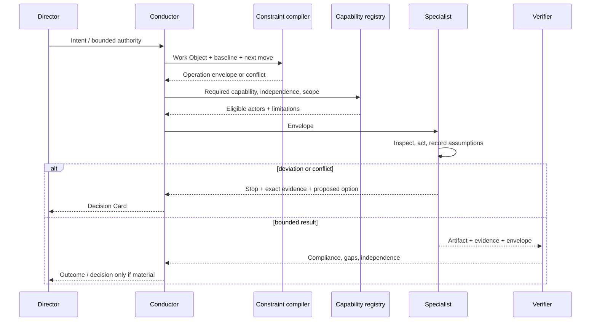

### Routing rules

1. Match required capability and context access before model preference.
2. Check platform degradation and tool availability at runtime.
3. Check permission separately from capability.
4. For independent verification, ensure the verifier did not produce the artifact and does not merely repeat its assertions. A different agent label on the same unchecked evidence is not independence.
5. Prefer the least capable actor that safely satisfies the envelope when it reduces cost or exposure; prefer the more capable actor when ambiguity, novelty, or consequence requires it.
6. Route across providers through the same semantic envelope. Platform adapters map mechanisms and restrictions but cannot change kernel authority.
7. Agents expose planning assumptions as structured candidates. An assumption that changes scope or consequence stops the affected path.

### Capability registry, simplified

```yaml
agent_capability:
  schema_version: 1
  actor_id: codex-session
  provider: openai
  model_ref: runtime-declared
  capabilities:
    file_read:
      status: native
      evidence_ref: platform-overlay:codex
    deployment:
      status: manual-fallback
      evidence_ref: platform-overlay:codex
  domain_claims:
    - domain: software-engineering
      basis: configured_skill_and_observed_tracers
      limitations: ["No standing production access"]
  access:
    repository: workspace-scoped
    external_write: requires_explicit_authority
  verification:
    can_execute_checks: true
    independent_when: "did not produce artifact and uses direct evidence"
  supervision:
    default_max_authority: create_candidate
```

Do not maintain a global “trust score.” Repeated success may support a scoped capability claim, lower review sampling for low-consequence work, or expand a particular reversible grant. It cannot convert capability into authority or accountability.

## 10. Constraint compiler architecture

“Compiler” is warranted only as an inspectable pipeline with typed inputs and outputs. It must not claim formal soundness for semantic interpretation.

### Constraint compiler data flow

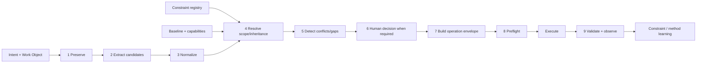

### Stage ownership

| Stage | LLM role | Deterministic role | Human role | Project-specific input |
|---|---|---|---|---|
| Preserve | Summarize only alongside exact text | Hash/store source ref | Correct intent | Conversation/brief |
| Extract | Propose semantic candidates, ambiguity, source phrase | Schema-check output | Correct/confirm inferred values | Domain vocabulary |
| Normalize | Suggest category/scope | Enum, ID, required-field validation | Resolve semantic ambiguity | Profiles |
| Inherit | Explain applicability | Exact selector, precedence, status, expiry | Approve deviations | Project and WO scopes |
| Conflict | Explain semantic tension, generate options | Detect duplicate IDs, predicate failures, declared exclusions | Choose tradeoff | Architecture facts |
| Plan/route | Generate next bounded move | Capability/authority/precondition check | Grant gated authority | Platform overlay |
| Preflight | Explain gaps | Block on failed `must` predicates | Accept residual uncertainty where allowed | Consequence profile |
| Execute | Specialist judgment | Sandbox, CLI, tests, access controls | Intervene on escalation | Tools |
| Validate | Interpret semantic evidence | Run checks, bind baseline, record results | Validate creative/value outcome | Acceptance criteria |
| Learn | Compare constraint to outcome | Trigger expiry/revisit | Change values/policy/method | Outcome records |

### Component view

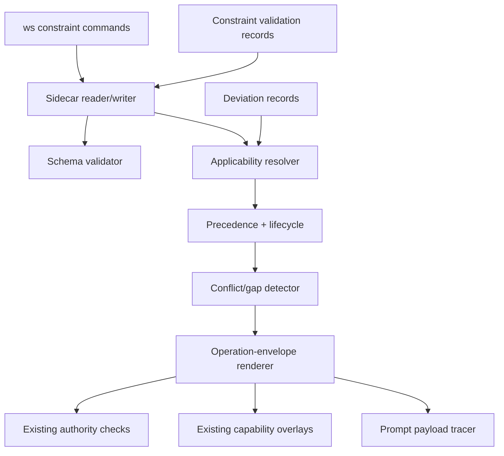

### Compilation precedence

1. Platform/system safety constraints
2. Work Studio kernel invariants
3. Explicit, current authority grants
4. Active project constraints
5. Work Object constraints
6. Component/artifact/operation constraints
7. Accepted deviations within exact scope
8. Preferences and candidate assumptions

Precedence does not mean “newer wins.” A lower-level `must` that conflicts with a higher-level `must` creates a conflict. The director or owning authority may supersede the higher rule only through its declared change path.

## 11. Validation architecture

### Four distinct claims

| Layer | Question | Evidence |
|---|---|---|
| Plan compliance | Would this plan respect the known envelope? | Static applicability, authority, capability, complexity, assumption review |
| Implementation compliance | Did the produced artifact satisfy inspectable constraints? | Diff, tests, schema, dependency, policy, review |
| Runtime compliance | Does behavior in the relevant environment remain within constraints? | Traces, metrics, logs, probes, browser/operational checks |
| Outcome effectiveness | Did the constraint and implementation produce the human-valued outcome? | Outcome observation, testimony, decision review |

NASA explicitly distinguishes verification from validation ([Systems Engineering Handbook](https://www.nasa.gov/reference/system-engineering-handbook-appendix/)). OpenTelemetry distinguishes traces, metrics, logs, and baggage as different signals rather than interchangeable proof ([official signals documentation](https://opentelemetry.io/docs/concepts/signals/)). Work Studio should likewise record the exact claim each check supports.

### Validation lifecycle

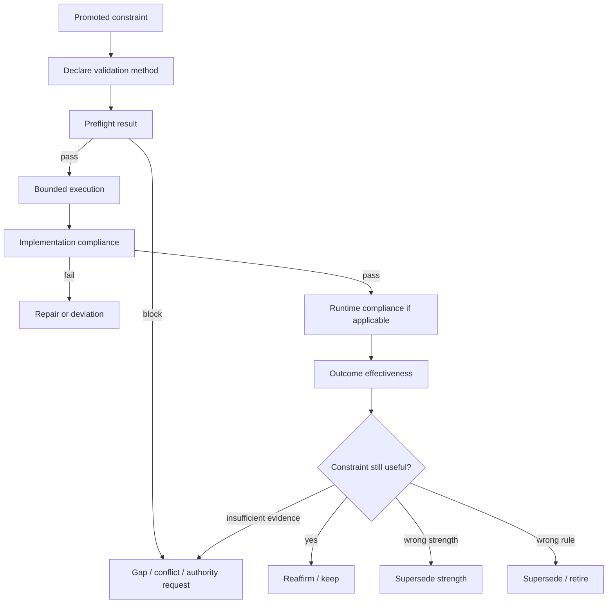

### Preflight checks mapped to skills

| Check | Primary owner | Deterministic support | Failure behavior |
|---|---|---|---|
| Intent and constraint envelope exist | `conduct-work-object` | required sections / promoted refs | Stop meaningful/high action |
| Invariant/prohibition conflict | `pressure-test-decision` | predicate and declared-conflict checks | Conflict object |
| Authority sufficient | conductor + owning skill | existing consequence/sensitivity gates | Request exact grant |
| Capability available | conductor | platform overlay + lazy detection | fallback or stop |
| Assumptions supported | `investigate-live-question` | provenance/freshness checks | gap or research route |
| Change bounded and reversible | `design-tracer-bullet` | changed-path and rollback fields | redesign |
| Complexity delta justified | `pressure-test-decision` | threshold checks | Decision Card |
| Verification available and independent enough | `verify-release-evidence` | verifier relation and check inventory | unverified gap |

### Candidate fitness functions

| Constraint | Mechanism | False-positive risk | False-negative risk | Execution point | Failure consequence |
|---|---|---|---|---|---|
| No dependency outside approved list | Lockfile diff against allowlist | Transitive or platform-specific package falsely rejected | Dynamic download/import missed | preflight + CI | block `must`, warn `should` |
| Read-only review does not mutate | Before/after Git + filesystem fingerprint in sandbox | Generated caches appear as mutation | External side effects outside fingerprint | after review | invalidate review; investigate |
| Accepted artifact has verification evidence | Artifact ref → Verification Record lookup | Evidence exists but is stale | Weak evidence satisfies presence check | transition gate | block meaningful release |
| Deployment has rollback reference | Runbook/command field and resolvable artifact | Rollback not applicable to immutable publish | Reference exists but procedure is unusable | release preflight | block or require deviation |
| Public UI routes meet accessibility checks | route inventory + automated axe-like check + human sample | Tool heuristic reports non-issue | Semantic/cognitive issues missed | verify | no full conformance claim |
| Durable memory has provenance and authority | schema + authority-ref resolver | Legitimate explicit preference lacks migrated ref | Side channel bypasses registry | write path | reject write |
| Generated adapters equal source generation | existing generator check | Intentional emergency patch rejected | Generator shares wrong assumption | CI / release | block distribution |
| Kernel paths remain inside repository | existing kernel verifier | Legitimate external reference treated as kernel path | Semantic data exfiltration not detected | CI | block kernel change |

WCAG 2.2 deliberately separates normative success criteria from informative techniques and warns that AAA is not suitable as a blanket whole-site policy ([W3C Recommendation](https://www.w3.org/TR/WCAG22/)). This is a useful pattern: a semantic constraint can have multiple mechanisms, and automated checks cannot justify a broader conformance claim than their coverage.

Policy-as-code should be introduced only when a stable predicate has repeated enforcement value. Kubernetes Validating Admission Policy separates abstract policy, parameters, binding, and actions such as Deny/Warn/Audit ([official documentation](https://kubernetes.io/docs/reference/access-authn-authz/validating-admission-policy/)); Work Studio can borrow that separation without adopting Kubernetes or CEL.

For high-consequence work, a compact assurance argument may link claim, context, strategy, evidence, and unresolved assumptions. The [Goal Structuring Notation Community Standard v3](https://scsc.uk/r1386.pdf) is an authoritative notation and practice guide for engineering arguments. **Recommendation:** use a small Markdown/YAML assurance record only when the strict profile demands it; do not require GSN diagrams for routine Work Objects.

## 12. Complexity governance

Complexity should be governed as a **change in obligations and failure surface**, not a single score. Counts are indicators; they are not commensurable units.

### Complexity dimensions

- components and boundaries;
- services and deployable units;
- state stores and schemas;
- external providers and credentials;
- long-running processes and schedules;
- environments and configuration variants;
- new failure/recovery modes;
- observability and on-call obligations;
- specialized knowledge required;
- manual review and coordination burden;
- generated/canonical duplication;
- coupling and migration/rollback cost.

### Complexity change record

```yaml
complexity_impact:
  schema_version: 1
  change_ref: WO-...
  baseline_ref: BLN-...
  components:
    added: []
    removed: []
    boundary_changes: []
  dependencies:
    runtime_added: []
    build_added: []
    providers_added: []
  state_and_operations:
    stores_added: []
    credentials_added: []
    environments_added: []
    monitoring_added: []
    recurring_tasks_added: []
  failure_surface:
    new_failure_modes: []
    recovery_paths: []
    rollback_cost: low
  knowledge_and_attention:
    concepts_director_must_understand: []
    specialist_knowledge_required: []
    estimated_manual_review_delta: ""
  justification:
    constraint_refs: []
    alternatives_rejected: []
    evidence_refs: []
  disposition: within_budget | decision_required | rejected
```

### Complexity dependency graph

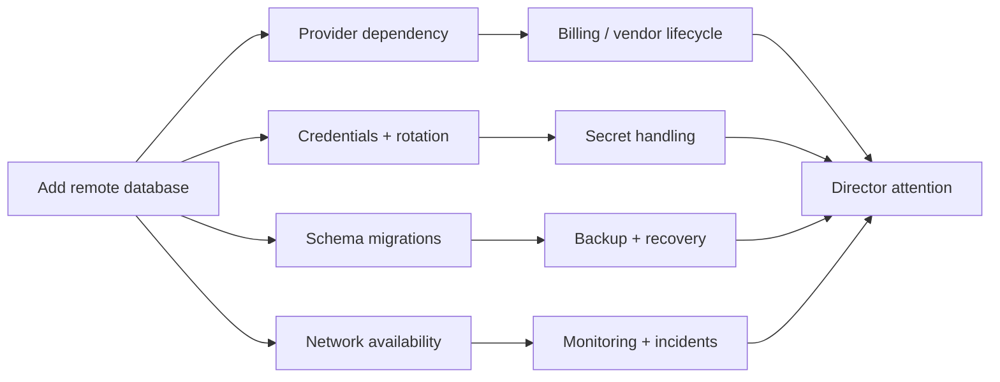

### Budget policy

Each project can declare threshold rules, for example:

```yaml
complexity_policy:
  no_new_standing_service_without:
    - demonstrated_need
    - owner
    - failure_and_recovery_plan
  director_decision_when:
    - new_state_store
    - new_external_provider
    - new_secret_class
    - recurring_manual_operation
  prefer_removal_or_substitution_when:
    - same_outcome_with_existing_component
```

Do not sum these into “complexity = 17.” A new schema and a new production credential are not equivalent. Instead:

- **hard thresholds** gate specifically named obligations;
- **trend indicators** show component/service/schema counts over time;
- **Decision Cards** explain material deltas;
- **outcome review** asks whether the added complexity bought the promised capability.

Ashby’s requisite variety warns that insufficient response variety cannot regulate diverse disturbances ([original book](https://ashby.info/Ashby-Introduction-to-Cybernetics.pdf)). This means “fewer components at all costs” is also wrong. Complexity is justified when it provides necessary response capability or isolates consequential failure. The governing question is whether added variety is legible, owned, and proportionate.

## 13. Director-facing visualization

Visualizations are derived projections; they do not become canonical state.

### Highest-value views

| View | Question answered | Canonical source | Interaction | Misinterpretation risk | Director action |
|---|---|---|---|---|---|
| Constraint hierarchy | What applies here and from where? | Constraint records + scope resolver | drill from operation to parent | arrows mistaken for automatic override | inspect source / open conflict |
| Constraint dependency graph | Why does this rule exist? | `rationale`, `depends_on`, evidence refs | select node for provenance | correlation shown as causation | revisit weak support |
| Conflict map | Which boundaries cannot all hold? | conflict view + validation | compare relaxation options | semantic incompatibility shown as proof | choose, research, or stop |
| Decision trace | Why was this built and did it work? | constraint, decision, artifact, validation, outcome refs | time/baseline filter | later evidence projected backward | accept/revisit |
| Candidate matrix | Which option fails differently? | Decision Card | sort only within one dimension | aggregate scoring hides non-compensable failures | select tradeoff |
| Complexity impact map | What new responsibility arrives? | complexity record + component ledger | expand obligations/failure paths | edge count treated as importance | accept/reject burden |
| Human-attention view | What needs me now? | conflicts, deviations, high consequence, gaps, triggers | acknowledge/route, not edit source | absence mistaken for system health | decide next frontier |
| Architectural-pressure view | Which constraints repeatedly fail? | deviation and violation history | filter scope/time | repeated exceptions automatically weaken rule | open method review |

### Director attention view

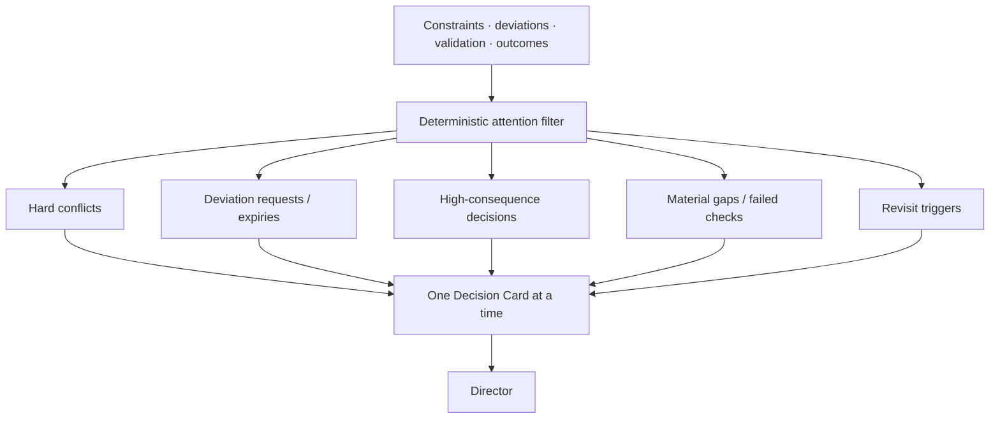

### Decision trace

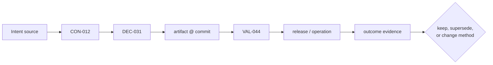

### Constraint satisfaction matrix

| Candidate | Local ownership (`must`) | No standing server (`must`) | Shared live mutation (`should`) | New obligations | Reversibility |
|---|---:|---:|---:|---|---|
| Filesystem + Git handoff | pass | pass | partial | merge discipline | high |
| Local SQLite index + file export | pass | pass | partial | schema migration | high |
| Managed remote database + local cache | deviation | fail | pass | provider, credentials, backup, monitoring | medium |

Do not calculate a total when a `must` fails. Among feasible candidates, the director compares tradeoffs; a weighted score is optional and should expose weights.

### Progressive disclosure

Level 1 shows the requested decision and consequence. Level 2 shows constraints, options, evidence, and obligations. Level 3 links exact repository records, validation commands, and source material. This preserves governability without hiding audit detail.

## 14. Current Work Studio gap analysis

### What already exists

**Repository observations:**

- Work Objects already require a narrative `## Constraints and non-goals` section through `references/WORK-OBJECT.md`, the template, and section validation.
- Lifecycle transitions have deterministic prohibitions and evidence prerequisites in `tools/ws/lifecycle.py`.
- `references/CONSEQUENCE-AUTHORITY.md` separates consequence from sensitivity, defines authority gates, and requires structured History entries for gated actions.
- `references/CAPABILITY-DEGRADATION.md` distinguishes `native`, `manual-fallback`, and `unsupported`; platform overlays and adapter generation carry these classifications.
- `WORKSPACE-DOCUMENTATION-CONTRACT.md` registers canonical artifacts, owners, stage triggers, provenance/freshness, supersession, and validation methods.
- `work-studio/kernel-manifest.yaml` exists and declares the portable kernel, platform mappings, path boundaries, and constitutional files.
- `tools/generate-adapters.py --check` passes on the inspected tree across Codex, Claude Code, and GitHub Copilot artifacts, manifests, and checksums.
- `tools/prompt_payload_tracer.py` computes declared dependency closure, rejects prohibited nodes, packages exact files, hashes payloads, and records payload size.
- The `ws` CLI currently exposes Work Object lifecycle, authority-related evidence/history, claim registration/inspection, epistemic lint, baseline capture/check, and conflict registration.
- `references/epistemic/taxonomy.yaml` is the canonical six-tag provenance taxonomy. Work Object ledgers accept bare tags; skill prose can use registered subtypes; claim `kind` is structured separately.
- Skills already mediate accepted deviations in prose, preserve dirty work, stop for material scope changes, and route verification/deployment separately.

These are not precursors to discard. They are most of the control substrate the constraint layer needs.

### What is missing

| Gap | Consequence | Smallest response |
|---|---|---|
| Constraints remain narrative and unaddressable. | A plan cannot name exactly which boundary it satisfies or violates. | Promote selected constraints to sidecars with stable IDs. |
| No canonical constraint taxonomy/schema. | Skills can use inconsistent force, category, and lifecycle language. | One small schema and normative reference. |
| No scope/applicability resolver. | Project/kernel rules may be omitted or silently overridden. | Deterministic exact-scope inheritance for promoted records. |
| No first-class deviation record/expiry. | Accepted exceptions can become permanent or hard to audit. | Sidecar deviation objects with exact constraint refs and triggers. |
| Existing conflict register is epistemic, not a constraint relaxation model. | Contradictory boundaries lack option/deviation semantics. | Extend or add a constraint-conflict view only after schema tracer. |
| No operation envelope. | Agent prompts may omit applicable authority, constraints, capabilities, or baseline. | Compile an ephemeral envelope and feed it into the prompt tracer. |
| No complexity-impact record. | New infrastructure burden can arrive hidden inside implementation detail. | Add a Decision Card section first; structure only repeated cases. |
| Validation is not constraint-addressed. | Tests prove behavior but do not directly show which constraint and baseline they cover. | Add constraint refs to verification records. |
| No director-facing constraint projection. | Current evidence is inspectable but fragmented. | Generate Markdown/HTML projection after data exists. |

### Working-tree qualification

At research time, `git status --short` showed modifications to `tests/test_ws_create.py` and `tools/ws/identity.py`, plus untracked epistemic-pressure-dashboard fixture, token CSS, dashboard test, and `tools/ws/dashboard_signals.py`. These belong to other work and were neither modified nor interpreted as stable architecture. The report’s repository observations are scoped to the inspected state and named commands.

The current tree also produces configuration-scoped validation noise: an epistemic lint run has legacy-token/fixture findings, and the full conformance verifier has fixture and generation-preamble expectation mismatches. Those observations support baseline-bound claims and policy/mechanism separation; they do **not** establish that the stable release is broken. This report does not prescribe fixes for unrelated work.

### Work Studio integration view

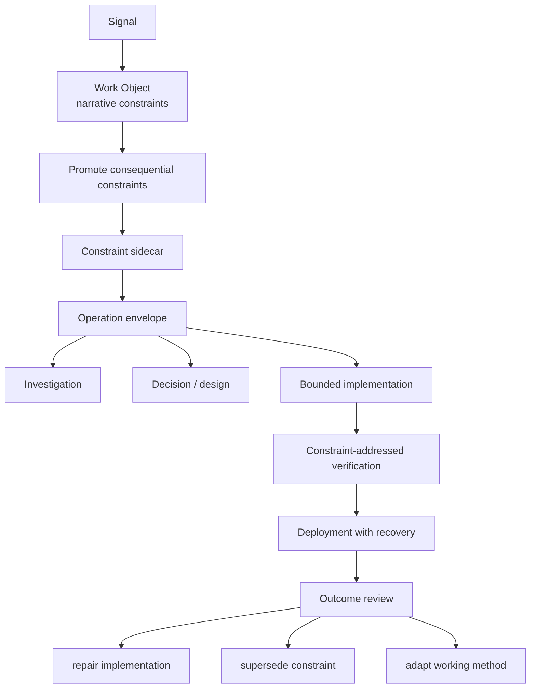

## 15. Skill impact analysis

The existing skills should remain the behavioral owners. Constraint preparation and audit are cross-cutting schemas/lenses before they are new conversational skills.

| Skill | Constraint role | Inputs | Outputs | Authority risk | Recommended change |
|---|---|---|---|---|---|
| `turn-signal-into-work` | Preserve direction and propose initial candidates. | Exact signal, source, consequence cues, minimal context. | Verbatim intent; explicit vs inferred candidates; ambiguities. | Turning a preference into durable `must`; assigning consequence from emotional intensity. | **Amend:** emit extraction proposal; no registration; cite source phrase; route confirmation to conductor. |
| `conduct-work-object` | Custodian of promotion, applicability, routing, and continuity. | Work Object, project/kernel constraints, grants, capabilities, baseline. | Registered constraint refs; operation envelope; lifecycle/deviation updates. | Silent inheritance omission; exceeding authority because actor is capable. | **Amend:** own constraint write path, compile envelope, explain actor selection, stop on unresolved `must`. |
| `grilling-session` | Discover hidden boundaries at one Decision Frontier. | Context Card, existing constraints/evidence, active tension. | One clarified constraint/tradeoff/unknown at a time. | Asking director factual questions discoverable in repo; generating rule volume. | **Amend lens:** classify question as discoverable fact, domain claim, or human tradeoff; keep one frontier. |
| `pressure-test-decision` | Test conflicts and candidates that fail differently. | Envelope, options, evidence, complexity deltas. | Conflict explanation, alternative shapes, relaxation options, Decision Card. | Performative criticism; weighted score concealing hard failure. | **Amend:** require structurally distinct candidates and `satisfies/violates/assumes/obliges/reverses`. |
| `design-tracer-bullet` | Test the riskiest uncertain constraint or mechanism. | Accepted constraint, uncertainty, exit signal, authority. | Bounded experiment envelope and observation plan. | Building architecture rather than buying evidence. | **Amend:** name exact uncertain constraint and what result would strengthen, relax, or reframe it. |
| `implement-bounded-change` | Execute within the compiled envelope. | Baseline-bound operation envelope and accepted tracer. | Change, direct check evidence, deviations/gaps. | Scope drift, hidden dependency, treating implementation choice as accepted constraint. | **Amend:** preflight envelope; compare final diff to allowed paths/dependencies; stop on material deviation. |
| `verify-release-evidence` | Validate promoted constraints by declared method and claim scope. | Artifact, baseline, constraint refs, evidence contract. | Per-constraint result: pass/fail/inconclusive/not-run; independence and limits. | Self-verification; passing a proxy while claiming semantic compliance. | **Amend:** matrix each constraint to mechanism, baseline, environment, evidence, limitation, verifier relation. |
| `deploy-with-recovery` | Enforce deployment prerequisites, recovery, and post-release observation. | Release envelope, authority, rollback constraint, runtime checks. | Deployment evidence, deviation, recovery/observation state. | Treating implement/merge authority as deploy authority; unusable rollback. | **Amend:** resolve deployment-scoped constraints and exercise/justify rollback evidence. |
| `diagnose-production-incident` | Use constraints to bound containment while recording emergency exceptions. | Incident state, safety/data constraints, existing grants, runtime evidence. | Containment action, temporary deviation, causal gaps, prevention candidate. | Urgency laundering authority; permanent emergency exception. | **Amend:** permit only predeclared emergency authority; expiring deviation and after-action review required. |
| `investigate-live-question` | Establish hidden/contested constraint facts. | One falsifiable claim, source/evidence requirement, scope. | Observed/documented candidate, contradiction, or gap. | Treating recommendation as domain rule; stale source. | **Amend:** return candidate status and constraint implication; never register policy directly. |
| `review-outcome-and-adapt` | Distinguish implementation failure from constraint failure. | Intended outcome, constraint, validation, runtime and testimony evidence. | `implementation_failed`, `constraint_wrong`, `strength_wrong`, `verification_inadequate`, or unresolved. | Outcome bias after one result; erasing original rationale. | **Amend:** require attribution and bounded scope; propose supersession, never silent edit. |
| `maintain-working-method` | Govern promotion from repeated local evidence to reusable policy. | Constraint/deviation history, bounded tests, contrary evidence. | Trial, revised, retired, or promoted method candidate. | Premature universalization; exception becoming default. | **Retain + amend:** treat cross-project constraint promotion as Workflow Candidate requiring evidence and owner decision. |
| `govern-scorecards` | Surface constraint/outcome dimensions without aggregation. | Per-constraint validation/outcome evidence, exceptions, gaps. | Non-compensable failures, trends, method candidates. | Goodhart effects, gaming, composite score hiding violations. | **Amend:** constraint metrics remain diagnostic; no automatic authority or global agent rank. |
| `track-components` | Project applicable constraints and recurring violations by component. | Component pointers, scope relations, validation/deviation history. | Component constraint view, architectural pressure signal. | Stale mapping; treating inherited projection as a copied source. | **Amend:** store pointers/selectors, not duplicate constraints; reopen on constraint or component drift. |

### Skill disposition

- **Retain:** all 14 named skills.
- **Amend now:** conductor, signal capture, bounded implementation, release verification.
- **Amend after tracer evidence:** grilling, pressure testing, tracer bullet, deployment, incident, outcome/method/scorecard/component views.
- **Split:** none yet.
- **Supplement:** deterministic constraint schema/register/inspect/validate/envelope commands; one optional conflict-reconciliation lens if existing pressure testing proves insufficient.

## 16. New skills and deterministic services

### New skill assessment

| Candidate | Decision | Reason |
|---|---|---|
| `prepare-constraint-envelope` | **Reject as a skill now** | This is conductor behavior plus deterministic compilation. A separate conversational owner would duplicate routing authority. |
| `audit-constraint-compliance` | **Defer skill; add verification lens** | `verify-release-evidence` already owns evidence-based compliance. |
| `reconcile-constraint-conflict` | **Test first as pressure-test lens** | A dedicated skill is justified only if conflict sessions have distinct persistent workflow needs. |
| `review-accepted-deviation` | **Use revisit trigger + conductor/outcome review** | Mostly lifecycle and validation. |
| `assess-complexity-impact` | **Use Decision Card schema/lens first** | Structure can be produced by pressure-test/design skills without new conversation. |

### Smallest deterministic layer

Build in this order:

```text
ws constraint validate <file|work-object>
ws constraint inspect <id> [--effective-for <operation>]
ws constraint register <work-object> --from <yaml>
ws constraint envelope <work-object> --operation <yaml>
ws deviation register <work-object> --from <yaml>
ws deviation inspect <id>
ws revisit list [--due]
```

`register` commands are mutations and must use the existing optimistic-concurrency and authority patterns. `inspect`, `validate`, and `envelope` are read-only. Do not build `constraint relax` as a direct mutation: relaxation is a decision producing either a deviation or a superseding constraint. Do not build `constraint conflict` until declarative conflicts and tracer evidence show deterministic value. Do not build a long-running constraint service.

### Deterministic versus semantic boundary

**Deterministic:**

- schema and enum validation;
- unique ID and reference resolution;
- exact scope matching/inheritance;
- active/expired/superseded status;
- `must` without validation method;
- deviation authority/scope/expiry;
- baseline and commit identity;
- registered predicate execution;
- constraint-to-verification trace completeness;
- operation path/dependency diffs;
- serialization of the effective envelope.

**LLM/human:**

- whether prose implies a constraint;
- category/scope ambiguity;
- whether a semantic conflict truly exists;
- whether two architecture candidates are meaningfully different;
- whether creative intent is preserved;
- whether operational burden is acceptable;
- whether an outcome justifies rule revision.

Open Policy Agent can produce versioned policy decisions and decision logs with input and bundle revision ([official documentation](https://www.openpolicyagent.org/docs/management-decision-logs)), but it also entails a policy language, bundles, and often a control-plane shape. Work Studio should borrow versioned decision evidence, not adopt OPA until numerous stable cross-project predicates justify it.

## 17. Data model and schemas

### Constraint schema

```yaml
$schema: "https://json-schema.org/draft/2020-12/schema"
title: Work Studio Constraint
type: object
required: [schema_version, id, statement, category, strength, scope, origin, authority, lifecycle, validation]
properties:
  schema_version: {const: 1}
  id: {type: string, pattern: "^CON-[A-Za-z0-9._-]+$"}
  statement: {type: string, minLength: 1}
  category:
    enum: [invariant, obligation, prohibition, preference, assumption, experiment]
  strength:
    enum: [must, should, may]
  facets:
    type: array
    uniqueItems: true
    items:
      enum: [functional, quality, resource, domain, architecture, creative, security, privacy, operations]
  scope:
    type: object
    required: [kind, ref]
    properties:
      kind:
        enum: [kernel, project, work_object, component, artifact, actor, tool, operation, environment, memory]
      ref: {type: string, minLength: 1}
      selector: {type: string}
    additionalProperties: false
  origin:
    type: object
    required: [actor, kind, source_ref, created_at]
    properties:
      actor: {type: string}
      kind:
        enum: [explicit, observed, documented, inferred, recommended, assumed]
      source_ref: {type: string}
      source_phrase: {type: string}
      created_at: {type: string, format: date-time}
    additionalProperties: false
  rationale: {type: string}
  evidence_refs:
    type: array
    items: {type: string}
  depends_on:
    type: array
    items: {type: string}
  authority:
    type: object
    required: [owner, may_change, deviation_requires]
    properties:
      owner: {type: string}
      may_change: {type: array, items: {type: string}}
      deviation_requires: {type: string}
    additionalProperties: false
  validation:
    type: object
    required: [kind]
    properties:
      kind:
        enum: [predicate, test, inspection, human_review, runtime_observation, outcome_review, none_yet]
      mechanism_ref: {type: string}
      criterion: {type: string}
    additionalProperties: false
  lifecycle:
    type: object
    required: [status, valid_from]
    properties:
      status:
        enum: [candidate, active, under_review, deviated, expired, superseded, retired, rejected]
      valid_from: {type: string, format: date-time}
      valid_until: {type: [string, "null"], format: date-time}
      revisit_trigger: {type: [string, "null"]}
      supersedes: {type: [string, "null"]}
    additionalProperties: false
additionalProperties: false
```

The schema is smaller than the prompt proposal because epistemic detail stays in referenced evidence. `origin.kind` is the constraint’s registration basis, not a substitute for the six-lane Evidence Ledger.

### Validation result

```yaml
constraint_validation:
  schema_version: 1
  id: VAL-20260728-001
  constraint_ref: CON-local-first
  subject_ref: artifact:dashboard@3918719
  baseline_ref: BLN-20260728T091500Z
  phase: implementation
  method:
    kind: test
    mechanism_ref: tests/test_local_first.py
    executed_at: "2026-07-28T09:30:00Z"
    environment: macos-local
  result: pass
  evidence_refs: [CLM-100]
  verifier:
    actor: codex-verifier
    relation_to_producer: independent_actor_same_toolchain
  limitations:
    - "Does not establish offline behavior on Windows."
  valid_for:
    commit: "3918719..."
    environment: macos-local
```

### Operation envelope schema essentials

```yaml
operation_envelope_contract:
  required:
    - operation_id
    - work_object_ref
    - baseline_ref
    - intent
    - applicable_constraints
    - scope
    - authority
    - required_capabilities
    - verification_obligations
    - escalation_triggers
  invariants:
    - "Every active applicable must constraint is included or compilation fails."
    - "Every deviation references an included constraint and valid authority."
    - "No granted action exceeds both platform and Work Studio authority."
    - "Unresolved must conflicts make executable=false."
```

### Constraint/decision relationship

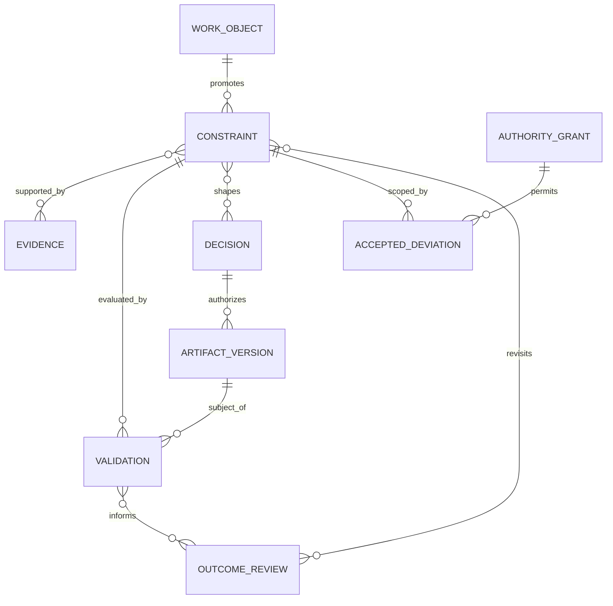

## 18. Repository architecture

Do not create a parallel top-level `constraints/` platform. Keep canonical runtime state project-local and shared definitions in the existing kernel.

```text
references/
  CONSTRAINT-MODEL.md                    # accepted normative semantics, later
  schemas/
    constraint.schema.json               # shared schema, if current convention accepts it
    deviation.schema.json
    operation-envelope.schema.json

tools/ws/
  constraint.py                          # read/write/resolve
  deviation.py                           # read/write/expiry
  constraint_validation.py               # result checks

.work-studio/
  objects/YYYY/MM/<id>-<slug>.md          # narrative capture + refs
  constraints/<work-object-id>/
    CON-*.yaml                            # promoted project-local records
  deviations/<work-object-id>/
    DEV-*.yaml
  validations/<work-object-id>/
    VAL-*.yaml

fixtures/
  constraint-*.md|yaml                    # behavioral scenarios

tools/prompt-tracer-modules/
  operation-envelope.md                   # only after tracer proves shape
```

Final paths must be reconciled with the Canonical Artifact Registry through an ADR and explicit owner approval; the tree above is a recommendation, not current authority.

The existing ADR approach is well aligned with keeping constraints and mechanisms separate. Michael Nygard’s original [Architecture Decision Record proposal](https://www.cognitect.com/blog/2011/11/15/documenting-architecture-decisions) favors small records of context, decision, status, and consequences. Constraint records should point to such decisions when architecture is chosen; they should not absorb the decision’s alternatives and consequences wholesale.

### Shared versus project-local

| Shared kernel | Project-local |
|---|---|
| taxonomy, schemas, applicability semantics | promoted constraint instances |
| authority and consequence profiles | deviations and grants |
| CLI validators/resolver | effective envelopes (prefer ephemeral) |
| stable fitness-function interfaces | project predicate configuration |
| skill instructions and adapter mappings | validation results |
| behavioral fixtures | complexity impact records |

Generated adapters receive semantics through deterministic generation. They do not contain independent constraint registries. `tools/prompt_payload_tracer.py` should package only the effective operation envelope and the selected skill’s dependency closure, recording source hashes and baseline identity.

## 19. Authority model

### Actor rights

| Action | Director | Conductor | Specialist | Review / verification agent | Deterministic service | Domain expert |
|---|---|---|---|---|---|---|
| Propose | yes | yes | yes | yes | emit detected candidate only | yes |
| Infer | yes | yes | yes | yes | no semantic inference | yes |
| Register | authorize; direct where permitted | write custodian | no; route | no; route | executes authorized write | no; route |
| Change/supersede | final for owned rules | executes accepted change | propose | propose | validates | advise within expertise |
| Relax `must` | accountable owner only | records exact grant | no | no | rejects absent grant | advise |
| Approve deviation | accountable authority per scope | low-risk only if predelegated | no | no | checks grant | no unless explicitly owner |
| Validate | human semantic outcome | structural coordination | self-check only disclosed | direct/independent check | exact predicate | domain judgment |

### Capability, expertise, permission, authority, accountability

- **Capability:** can the actor perform the operation?
- **Expertise:** is there evidence the actor can judge this domain?
- **Permission:** is this operation allowed in the current environment?
- **Authority:** may this actor decide or commit the consequence?
- **Accountability:** who owns the outcome and residual risk?

These axes may coincide but never imply each other.

### Progressive action levels

#### Authority map

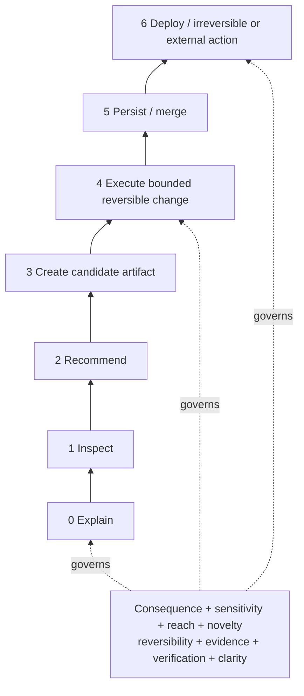

Levels describe action power, not personal trust. Grants are always:

```yaml
authority_grant:
  actor: ""
  maximum_level: execute_bounded_reversible
  operation_refs: []
  allowed_scope: []
  prohibited_scope: []
  constraint_refs: []
  evidence_reviewed: []
  granted_by: ""
  granted_at: ""
  expires_when: ""
```

Recommended default:

- low + reversible + ordinary: through level 4 within exact workspace scope;
- meaningful: level 3 by default; level 4 with accepted tracer/envelope; human approves level 5 when durable/public;
- high, restricted, external, destructive, financial, safety, or irreversible: explicit human authority for each consequential transition; independent/deterministic verification and recovery before level 6.

NIST zero-trust guidance rejects implicit trust based solely on location or ownership ([SP 800-207](https://doi.org/10.6028/NIST.SP.800-207)). The transferable principle is continuous, resource-specific authorization, not importing enterprise zero-trust infrastructure into a local repository. GitHub’s protected-branch model shows a practical enforcement option: required checks, code-owner review, stale-approval dismissal, and approval by someone other than the latest pusher can be configured at the persistence boundary ([GitHub documentation](https://docs.github.com/en/repositories/configuring-branches-and-merges-in-your-repository/managing-protected-branches/about-protected-branches)).

## 20. Epistemic integration

Constraint governance answers **what should remain true and who may change it**. Epistemic governance answers **why we believe it applies, what evidence supports compliance, what remains uncertain, and how fresh that basis is**.

Do not embed full epistemic status in every constraint. Reference shared evidence, claims, decisions, conflicts, and baselines:

```text
Constraint
  ├─ origin.kind: explicit | observed | documented | inferred | recommended | assumed
  ├─ origin.source_ref
  ├─ evidence_refs → Evidence Ledger / claim sidecar
  ├─ decision refs → accountable acceptance
  ├─ validation refs → baseline-bound result
  └─ lifecycle trigger → freshness / outcome review
```

### Interaction rules

1. An LLM-generated constraint begins as `candidate` with `origin.kind: inferred` or `recommended`.
2. An observed system fact can support an `invariant`, but its scope and baseline must be explicit.
3. Constraint strength does not express evidence confidence.
4. A documented rule can be stale or conflict with current code; canonical ownership and freshness must be checked.
5. A validation pass is evidence only for its subject, baseline, environment, method, and claim.
6. Contradictory evidence remains visible; it may create a constraint review trigger without automatically changing the rule.
7. A preference can be explicit and authoritative even though it is not an empirical fact.
8. A deviation is a decision/authority record, not disconfirming evidence by itself.
9. Repeated violations are evidence of architectural pressure; the reason may be bad implementation, bad enforcement, a wrong rule, or a changed environment.

### Policy versus mechanism

| Layer | Example | Storage |
|---|---|---|
| Constraint | Reviews do not mutate artifacts. | Constraint record |
| Policy | Meaningful/high reviews are read-only `must`; low reviews `should` be read-only. | project/WO profile or scoped constraint |
| Mechanism | Reviewer receives read-only filesystem plus before/after fingerprint. | tool/platform config + validation mechanism ref |
| Evidence | Fingerprint unchanged at commit and environment. | validation/claim record |

This separation matters because mechanism failures do not automatically invalidate the semantic constraint, and changing tools does not require changing the value.

### Learning loops

- **Single loop:** repair implementation or enforcement so the active constraint is satisfied. Route to `implement-bounded-change`.
- **Double loop:** ask whether the constraint, strength, scope, or assumption is still appropriate. Route through `review-outcome-and-adapt` and a decision.
- **Method loop:** ask whether Work Studio extracts, promotes, validates, or retires constraints well. Route a bounded Workflow Candidate to `maintain-working-method`, with scorecard and component evidence.

Argyris’s original account of double-loop learning distinguishes correcting action within governing variables from questioning those variables ([“Double Loop Learning in Organizations”](https://hbr.org/1977/09/double-loop-learning-in-organizations)). “Triple-loop” terminology is less standardized; Work Studio should call the third level **method-loop learning** and define it operationally rather than claim a settled theory.

## 21. Failure taxonomy and controls

Safety analysis methods are useful when applied proportionally. FMEA asks how components fail and what downstream effects follow ([NASA software engineering guidance](https://swehb.nasa.gov/spaces/SWEHBVD/pages/102695706/8.05%2B-%2BSW%2BFailure%2BModes%2Band%2BEffects%2BAnalysis)). STPA treats safety as a control problem involving inadequate control and unsafe interactions rather than only component failure ([MIT STPA Handbook](https://psas.scripts.mit.edu/home/books-and-handbooks/)). Work Studio should use the combined question “what failed, what interaction made it consequential, and what control/recovery is proportionate?”—not require a formal hazard analysis for ordinary creative work.

| Failure | Prevention | Detection | Containment | Recovery | Human escalation |
|---|---|---|---|---|---|
| **Intent: misinterpreted direction** | Preserve exact wording; source phrase per candidate. | Director corrects Context/Decision Card; candidate differs from quote. | Keep candidates provisional. | Re-extract; supersede wrong interpretation. | Ask one meaning-bearing question when outcome changes. |
| **Intent: lost nuance** | Store creative/emotional intent separately from observable hypotheses. | Options satisfy mechanics but director rejects feel/meaning. | Do not promote translation to universal rule. | Run bounded creative review/tracer. | Director judges semantic fit. |
| **Intent: hidden value judgment** | Label inferred values; distinguish domain fact from preference. | No authoritative source for normative statement. | Block durability. | Reclassify as recommendation or obtain decision. | Director owns value. |
| **Constraint: missing constraint** | Hidden-constraint inspection and preflight. | Plan introduces ungoverned obligation or failed check. | Stop affected consequential path. | Register/promote if justified; recompile. | Escalate if tradeoff/authority changes. |
| **Constraint: incorrect strength** | Three precise strengths; cite source. | Frequent unjustified deviations or director correction. | Treat disputed rule as under review, not erased. | Supersede strength with rationale. | Owner approves `must` change. |
| **Constraint: conflicting constraints** | Inheritance/conflict preflight. | Predicate failure or semantic conflict report. | Mark envelope non-executable if `must`. | Research, alternative, deviation, or supersession. | Decision Card to accountable owner. |
| **Constraint: stale constraint** | Freshness/revisit trigger; baseline binding. | Source, environment, or assumption changed. | Stop claims depending on freshness. | Revalidate, reaffirm, supersede, or retire. | Owner for consequential rule. |
| **Constraint: unverified domain rule** | `origin.kind` and evidence reference required. | Claim lacks primary/expert basis. | Keep candidate; do not enforce as policy. | Investigate or expert review. | Director decides whether to wait or accept scoped uncertainty. |
| **Planning: scope drift** | Exact operation envelope and allowed paths/actions. | Diff/tool trace outside scope. | Stop mutation; preserve work. | Revert only authorized agent change or propose deviation. | Exact expansion request. |
| **Planning: constraint omission** | Deterministic applicability compilation. | Effective set differs from prompt/plan. | Invalidate preflight. | Recompile and replan. | Only if conflict emerges. |
| **Planning: overengineering** | Complexity thresholds and distinct simple candidate. | Unjustified service/store/provider appears. | Block adoption/merge. | Remove or compare to existing mechanism. | Director accepts new obligation. |
| **Planning: premature optimization** | Require measured bottleneck/need. | Optimization claim lacks baseline evidence. | Keep experiment isolated. | Benchmark or remove. | Only for material architecture change. |
| **Execution: constraint violation** | Deterministic guard where possible; continuous checks. | Test, diff, runtime signal, review. | Stop/recover affected path. | Repair, rollback, or deviation. | `must` or material consequence. |
| **Execution: unauthorized deviation** | Scoped grants resolved before action. | Action differs from envelope/grant. | Revoke continuation; quarantine candidate artifact. | Inspect, revert/re-authorize, record incident. | Always when consequential. |
| **Execution: hidden dependency** | Dependency and network diff checks. | Lockfile/import/runtime trace changes. | Do not persist/release. | Remove or justify with complexity record. | New provider/service/credential. |
| **Execution: implementation drift** | Baseline and exit criteria. | Final artifact no longer matches accepted design. | Route back to design/decision. | Restore boundary or accept successor. | Material shape/behavior. |
| **Verification: self-verification** | Declare producer–verifier relation; use direct checks. | Same actor/assertion with no external predicate. | Downgrade evidence, not necessarily artifact. | Independent or deterministic verification. | High consequence or disputed result. |
| **Verification: wrong evidence** | Claim-to-method contract. | Evidence proves proxy, wrong environment, or stale baseline. | Mark inconclusive. | Execute relevant check. | If action cannot wait. |
| **Verification: semantic constraint untested** | Human-review method and observable criteria. | Only structural checks exist. | No semantic compliance claim. | Director/domain review or outcome tracer. | Appropriate authority/expert. |
| **Verification: false confidence** | Result enums plus limitations; no aggregate confidence. | Contradictory runtime/outcome evidence. | Suspend broad claim. | Narrow scope and revalidate. | Material residual risk. |
| **Governance: authority drift** | Per-operation grants and expiry. | Action level exceeds grant or new scope. | Stop and audit. | New exact grant or rollback. | Always consequential. |
| **Governance: rubber-stamp approval** | Decision Card includes alternatives, unknowns, obligations. | Approval without evidence reviewed/scope. | Do not treat as structured grant. | Re-present minimum decision. | Director confirms with exact scope. |
| **Governance: constraint bureaucracy** | Promotion threshold and burden metrics. | Records grow while violations/decisions do not improve. | Pause new taxonomy/fields. | Retire redundant rules; simplify schema. | Method review. |
| **Governance: excessive review burden** | Proportional profiles; management by exception. | Latency and interruption metrics rise. | Batch low-risk signals; preserve high-risk gates. | Adjust profile, not evidence truth. | Director selects acceptable burden. |
| **Learning: outcome bias** | Predeclare hypothesis and success signal. | Rule changed because result was good/bad without causal basis. | Keep original record. | Gather discriminating evidence. | Consequential method change. |
| **Learning: premature generalization** | Scope every test; contrary-evidence review. | One project result promoted globally. | Keep Workflow Candidate local. | Replicate or narrow. | Kernel promotion owner. |
| **Learning: failure to update** | Revisit queue and due triggers. | Trigger overdue; repeated known failure. | Flag attention; block stale high-risk use. | Review and supersede/retire. | Owner if materially stale. |
| **Learning: temporary becomes permanent** | `valid_until`/trigger required for assumptions/experiments. | Expired record still compiled. | Resolver excludes it or makes envelope non-executable if relied on. | Reaffirm with evidence or remove dependency. | Owner for renewal. |

Defense in depth means complementary controls, not duplicated prompts: semantic instruction, deterministic preflight, restricted execution, independent/deterministic verification, append-only records, and recovery. NIST SSDF similarly frames secure practices as a core set integrated into an SDLC rather than a replacement lifecycle ([SP 800-218](https://doi.org/10.6028/NIST.SP.800-218)).

## 22. Tracer bullets

Each tracer is a bounded experiment; none authorizes production infrastructure.

### Tracer 1 — Natural-language constraint extraction

- **Hypothesis:** An LLM can preserve direction and produce a small, correctable set of explicit and inferred candidates without manufacturing `must` rules.
- **Input:** “I want a local-first governance dashboard that I can understand visually and maintain without a backend.”
- **Scope:** One synthetic Work Object; no implementation.
- **Steps:** preserve quote; extract outcome/candidates; inspect current local-first/project facts; label explicit/inferred; surface ambiguity; ask at most one decision-bearing question.
- **Artifacts:** extraction YAML, rendered Director Card, correction diff.
- **Success:** every candidate has source phrase/basis; `local-first` and `without a backend` remain explicit; “visually understandable” translations remain inferred; no unrelated constraint is registered.
- **Failure:** preference promoted to `must` without authority; more than one avoidable factual question; creative intent disappears.
- **Evidence:** exact input/output, user corrections, schema validation.
- **Rollback:** delete synthetic candidate file; no canonical mutation.
- **Uncertainty resolved:** whether extraction shape is usable before a registry exists.

### Tracer 2 — Architecture candidate comparison

- **Hypothesis:** A constraint matrix makes filesystem-only, local SQLite index, and remote database candidates differ by obligations and reversibility rather than sophistication.
- **Scope:** Design analysis only.
- **Steps:** compile must/should set; generate three structural candidates; record satisfied/violated constraints, assumptions, operations, failure modes, rollback, unknowns; refuse aggregate ranking across failed `must`.
- **Artifacts:** Decision Card, satisfaction matrix, complexity records.
- **Success:** remote option exposes provider/network/credentials/backup; SQLite exposes schema/index rebuild; filesystem exposes query/concurrency limits; recommendation follows evidence and intent.
- **Failure:** remote database wins because “scalable”; options are cosmetic variants; hard failure averaged away.
- **Evidence:** source-backed capability facts and repository baseline.
- **Rollback:** none; analysis only.
- **Uncertainty resolved:** whether the card helps the director identify the actual tradeoff.

### Tracer 3 — Unauthorized complexity

- **Hypothesis:** The envelope and diff checks detect a proposed queue/service/database outside an accepted bounded change.
- **Scope:** Synthetic implementation branch or fixture.
- **Steps:** authorize a file-only change; have candidate implementation introduce a dependency/service manifest; run dependency/path/complexity preflight; require exact deviation.
- **Artifacts:** operation envelope, synthetic diff, failed validation, deviation proposal.
- **Success:** no silent persistence; new operational obligations are enumerated; implementation can continue only after removal or exact authority.
- **Failure:** change passes because tests pass; generic “just execute” broadens scope.
- **Evidence:** Git diff, lockfile/config scan, validation output.
- **Rollback:** discard only tracer-created change.
- **Uncertainty resolved:** which deterministic checks catch hidden complexity with acceptable false positives.

### Tracer 4 — Semantic constraint conflict

- **Hypothesis:** The system surfaces the incompatibility among local-only mutable state, simultaneous remote shared access, and no server without pretending a formal proof.
- **Scope:** One conflict record and Decision Card.
- **Steps:** register synthetic constraints; resolve applicability; explain smallest found conflict; produce Git handoff, local coordinator, and managed remote options; name relaxations and authority.
- **Artifacts:** conflict YAML, three option cards.
- **Success:** no constraint silently disappears; analysis says “smallest found,” not globally minimal; only the necessary human tradeoff is asked.
- **Failure:** factual question delegated to director; one fashionable option; relaxation changes unrelated scope.
- **Evidence:** exact constraints, architecture consequences, director comprehension response.
- **Rollback:** retire synthetic records.
- **Uncertainty resolved:** whether existing `pressure-test-decision` lens suffices or a new conflict skill is justified.

### Tracer 5 — Outcome-driven constraint revision

- **Hypothesis:** Review can distinguish implementation failure, constraint error, wrong strength, and inadequate verification.
- **Scope:** A reversible synthetic feature governed by one experimental constraint.
- **Steps:** predeclare outcome and validation; implement; inject one of four failure cases; run compliance and outcome review; produce disposition.
- **Artifacts:** constraint, validation, outcome, supersession proposal.
- **Success:** original rule remains; result is one of the four explicit dispositions with evidence; no generalization beyond scope.
- **Failure:** bad outcome automatically deletes rule; passing tests are treated as user value.
- **Evidence:** predeclared hypothesis, execution result, user/system outcome observation.
- **Rollback:** revert feature; expire experiment.
- **Uncertainty resolved:** whether the learning loop is operational rather than rhetorical.

### Tracer 6 — Provider replacement and capability degradation

- **Hypothesis:** The same semantic envelope routes across two platform adapters while preserving stricter constraints and exposing unavailable capabilities.
- **Scope:** Read-only inspection plus candidate artifact.
- **Steps:** package identical scenario for two adapters; compare effective capabilities, prompt closure, and authority; simulate one unsupported/manual fallback.
- **Artifacts:** two prompt-tracer packages, envelope hashes, degradation record.
- **Success:** core constraint semantics match; platform mechanism differs visibly; no false verification.
- **Failure:** adapter rewrites authority; missing tool silently skipped; full unrelated prompt context loads.
- **Evidence:** package manifests, hashes, adapter overlays, expected fixture outcomes.
- **Rollback:** delete temporary packages.
- **Uncertainty resolved:** whether the operation envelope preserves provider replaceability.

## 23. Evaluation framework

Metrics are diagnostic and scoped. They must not automatically expand agent authority or collapse into a studio score.

### Technical and traceability measures

| Measure | Definition | Interpretation caution |
|---|---|---|
| Promoted constraint coverage | consequential decisions with all shaping `must/should` constraints referenced / sampled decisions | 100% may mean over-promotion. |
| Trace completeness | promoted constraints linked to source, decision where needed, validation, and outcome where due | Presence does not prove evidence quality. |
| Violation rate | failed active-constraint validations / executed validations, by category/scope | More testing can increase observed rate beneficially. |
| Unauthorized deviation rate | actions outside envelope without valid deviation / consequential operations | Any severe case matters more than average. |
| Verification coverage | constraints with relevant executed method / active constraints requiring validation | Human-semantic constraints need qualitative review. |
| Baseline-binding rate | validations naming exact artifact/version/environment / validations | A hash cannot establish semantic relevance. |
| Rollback success | exercised successful recoveries / attempted recoveries | Small samples; distinguish test from incident. |
| Scope drift | operations with changed paths/actions outside envelope / operations | Report magnitude and consequence. |

### Operational and complexity measures

| Measure | Definition |
|---|---|
| Hidden obligation rate | obligations discovered after approval / material changes |
| Decision latency | time from surfaced material conflict to disposition, by profile |
| Review burden | director interruptions and active review minutes per meaningful outcome |
| Complexity delta | counts and named obligations added/removed per change, never one total |
| Revisit completion | due triggers reviewed by due window / due triggers |
| Deviation recurrence | repeated deviations against same constraint/component within period |
| Constraint churn | supersessions and strength changes, with reasons, per active set |
| Governance overhead | time/artifacts added by constraint process versus work cycle time |

### Epistemic measures

- proportion of inferred constraints confirmed, corrected, rejected, or left provisional;
- source/freshness completeness for observed/documented constraints;
- semantic-validation gaps visible before release;
- contradictory evidence preserved rather than overwritten;
- unsupported broad claims detected during review;
- verification independence by consequence class.

### Human-agency measures

After sampled meaningful decisions, ask the director to answer without opening code:

1. Why does each major new component exist?
2. Which constraint forced or favored it?
3. What important tradeoff was accepted?
4. What new operational responsibility exists?
5. What would trigger reversal or review?
6. Where is the strongest direct evidence?
7. Did any agent exceed the granted authority?
8. Which statements are facts, assumptions, preferences, and decisions?

Measure correct recall/explanation, time to locate drill-down evidence, and perceived decision burden. Avoid satisfaction alone; a smooth interface can still create automation bias.

### Evaluation design

- Establish a pre-layer baseline on 5–10 past Work Objects.
- Run tracers before changing core skills.
- Compare low/standard/strict profiles on decision quality, burden, and drift.
- Review false-positive and false-negative examples, not only rates.
- Keep metrics out of automatic agent-ranking and authority decisions.
- Use `govern-scorecards` to preserve non-compensable failures and subgroup/scope differences.

## 24. Migration roadmap

### Tier 1 — Minimum viable constraint layer

**Build now**

1. Accept an ADR for the minimal taxonomy, promotion threshold, storage path, and conductor custody.
2. Add the constraint schema and three read-only validations: schema, reference resolution, and lifecycle/expiry.
3. Add `constraint inspect` and `constraint validate`.
4. Add one fixture for explicit/inferred extraction and one for `must` conflict/deviation.
5. Amend the conductor to promote exact constraints only under existing authority.
6. Amend bounded implementation and release verification to consume constraint refs and baseline identity.

**Test first**

- effective-scope resolver for project → Work Object → operation;
- ephemeral operation-envelope rendering;
- Director Card comprehension on Tracers 1–4.

**Rollback point:** sidecars remain non-required and skills fall back to narrative `Constraints and non-goals`; remove the new prompt module without migrating Work Objects.

### Tier 2 — Governed studio operating layer

**Build after Tier 1 evidence**

- accepted deviation schema and expiry/revisit listing;
- scope resolver and operation-envelope compiler;
- constraint-addressed verification records;
- complexity impact section/card for services, stores, providers, secrets, and recurring operations;
- prompt payload tracer integration;
- derived human-attention and decision-trace views;
- component pressure projection from recurring validations/deviations.

**Test first**

- enforcement modes analogous to warn/audit/deny;
- provider replacement tracer;
- independent verification sampling by consequence.

**Rollback point:** downgrade new predicates to `warn/audit`, preserve records, and return routing to existing skills.

### Tier 3 — Advanced adaptive constraint system

**Defer until repeated cross-project evidence**

- reusable constraint profiles;
- a registry of stable deterministic predicates;
- constraint impact analysis across component dependencies;
- trend-based method review;
- optional formal solver for a genuinely formal subdomain such as scheduling;
- optional external policy engine only after many stable policies and multiple enforcement points exist.

**Reject absent a new decision:** autonomous authority expansion, self-modifying kernel constraints, universal confidence/trust score, or automatic relaxation.

**Rollback point:** export all advanced objects to the Tier 1 schema, retain append-only lineage, disable adaptive projections.

### Dependencies

```text
ADR and documentation-contract registration
  → schema + fixture
  → read-only validation
  → guarded registration
  → operation envelope
  → constraint-addressed verification
  → deviations / views / learning
```

No dashboard should precede canonical data. No enforcement should precede warn/audit tracer evidence. No kernel promotion should follow from one project.

## 25. Risks and deferred complexity

### Risks and mitigations

| Risk | How it appears | Mitigation |
|---|---|---|
| Overconstraint | Specialists optimize compliance and stop exploring. | Preserve `preference`, experiment sandboxes, structurally distinct options, and bounded creative latitude. |
| Loss of creativity | Observable proxies replace intent. | Keep creative intention canonical; translations inferred and outcome-reviewed. |
| Analysis paralysis | Every action requests a card/approval. | Inline light profile; management by exception; next bounded action. |
| False precision | Semantic conflict presented as solver proof or confidence number. | Mark formal versus semantic; “smallest found”; qualitative uncertainty with reasons. |
| Constraint bureaucracy | Sidecars for trivial prose. | Promotion threshold and governance-overhead metric. |
| Stale rules | Old assumptions keep gating current work. | baseline/freshness/revisit triggers; deactivate expired assumptions. |
| Goodhart effects | Agents optimize constraint counts or pass rates. | No aggregate score; qualitative sampling; preserve violations and outcomes. |
| Agent gaming | Superficial evidence or candidate wording avoids checks. | Direct/deterministic evidence, negative tests, independent sampling, outcome review. |
| Hidden conflicts | Inheritance or semantic coupling omitted. | exact scope resolver, dependencies, pressure testing, conflict tracer. |
| Local optimization | One component passes while system burden rises. | complexity dependency and component views; system outcome validation. |
| Excessive approval | Director becomes bottleneck and rubber stamp. | predelegated low-risk reversible authority; precise exceptions only. |
| Suppressed expert judgment | Stable rule overrides domain evidence. | expert may propose conflict/supersession; rule remains revisable under authority. |
| Director bottleneck | Every ambiguity escalates. | investigate discoverable facts; delegate mechanism; show only decision frontier. |
| Prompt bloat | Full registry loaded into every agent turn. | compile minimum effective envelope; trace dependency closure and bytes. |
| Split source of truth | Narrative and sidecar disagree. | narrative is capture; promoted record has stable ID and is canonical for enforcement; conflict surfaced. |

Goodhart’s original observation arose in monetary-control policy, not AI governance; the broader warning that a measure can degrade when used as a target is an analogy. It is still prudent to keep scorecards advisory and inspect behavior around the measure.

### Explicitly deferred or rejected

- **Large rules engine — reject now.** The current constraint population and enforcement points do not justify a policy runtime.
- **Universal ontology — reject.** Optional facets and project vocabularies are sufficient.
- **Formal constraint solver — defer to formal subdomains.** Most studio constraints are semantic, evidential, and authority-laden.
- **Autonomous supervisor agent — reject.** It adds another fallible interpreter and authority ambiguity. The conductor remains a role governed by deterministic checks and human authority.
- **Complex multi-agent platform — reject.** Current portable skills and platform adapters already route specialists. AutoGen demonstrates that multi-agent conversation is technically possible ([primary paper](https://arxiv.org/abs/2308.08155)); it does not establish that more agents improve this studio’s outcomes.
- **Global agent trust score — reject.** Track scoped capability evidence, failures, and verifier independence.
- **Constraint knowledge graph — defer.** Stable IDs and references provide sufficient initial linkage.
- **Always-on constraint server — reject.** Local files and CLI fit the current canonical architecture.
- **Automated natural-language enforcement — reject.** LLM judgments may explain or flag; they should not silently block or relax semantic constraints.
- **Self-updating constraints from outcomes — reject.** Outcomes create proposals and revisit triggers, never automatic policy.
- **Real-time dashboard — defer.** Build projections only after records and decisions demonstrate attention value.

## 26. Recommended first implementation unit

Build one bounded unit:

> **Promote and validate a single consequential Work Object constraint, then pass its stable reference through bounded implementation and release verification.**

### Exact slice

1. Write and accept one ADR defining:
   - six categories;
   - three strengths;
   - promotion threshold;
   - Work Object-level scope only;
   - candidate/active/superseded/expired lifecycle;
   - conductor as mutation custodian;
   - no inheritance beyond exact Work Object scope in this slice.
2. Register `constraint-record` and `accepted-deviation` artifact types/paths in the Workspace Documentation Contract through its existing authority.
3. Add one dependency-free constraint parser/validator under `tools/ws/`, following current CLI and optimistic-concurrency conventions.
4. Add:

```text
ws constraint validate <path>
ws constraint inspect <id>
ws constraint register <work-object-id> --file <candidate.yaml> --expect-updated <timestamp>
```

5. Support only:

```yaml
id
statement
category
strength
scope: {kind: work_object, ref: <id>}
origin
authority
validation
lifecycle
evidence_refs
```

6. Amend exactly three skills:
   - `conduct-work-object`: confirm/promote and pass refs;
   - `implement-bounded-change`: consume refs and stop on material deviation;
   - `verify-release-evidence`: return one result per referenced constraint with baseline and limitations.
7. Add three behavioral fixtures:
   - explicit requirement promoted; inferred requirement remains candidate until confirmed;
   - `must` violation stops bounded implementation;
   - passing structural check does not claim semantic outcome validation.
8. Run the natural-language extraction, unauthorized complexity, and outcome-revision tracers.

### Acceptance criteria

- Existing Work Objects without sidecars continue to work.
- No narrative constraint is auto-promoted.
- Every registered constraint resolves to one Work Object and origin source.
- An inferred constraint cannot become active without the required authority reference.
- `must` validation failure produces a non-zero CLI result and exact constraint ID.
- Bounded implementation reports a material deviation before continuing.
- Verification records method, baseline, environment, evidence, result, and limitation.
- Adapter generation, kernel verification, and focused new tests pass.
- Prompt payload growth is measured; only referenced constraints load.
- No new service, database, external dependency, daemon, policy language, or agent role is introduced.

### Why this is first

It closes the smallest important loop:

```text
human direction
→ confirmed promoted constraint
→ bounded operation
→ deterministic/semantic validation
→ inspectable evidence
```

It tests the central architecture without solving inheritance, universal policy, dashboards, or autonomous adaptation. If the record does not improve scope control, director comprehension, or verification traceability enough to justify its burden, the slice can be retired with no migration of narrative Work Objects.

### Final implementation tiers and disposition

| Capability | Tier | Disposition |
|---|---:|---|
| Exact Work Object constraint record + validation | 1 | **Build now** |
| LLM extraction result + confirmation tracer | 1 | **Test first**, then integrate |
| Constraint refs in implementation/verification | 1 | **Build now** |
| Work Object/project inheritance | 2 | **Test first** |
| Accepted deviation expiry | 2 | **Build after Tier 1 evidence** |
| Operation-envelope compiler | 2 | **Test first** |
| Complexity Decision Card | 2 | **Test first** |
| Derived attention/decision views | 2 | **Defer until records exist** |
| Reusable cross-project profiles | 3 | **Defer** |
| Formal solver for a formal subdomain | 3 | **Defer** |
| General rules engine / universal ontology | — | **Reject** |
| Autonomous supervisor / authority expansion | — | **Reject** |

### Final synthesis

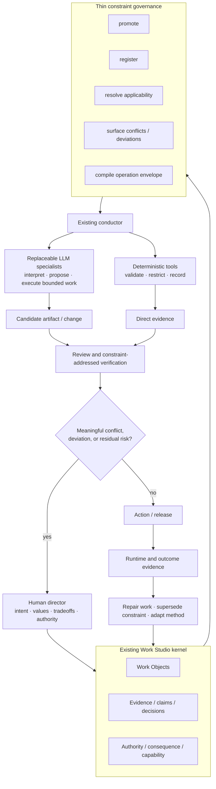

The design succeeds when agents become more capable **and** the director remains able to explain the architecture, locate the governing evidence, recognize the active tradeoff, revoke or narrow authority, and reverse a decision. Constraint records are valuable only insofar as they make that human capability cheaper and more reliable.

### Research limitations

- Several foundational disciplines are transferred by analogy; the report explicitly marks where formal results do not carry over.
- ISO standards are partly paywalled; claims here rely on the official ISO abstract plus freely accessible NASA guidance for implementation detail.
- No user study was conducted. Director comprehension and review burden remain hypotheses for tracer evaluation.
- No formal satisfiability analysis was performed because current Work Studio constraints are largely semantic.
- Repository conclusions are limited to the inspected commit and dirty working tree on 2026-07-28.
- This report did not modify schemas, skills, adapters, tools, Work Objects, or canonical registries; all architecture changes remain recommendations.
