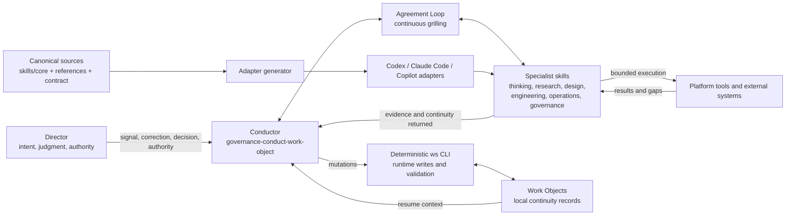
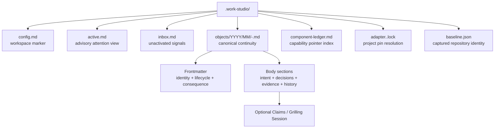
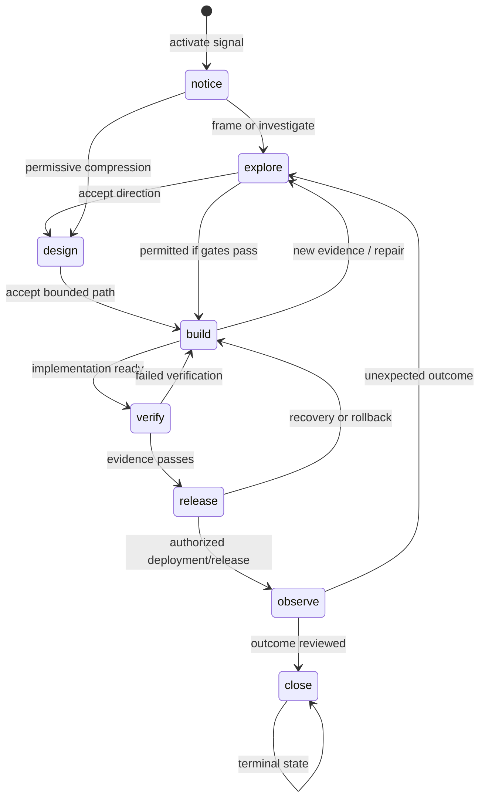
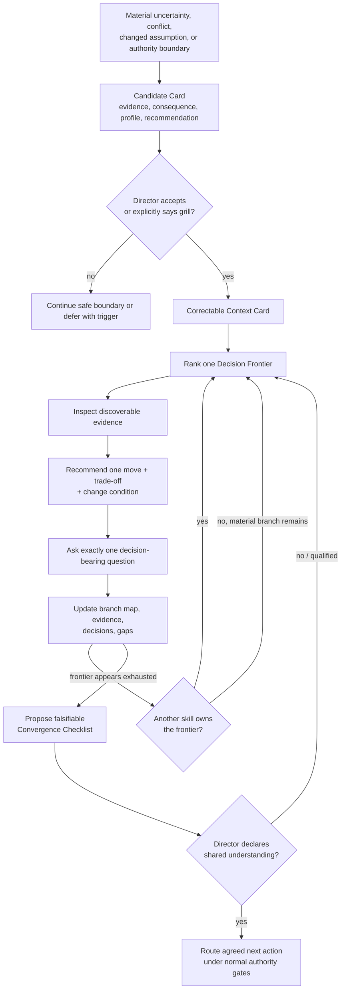
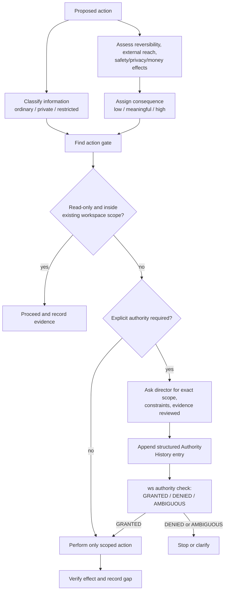
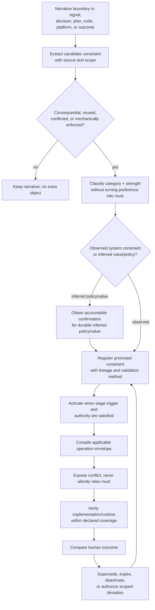
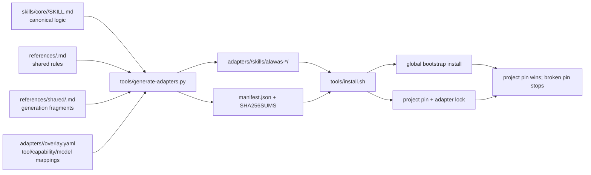
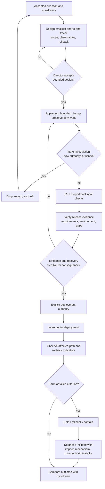

# Work Studio Director System Reference

> A codebase-grounded guide to what the studio is, what it actually enforces,
> what remains instruction-level governance, and what is still proposed.

**Inspected:** 2026-08-10

**Repository:** `andrelawas-work-studio`

**Audience:** the director and accountable owner
**Scope:** the checked-out repository, its local runtime records, canonical
skills, CLI, adapters, tests, design records, and research notes. This is a
read-only explanation, not a new authority source. If this guide conflicts with
an owning source, the owning source wins.

## 1. Read this first

Work Studio is a personal system for carrying a real signal through inquiry,
decision, design, implementation, verification, release, observation, and
repair. The unit that survives chat sessions is the **Work Object**: a local
Markdown record of intent, evidence, decisions, state, and next action. Skills
are replaceable specialist procedures. The `ws` command is the deterministic
writer and validator for runtime records. The director retains authority over
meaning, consequential trade-offs, irreversible or external actions, and the
declaration that inquiry has converged. This description follows the repository's
own summary and contracts ([README](../../README.md#andrelawas-work-studio),
[Work Object](../WORK-OBJECT.md#work-object), [Agreement Loop](../AGREEMENT-LOOP.md#agreement-loop)).

The system deliberately separates four things that are often blurred:

1. **Conversation** is where the director and agents interact.
2. **Continuity** lives in Work Objects, not in chat recall.
3. **Execution** belongs to bounded specialist skills and platform tools.
4. **Authority** remains scoped to an accountable human decision; agent ability
   is not permission.

### Status legend

Every major statement in this guide uses one of these meanings:

| Label | Meaning |
|---|---|
| **Implemented / enforced** | Executable code, a validator, test, hook, or generator performs the behavior. It may still have coverage limits. |
| **Implemented in instructions** | Canonical skill or protocol text directs agents to behave this way, but the platform can bypass it and code may not prevent violations. |
| **Convention / record** | The repository currently stores or names something this way; it is not necessarily enforced. |
| **Proposed / research** | A design, research report, or incubated signal recommends it, but it is not current runtime behavior. |
| **Known gap / drift** | Sources disagree, implementation is incomplete, or a validation boundary is narrower than the prose claim. |

### The director's shortest operating rule

Ask the system to show four things before consequential action:

- what it inspected;
- what it inferred rather than observed;
- which exact decision and authority permit the action; and
- how success, failure, and recovery will be observed.

Those questions correspond to the Evidence Ledger, decision records, authority
gates, verification, and recovery contracts ([Agreement Loop lines 96–125](../AGREEMENT-LOOP.md#grounding-and-personalization),
[Consequence and Authority](../CONSEQUENCE-AUTHORITY.md#authority-gates),
[Evidence Model](../EVIDENCE-MODEL.md#in-the-work-object)).

## 2. System at a glance

**Implemented / enforced:** the CLI writes Work Objects, performs optimistic
concurrency checks, applies lifecycle gates, appends records, and validates
schema/sections/authority/sensitivity and other invariants
([CLI entry point](../../tools/ws/__main__.py#L52-L84),
[transition implementation](../../tools/ws/__main__.py#L266-L354),
[validation registry](../../tools/ws/validate.py)).

**Implemented in instructions:** the conductor is the sole logical custodian;
specialists return evidence and routing state instead of directly changing the
Work Object. This is a behavioral contract, not an operating-system access
control ([Agreement Loop lines 261–300](../AGREEMENT-LOOP.md#cross-skill-continuity),
[Work Object write path](../WORK-OBJECT.md#write-path)).

**Implemented / enforced:** adapter files are deterministically generated from
canonical skills plus overlays; generation preserves the core decision body,
adds platform metadata, and writes manifests/checksums
([generator architecture](../../tools/generate-adapters.py#L1-L20)).

## 3. Your role as director

The director does not need to perform every specialist task. You own the parts
that cannot be safely reduced to tool execution:

- define why the work matters and what observable outcome counts;
- correct the Context Card when the system's model is wrong;
- distinguish non-negotiable boundaries from tradable preferences;
- decide material product, architectural, privacy, security, and operational
  trade-offs;
- grant narrow authority for gated actions;
- decide when uncertainty is acceptable and what triggers revisiting it;
- declare convergence after reviewing the branch inventory;
- accept, reject, or qualify outcome claims.

Convergence is explicitly **proposed by the engine and declared by the
director**; exhaustion of questions is not self-authorizing closure
([Agreement Loop lines 329–340](../AGREEMENT-LOOP.md#convergence-and-action-authority)).
`yes` or `do recommended` accepts only the recommendation in focus, not all open
branches or unrelated authority ([Agreement Loop lines 199–225](../AGREEMENT-LOOP.md#choice-frame-and-confidence)).

### Questions you should be able to answer

For any consequential studio component or decision:

1. Why does it exist?
2. What outcome or constraint does it serve?
3. What evidence currently supports the claim?
4. What evidence contradicts it or is missing?
5. Who is authorized to decide or act?
6. What could fail, including outside the immediate path?
7. How will the result be verified in the relevant environment?
8. How can it be recovered, superseded, or revisited?

The presentation protocol requires plain meaning before technical terminology
and keeps observation, interpretation, and recommendation separate
([Director Language](../DIRECTOR-LANGUAGE.md#the-rule)).

## 4. Director quick start

### Beginning a piece of work

1. State the signal in your own words. Do not prematurely phrase it as a task.
2. Ask `turn-signal-into-work` to classify it as discard, retain, incubate, or
   activate. Only explicit activation creates durable work
   ([signal skill](../../skills/core/thinking-turn-signal-into-work/SKILL.md)).
3. If activated, route through `conduct-work-object`. Confirm the Work Object's
   type, consequence, sensitivity, intent, success evidence, constraints, and
   concrete next move before work expands
   ([conductor](../../skills/core/governance-conduct-work-object/SKILL.md),
   [schema](../WORK-OBJECT.md#schema-minimum-accepted)).
4. If the central issue is unclear or disputed, ask for a Grilling Session. It
   will show a Context Card, choose one Decision Frontier, recommend one answer,
   and ask exactly one decision-bearing question per turn
   ([Agreement Loop](../AGREEMENT-LOOP.md#conversational-turn-contract)).
5. Ask for the smallest end-to-end tracer before broad implementation. Accept
   its scope, success checks, and rollback deliberately
   ([tracer skill](../../skills/core/design-design-tracer-bullet/SKILL.md)).
6. Let implementation, verification, deployment, and observation use different
   specialist boundaries. A builder's report is not independent release
   evidence, and a passing local check is not a production claim.

### Daily operating rhythm

- **Resume:** invoke `thinking-resume-work` for a read-only recommendation of one
  forward-motion candidate. It deliberately ignores `active.md` as a ranking
  input and does not surface verify/observe objects
  ([resume skill](../../skills/core/thinking-resume-work/SKILL.md)).
- **Orient:** read the chosen Work Object's state, status, next action, latest
  decisions, gaps, and revisit triggers. Treat `active.md` as an advisory index,
  not truth or a concurrency lock
  ([attention code](../../tools/ws/attention.py#L34-L124)).
- **Direct:** accept or correct one current recommendation. Ask for the evidence
  that would change it.
- **Act:** authorize only the next bounded mutation or external effect.
- **Checkpoint:** require accepted decisions, material evidence, deviations, and
  transitions to be recorded through `ws` with the current `updated_at` value.
- **Stop cleanly:** leave a concrete `next_action` and a revisit trigger for any
  waiting or paused work.

### Weekly operating rhythm

- Run `python3 -m tools.ws validate` and read warnings as attention signals, not
  automatic decisions. The current checkout passes validation while reporting
  unresolved-conflict and below-support-adequacy warnings; the dashboard signals
  are projections over Work Objects, not new sources
  ([dashboard signal reader](../../tools/ws/dashboard_signals.py#L66-L164),
  [Evidence Model projections](../EVIDENCE-MODEL.md#projections-of-the-record)).
- Review `active.md` for stale, duplicate, or excess supporting entries. There is
  no enforced numeric work-in-progress cap.
- Review `.work-studio/inbox.md`; promote nothing merely because it is old or
  detailed. Activation still requires intent.
- Review components whose implementation, owning skill, outcome evidence, or
  dependency changed. The ledger is a pointer index and preserves retired
  lineage rather than copying implementations
  ([artifact registry lines 99–112](../../WORKSPACE-DOCUMENTATION-CONTRACT.md#canonical-artifact-registry)).
- Run adapter drift and kernel checks after canonical skill/protocol changes:
  `python3 tools/generate-adapters.py --check` and
  `python3 tools/verify-kernel.py`.
- Review observed outcomes separately from implementation completion. Decide
  whether to repair the artifact, change a decision, revise a working method, or
  leave an explicit uncertainty.

## 5. Signals, Projects, Work Objects, and campaigns

A **signal** is an idea, request, observation, or pressure that may deserve
attention. Retaining a signal in the inbox is not a commitment. A **Project** is
a bounded effort; a **Question** may exist without a Project. A **Work Object**
is the durable record for one activated inquiry, project, change, or incident
([domain language](../../CONTEXT.md#andrelawas-work-studio)).

Work Object types are immutable after activation:

| Type | Use it for | Typical successor |
|---|---|---|
| `inquiry` | Resolve an important unknown | `project` or `change` after a decision |
| `project` | Deliver a bounded outcome | follow-up project/change or outcome review |
| `change` | Modify an existing system | incident if it fails; successor change for repair |
| `incident` | Restore safety/service and understand harm | `change` with `responds_to` relationship |

Do not mutate type when work changes character. Create a linked successor using
relationships such as `resulted_in`, `responds_to`, or `supersedes`
([identity rules](../WORK-OBJECT.md#identity-rules)). A `campaign` is an optional
repository-relative `docs/design/*.md` anchor for grouping Work Objects; the CLI
validates the shape, can set it with concurrency protection, and lists exact
members ([campaign validation](../../tools/ws/schema.py#L46-L68),
[members/set-campaign](../../tools/ws/__main__.py#L158-L258)).

## 6. Work Object data model

The canonical filename is
`.work-studio/objects/YYYY/MM/<id>-<slug>.md`. IDs use a daily, zero-padded,
time-sortable form such as `2026-07-15-001`; IDs and types are immutable, while
titles and slugs may change ([Work Object naming](../WORK-OBJECT.md#file-naming),
[ID allocator](../../tools/ws/identity.py)).

### Frontmatter

| Field | Current code rule |
|---|---|
| `schema_version` | generated as `1` |
| `id` | immutable allocated identifier |
| `title` | human-readable title |
| `type` | `change`, `inquiry`, `project`, or `incident` |
| `status` | `active`, `waiting`, `paused`, or `closed` |
| `state` | `notice`, `explore`, `design`, `build`, `verify`, `release`, `observe`, or `close` |
| `consequence` | `low`, `meaningful`, or `high` |
| `sensitivity` | `ordinary`, `private`, or `restricted` in current code |
| `campaign` | optional `docs/design/*.md` anchor |
| `created_at`, `updated_at` | UTC timestamps; mutations update `updated_at` |

The enums are enforced in
[`tools/ws/schema.py`](../../tools/ws/schema.py#L11-L20). The prose schema also
lists `next_action` in frontmatter and requires `revisit_trigger` for waiting or
paused work, but the current `generate_frontmatter` function does not emit either
field and the generated template stores next movement in a body section instead
([prose schema](../WORK-OBJECT.md#required-fields),
[frontmatter generator](../../tools/ws/schema.py#L87-L129)). This is a **known
documentation/implementation drift**, not something this guide resolves.

### Body sections

New objects are generated with eight required ordered sections: Intent, Success
evidence, Constraints and non-goals, Decisions and revisit triggers, Evidence
ledger, Open questions, Next move, and History
([template](../../tools/ws/template.py#L8-L34),
[order validator](../../tools/ws/sections.py#L115-L156)). The broader protocol
also defines optional Current hypothesis, Grilling Session, Relationships,
Artifacts, Verification and release evidence, Observed outcome, and Workflow
Candidates sections ([Work Object body sections](../WORK-OBJECT.md#body-sections)).

Evidence, decisions, claims, and History are append-only in the governing ADRs.
CLI append functions preserve existing text, while full protection across
commits requires the Git-aware `tools/verify-append-only.py`; the in-process
check is explicitly structural rather than a semantic or historical proof
([section append implementation](../../tools/ws/sections.py#L80-L112),
[structural limitation](../../tools/ws/sections.py#L288-L310)).

## 7. Lifecycle and handoffs

This diagram shows the normal path plus representative loops. The actual graph
is permissive: any state can move to any other state except that `close` cannot
leave `close`, and a `closed` status cannot reopen
([lifecycle code](../../tools/ws/lifecycle.py#L23-L70)). State and status are
independent: state describes where the work is; status describes whether it is
active, waiting, paused, or finished.

Executable transition gates currently include:

| Target | Enforced prerequisite |
|---|---|
| `build` | high-consequence object has a structured decision with `decision_type: decision` |
| `release` | most recent structured decision has `result: pass` and populated scope |
| `observe` | some structured decision has `result: pass` |
| `close` | an outcome decision has `result: pass` or `fail` |

See [gate code](../../tools/ws/lifecycle.py#L79-L222). Low and meaningful Work
Objects may close directly; high-consequence objects must reach state `close`
before status `closed` ([closure scaling](../../tools/ws/lifecycle.py#L225-L248)).
`--force` can bypass concurrency and, for closure, the close gate; it is a
recovery mechanism that emits warnings, not normal authority.

Post-transition epistemic audits add `[gap]` rows instead of blocking some
transitions. Low consequence audits `verify`; meaningful audits build,
`decision`, verify, and release; high audits those plus observe
([epistemic controls](../../tools/ws/epistemic_controls.py#L1-L32)). **Known
gap:** `decision` is not one of the eight valid lifecycle states, so that audit
dispatch entry cannot be reached through `ws transition`; a current Work Object
records this mismatch rather than silently redefining the lifecycle.

## 8. The Agreement Loop and Grilling Session

The Agreement Loop is the shared conversational engine. A Grilling Session is
not a questionnaire or a generated plan; it is a continuous sequence in which
each turn updates a provisional model, makes one recommendation, and asks one
decision-bearing question. Routing changes the active specialist lens without
resetting accepted context ([Agreement Loop opening](../AGREEMENT-LOOP.md#agreement-loop)).

Candidate nomination requires all three conditions: a material unresolved issue,
the current skill cannot safely settle it, and a user answer or specific fact
could change the recommendation. Nomination does not activate grilling; explicit
acceptance does ([activation threshold](../AGREEMENT-LOOP.md#three-part-threshold)).

The two traversal modes are `serial-depth` (default, one branch pursued deeply)
and `breadth-sweep` (one question per turn while rotating branches). The protocol
says the mode is recorded in Work Object frontmatter, but the current schema and
frontmatter generator do not define or emit a mode field. The durable Grilling
Session section does store it. Treat the frontmatter statement as **instruction
drift**, and the body checkpoint as the currently described record
([mode contract](../AGREEMENT-LOOP.md#mode),
[durable format](../AGREEMENT-LOOP.md#durable-continuity)).

## 9. Evidence, claims, decisions, conflicts, and gaps

### Provenance lanes

| Tag | What it means | What it must not become |
|---|---|---|
| `[system]` | current code, configuration, executable result, or record | an inference about what the record implies |
| `[decision]` | explicit director or accountable-owner choice | proof that the choice produced its intended outcome |
| `[memory]` | relevant, user-approved reusable preference | silent remembered identity or private archive content |
| `[testimony]` | attributable human observation with context and uncertainty | automatically promoted system fact |
| `[inference]` | agent reasoning or unverified hypothesis | disguised evidence |
| `[gap]` | fact not accessed or established | evidence that the fact is false |

The six bases are authoritative in the Agreement Loop and mirrored in the
taxonomy and code ([Agreement Loop lines 98–111](../AGREEMENT-LOOP.md#grounding-and-personalization),
[taxonomy](../epistemic/taxonomy.yaml#L21-L41),
[evidence row code](../../tools/ws/sections.py#L12-L25)). Bare tags are required
inside Work Object Evidence Ledgers; registered `base:subtype` forms are allowed
in skill prose only. Claims use structured `kind`, not bracket tags
([taxonomy surface rules](../epistemic/taxonomy.yaml#L10-L16)).

```mermaid
flowchart LR
    SRC["Source or event"] --> CAP["Capture with provenance<br/>system / decision / testimony / inference / gap / memory"]
    CAP --> LED["Append Evidence Ledger row"]
    LED --> LINK["Link evidence to a scoped claim"]
    LINK --> SIDE["Optional Claim sidecar<br/>observation / inference / decision"]
    SIDE --> CONFLICT{"Contradictory source<br/>or version?"}
    CONFLICT -->|yes| CONF["Register conflict with<br/>version identity tuples"]
    CONFLICT -->|no| DECIDE["Use in recommendation<br/>or accountable decision"]
    CONF --> DECIDE
    DECIDE --> VERIFY["Verification checks claim<br/>within stated scope"]
    VERIFY --> OUTCOME["Observe outcome separately"]
    OUTCOME --> REVISE["Append correction, successor,<br/>or revisit trigger"]

    GAP["Missing source / unresolved fact"] -->|"record, never negate"| LED
```

Evidence is never marked “true.” The accepted object is a scoped support or
counterevidence link between evidence and claim. Missing edges mean “not
recorded,” not false ([laundering guard](../AGREEMENT-LOOP.md#grounding-and-personalization),
[projection rule](../EVIDENCE-MODEL.md#projections-of-the-record)).

### Evidence Ledger

The implemented row is a Markdown table row generated from tag, source, entry,
and optional Git SHA. A SHA is permitted only on `[system]` evidence
([row generator](../../tools/ws/sections.py#L245-L271)). Corrections append new
rows; they do not rewrite earlier evidence. Decision confidence is qualitative
and scope-qualified, with a basis and revisit condition; no aggregate epistemic
score is defined ([Evidence Model](../EVIDENCE-MODEL.md#confidence-on-a-decision-record)).

### Structured claims

For meaningful/high consequence Work Objects, `ws claim register` can append a
claim under `## Claims`. Kinds are `observation`, `inference`, or `decision`;
new claims start at `captured`. Scope may be a legacy string or a structured
repository/commit/dirty-tree/path defeater surface, with optional revisit events
([claim schema](../../tools/ws/claim.py#L1-L25),
[structured scope](../../tools/ws/claim.py#L120-L157)).

**Implemented / partial:** states `captured`, `supported`, and
`accepted_for_action` are parsed, but there is no CLI transition command for
claim state. Repository notes explicitly say existing claims have not moved off
captured. A state name is therefore not an establishment verdict.

### Conflicts

`ws conflict register` appends a conflict associated with one claim and stores
one or more `(commit_sha, file_path, dirty_hash)` tuples
([conflict format and writer](../../tools/ws/conflict.py#L1-L21),
[registration](../../tools/ws/conflict.py#L134-L204)). The current schema has no
resolution field; the dashboard consequently counts every recorded conflict as
unresolved ([dashboard reader](../../tools/ws/dashboard_signals.py#L66-L90)).
That is a known implementation gap, currently tracked by an active Work Object.

## 10. Consequence, sensitivity, and authority

Consequence measures effects; sensitivity measures how information must be
handled. They are independent. Urgency or emotional intensity does not raise or
lower consequence by itself ([Consequence and Authority](../CONSEQUENCE-AUTHORITY.md#consequence-levels)).

| Consequence | Meaning | Minimum director posture |
|---|---|---|
| `low` | cheap, private, reversible | stages may compress; keep scope visible |
| `meaningful` | durable data/effort, public artifact, or other people affected | framing, decision, and verification evidence |
| `high` | safety, privacy, money, production, irreversible data, identity, external commitments | explicit authority at every transition, recovery, verification, observation |

| Sensitivity | Storage/export behavior |
|---|---|
| `ordinary` | normal workspace or Git storage |
| `private` | `.work-studio/`, excluded from Git; no automatic export |
| `restricted` | pointer only; never substantive Work Object body content |

The CLI schema currently accepts all three sensitivity values
([schema enums](../../tools/ws/schema.py#L13-L20)). The kernel manifest still
contains a stale “sensitivity enum mismatch” gap claiming code rejects `private`;
that manifest note no longer describes the inspected code
([stale gap](../../work-studio/kernel-manifest.yaml#L218-L230)).

Explicit confirmation is always required for destructive actions, exports,
sharing, deployments, schema migrations, external writes, and type changes
([explicit authority](../CONSEQUENCE-AUTHORITY.md#explicit-authority)). An
authority History entry records action, exact scope, evidence reviewed,
constraints, mode, and grantor. The read-only `ws authority check` parses grants
and returns `GRANTED`, `DENIED`, or `AMBIGUOUS`; wildcard-like scope is treated
as ambiguous and expiry is honored
([authority checker](../../tools/ws/authority_check.py#L18-L74)).

**Enforcement boundary:** instruction contracts, CLI transition gates, and Git
hooks provide defense in depth, but they cannot prevent a user or tool from
writing files directly or invoking an external platform outside the CLI. The
authority document's final section says these actions await a
platform-agnostic CLI even though `ws` now exists; the accurate interpretation
is that the CLI governs Work Studio state but does not mediate every shell,
deployment, export, or external API action. The prose is stale in wording, while
the prevention gap remains real
([authority limitation](../CONSEQUENCE-AUTHORITY.md#auditable-but-not-preventable-actions),
[CLI command surface](../../tools/ws/__main__.py#L738-L750)).

## 11. Constraint model: current reality and proposed architecture

Today, constraints are primarily narrative: the Work Object has a `Constraints
and non-goals` section; skill contracts define non-goals and authority rules;
platform overlays define capability limits; tests and hooks mechanize selected
predicates. There is **no implemented `ws constraint` command, constraint
sidecar registry, operation-envelope compiler, AcceptedDeviation object, or
constraint promotion state machine** in the inspected source.

The constraint research proposes a thin promoted layer with six categories:
`invariant`, `obligation`, `prohibition`, `preference`, `assumption`, and
`experiment`. It recommends promoting only consequential, reused, conflicted,
or mechanically enforced boundaries and compiling an ephemeral operation
envelope. The report calls this an architectural metaphor rather than a settled
scientific field
([constraint synthesis](../constraints/constraint-driven-studio-operating-system-research-and-applied-architecture.md#1-executive-synthesis),
[taxonomy](../constraints/constraint-driven-studio-operating-system-research-and-applied-architecture.md#5-constraint-taxonomy)).

This diagram is **proposed / research**, not current executable flow. The parts
already realized are narrative constraints, explicit decisions/authority,
capability classifications, append-only history, selected validation predicates,
and outcome review. Until a separate accepted architecture decision implements
promotion, the director should not ask agents to pretend a candidate constraint
has a registered lifecycle. Record it as narrative, decision, inference, or gap
in existing artifacts.

### Director rule for current constraints

- Call an invariant non-negotiable only when its source and scope are clear.
- Keep a preference tradable and show the cost of trading it.
- Treat an assumption as provisional and give it a revisit trigger.
- Do not let a test's coverage become a broader semantic claim.
- Never silently relax a hard rule; record a scoped exception or stop.
- Separate a semantic constraint (“restricted data never enters the Work
  Object”) from one enforcement mechanism (pre-commit inspection).

## 12. Skill routing and ownership

Canonical skills live under `skills/core/`. Generated installed names add the
`alawas-` namespace. The generated `work-studio/skill-map.yaml` indexes each
skill's responsibility, non-goals, and required capabilities; prose skill
contracts remain authoritative
([skill-map header](../../work-studio/skill-map.yaml#L1-L7)).

| Canonical skill (22 present) | Use when | Owns / does not own |
|---|---|---|
| [`thinking-turn-signal-into-work`](../../skills/core/thinking-turn-signal-into-work/SKILL.md) | a raw signal needs classification | preserves provenance and routes; does not activate without authority |
| [`thinking-resume-work`](../../skills/core/thinking-resume-work/SKILL.md) | returning after a break | read-only ranking of one candidate; no mutations |
| [`thinking-develop-idea`](../../skills/core/thinking-develop-idea/SKILL.md) | an idea needs exploration before commitment | develops options; does not implement |
| [`thinking-inquire-system`](../../skills/core/thinking-inquire-system/SKILL.md) | the director wants a plain-language explanation grounded in the system | explains relationships and evidence; does not silently change them |
| [`thinking-pressure-test-decision`](../../skills/core/thinking-pressure-test-decision/SKILL.md) | a consequential choice needs counterexamples and trade-offs | challenges and recommends; does not grant authority |
| [`thinking-grilling-session`](../../skills/core/thinking-grilling-session/SKILL.md) | explicit continuous grilling is requested | owns live Agreement Loop conversation; conductor owns durable checkpoint |
| [`thinking-diagnose-homogenization`](../../skills/core/thinking-diagnose-homogenization/SKILL.md) | output may be converging into generic or derivative form | diagnoses sameness and its causes; does not automatically rewrite |
| [`research-investigate-live-question`](../../skills/core/research-investigate-live-question/SKILL.md) | a fact gap could change the recommendation | gathers bounded primary evidence; does not promote testimony to system fact |
| [`design-audit-product-interface`](../../skills/core/design-audit-product-interface/SKILL.md) | existing routes/components/layouts need discovery | read-only interface inventory; no implementation |
| [`design-build-design-foundation`](../../skills/core/design-build-design-foundation/SKILL.md) | existing tokens/themes need discovery | read-only token audit; does not invent tokens |
| [`design-apply-design-direction`](../../skills/core/design-apply-design-direction/SKILL.md) | natural-language direction needs concrete interpretation | proposes preserve/revise boundary; execution needs confirmation |
| [`design-design-tracer-bullet`](../../skills/core/design-design-tracer-bullet/SKILL.md) | an accepted direction needs the smallest end-to-end experiment | designs reversible tracer; does not implement or deploy |
| [`design-track-components`](../../skills/core/design-track-components/SKILL.md) | durable capabilities need registration, sweep, grilling, cascade, or retirement | proposes ledger/inbox mutations; never auto-creates commitments |
| [`design-verify-design-implementation`](../../skills/core/design-verify-design-implementation/SKILL.md) | rendered implementation must be compared with confirmed direction | reports design parity; does not fix, test all behavior, or claim accessibility |
| [`engineering-implement-bounded-change`](../../skills/core/engineering-implement-bounded-change/SKILL.md) | an accepted tracer is ready to build | changes only accepted scope and preserves dirty work; does not deploy |
| [`engineering-verify-release-evidence`](../../skills/core/engineering-verify-release-evidence/SKILL.md) | implementation/release claims need direct checks | classifies evidence and gaps; does not release or infer environment proof |
| [`operations-deploy-with-recovery`](../../skills/core/operations-deploy-with-recovery/SKILL.md) | verified change has authorized live effects and recovery plan | incremental deployment/rollback; explicit authority always applies |
| [`operations-diagnose-production-incident`](../../skills/core/operations-diagnose-production-incident/SKILL.md) | harm is occurring or service behavior is unexplained | containment, ranked diagnosis, recovery; access remains narrow and expiring |
| [`governance-conduct-work-object`](../../skills/core/governance-conduct-work-object/SKILL.md) | work starts, resumes, transitions, checkpoints, or closes | canonical continuity and routing; no specialist domain execution |
| [`governance-review-outcome-and-adapt`](../../skills/core/governance-review-outcome-and-adapt/SKILL.md) | observed reality must be compared with prior hypothesis | outcome attribution and adaptation; implementation success is not outcome success |
| [`governance-maintain-working-method`](../../skills/core/governance-maintain-working-method/SKILL.md) | recurring evidence suggests a workflow rule should change | bounded, expiring method experiments; not personality law |
| [`governance-govern-scorecards`](../../skills/core/governance-govern-scorecards/SKILL.md) | outcomes need multi-dimensional review | exposes gaps/subgroup harm; no composite score or automatic rule |

### Routing principle

The conductor owns continuity, not expertise. Specialists own a bounded stage,
return their recommendation/evidence/gaps, and route back. Verification and
deployment are separate because the ability to build is not evidence that the
build is fit for release. Outcome review is separate because conformance to a
plan is not evidence that the plan served the human goal.

## 13. The `ws` command surface

Invoke as `python3 -m tools.ws`. Existing-file mutations require
`--expect-updated`, except read-only commands; `--force` bypasses the optimistic
check with a warning ([Work Object concurrency](../WORK-OBJECT.md#concurrency),
[concurrency module](../../tools/ws/concurrency.py)).

| Command | Read/write | What it owns |
|---|---|---|
| `init --name` | write | creates `.work-studio/`, `objects/`, minimal config, active, inbox; idempotent if config exists |
| `create` | write | validates type/consequence/sensitivity, allocates ID, writes frontmatter/body |
| `members --campaign` | read | lists exact campaign members |
| `set-campaign` | write | sets validated campaign and appends History |
| `transition` | write | validates state/status, gates, concurrency; appends History and advisory epistemic gaps |
| `close` | write | consequence-scaled closure, gate, History, removal from active register |
| `activate` | write | adds/moves an existing non-closed object in advisory `active.md` |
| `append-evidence` | write | appends a canonical evidence table row; optional SHA for `[system]` only |
| `append-history` | write | appends structured History, optional commit SHA |
| `claim register` | write | creates a captured claim for meaningful/high objects |
| `claim inspect` | read | lists claims, optionally by state |
| `conflict register` | write | appends a version-identified conflict under Claims |
| `authority check` | read | evaluates recorded grants for one exact action |
| `baseline capture` | write | records commit/status fingerprint in `.work-studio/baseline.json` |
| `baseline check` | read | compares current repository identity with captured baseline |
| `epistemic lint` | read | checks skill/document tag tokens against taxonomy and allowlist |
| `skill-map build` | generated write | rebuilds `work-studio/skill-map.yaml` from core contracts |
| `validate [checks]` | read | validates Work Objects and emits errors/warnings |

The parser defines these commands in
[`tools/ws/__main__.py`](../../tools/ws/__main__.py#L738-L1067). `ws init` does
**not** copy the canonical Workspace Documentation Contract, kernel, skills, or
adapters into a new arbitrary workspace; it only creates minimal runtime files
([init code](../../tools/ws/__main__.py#L653-L683)). This is narrower than the
kernel manifest's description of bootstrapping a “functional Work Studio
instance,” a known bootstrap/documentation ambiguity.

## 14. Documentation and artifact governance

The root `WORKSPACE-DOCUMENTATION-CONTRACT.md` is the discovery source for
canonical project records. It registers artifact type, exact location, purpose,
owner, trigger, evidence, authority, freshness, supersession, status, and
validation. Missing registered files are **Missing Artifact Gaps**, never
permission to search for a plausible substitute or invent contents
([contract operating rules](../../WORKSPACE-DOCUMENTATION-CONTRACT.md#operating-rules),
[Missing Artifact Gap](../MISSING-ARTIFACT-GAP.md#application)).

The main registered classes are domain context, Work Objects, ADRs,
plans/designs, Evidence Ledgers, component ledger, runbooks, verification
records, outcome reviews, generated adapters, and kernel manifest
([artifact registry](../../WORKSPACE-DOCUMENTATION-CONTRACT.md#canonical-artifact-registry)).
Changing registry schema/taxonomy requires an ADR and owner approval. Ordinary
artifact updates follow the individual row's authority and freshness rules.

### Repository map

| Path | Role | Status |
|---|---|---|
| `skills/core/` | canonical portable skill contracts | source of truth |
| `references/` | shared constitutional/protocol and research references | mixed: normative and advisory; read labels |
| `work-studio/kernel-manifest.yaml` | declared portable kernel and platform mappings | canonical but has drift noted below |
| `work-studio/skill-map.yaml` | generated skill contract index | generated view |
| `tools/ws/` | deterministic runtime record CLI | implemented |
| `tools/generate-adapters.py` | canonical-to-platform compiler | implemented |
| `adapters/<platform>/` | generated, checksummed platform skills | generated, not hand-edited |
| `.work-studio/` | local runtime state and private continuity | output, not kernel; Git-excluded by policy |
| `docs/adr/` | accepted architectural trade-offs | canonical decisions |
| `docs/design/` | bounded plans/designs | canonical when triggered |
| `fixtures/` | behavioral scenarios | regression specifications |
| `tests/` | executable checks | implementation evidence within test scope |
| `apps/epistemic-pressure-dashboard/` | browser dashboard implementation | present, but a Work Object proposes retirement in favor of validation signals |

## 15. Platform adapters, installation, and capability degradation

The generator replaces frontmatter, injects shared preambles/references, appends
platform mappings, and preserves canonical core decision logic byte-for-byte.
It selects essential/full epistemic rules by skill default tier, with
consequence escalation described in code
([generator inputs](../../tools/generate-adapters.py#L31-L74),
[tier resolver](../../tools/generate-adapters.py#L76-L101)). Generated adapters
are committed and verified with manifests and SHA-256 sums.

The installer is POSIX shell and requires a SHA-256 utility, not Python. Actual
project targets in code are `.agents/skills`, `.claude/skills`, and
`.github/skills`; global targets are `~/.agents/skills`, `~/.claude/skills`, and
`~/.copilot/skills` ([installer mappings](../../tools/install.sh#L47-L62)). A
project pin takes precedence and is represented by an adapter lock
([README installation](../../README.md#installing-skills)).

Capability degradation has three levels: `native`, `manual-fallback`, and
`unsupported`. Manual fallback pauses and gives one concrete human instruction;
unsupported stops the path. Unavailable tools may never be laundered into
verification or deployment claims
([Capability Degradation](../CAPABILITY-DEGRADATION.md#classification-tiers)).
Platform safety rules can be stricter than core rules and then win.

## 16. Delivery, verification, deployment, and recovery

The bounded-change skill must preserve unrelated dirty work and stop on material
scope, product, architecture, data, privacy, security, or authority deviations
([implementation skill](../../skills/core/engineering-implement-bounded-change/SKILL.md)).
Release verification classifies direct evidence, inherited evidence, gaps,
blockers, and recovery credibility; it does not turn local evidence into a live
environment claim
([verification skill](../../skills/core/engineering-verify-release-evidence/SKILL.md)).

Deployment is always an external effect requiring explicit authority. The
deployment skill expects readiness, recovery, incremental exposure, sanitized
evidence, and observation; incident diagnosis prioritizes reversible containment
when harm is growing
([deploy skill](../../skills/core/operations-deploy-with-recovery/SKILL.md),
[incident skill](../../skills/core/operations-diagnose-production-incident/SKILL.md)).
Capability absence stops or pauses rather than disappearing from the record.

## 17. Validation, tests, hooks, and CI

`ws validate` composes checks including schema, required sections, structural
append-only shape, sensitivity and sensitivity policy, lifecycle, claims,
evidence lanes, authority, protected fields, History integrity, file integrity,
incident routing, prerequisites, and dashboard signals
([validation CLI](../../tools/ws/__main__.py#L611-L645),
[check registry](../../tools/ws/validate.py)). Some retrospective checks exempt
objects created before a cutoff rather than rewriting old records
([retroactive cutoff](../../tools/ws/validate.py#L209-L233)).

Git hooks add a separate boundary. The pre-commit hook rejects staged Work
Objects, restricted inline content, misplaced sensitive Markdown, and high-
consequence post-notice Work Objects lacking an authority entry; constitutional
file authorization is checked in the commit-message hook because pre-commit
cannot reliably read the pending message
([pre-commit contract](../../tools/pre-commit#L1-L25),
[pre-commit checks](../../tools/pre-commit#L129-L217),
[commit message hook](../../tools/commit-msg)). Hooks only protect commits when
installed; they do not prevent uncommitted direct edits.

CI on pushes to main/master and pull requests performs:

1. generated adapter drift detection;
2. unit and installer tests;
3. behavioral/conformance verification;
4. manifest/checksum verification; and
5. clean-checkout presence checks

([CI workflow](../../.github/workflows/ci.yml#L19-L85)). `tests/run.sh` runs
Python unit discovery, installer behavior, Codex precedence/reproducibility, and
adapter drift ([test runner](../../tests/run.sh#L1-L24)). Behavioral fixtures
describe observable handoffs rather than hidden reasoning
([README fixtures](../../README.md#behavioral-fixtures)).

At inspection time:

- `python3 -m tools.ws validate` passed with warnings for two unresolved conflict
  records, four below-support-adequacy claims, and one consequence-plausibility
  signal;
- `python3 tools/verify-kernel.py` passed its four declared integrity checks;
- `python3 tools/generate-adapters.py --check` reported no generated drift.

These results are **point-in-time system evidence**, not a claim that all design
intent is satisfied. They also coexist with unrelated uncommitted working-tree
changes, which this research task did not alter.

## 18. Maintenance, components, scorecards, and learning

The component ledger is a standing index of realized capabilities. Each entry
points to implementation locations and Work Objects, names declared dependencies,
applicable outcome dimensions, owning skill/profile, last-grilled commit, best-
case anchor, status, and findings. Entries retire rather than disappear, so
lineage remains visible
([component registry contract](../../WORKSPACE-DOCUMENTATION-CONTRACT.md#canonical-artifact-registry),
[current ledger](../../.work-studio/component-ledger.md)).

The current ledger explicitly distinguishes active components from retired
design skill shells. Many active entries still say `last-grilled-SHA:
not-yet-grilled`, so “registered” or “active” must not be read as “settled” or
“recently verified.” The track-components skill may register, sweep, grill,
cascade, and retire, but a finding enters the inbox and never automatically
becomes a Work Object ([track-components skill](../../skills/core/design-track-components/SKILL.md)).

Scorecards are governance views, not optimization targets. The scorecard skill
keeps dimensions separate, exposes subgroup harm and non-compensable failures,
and does not produce an aggregate health score or automatically change rules
([scorecard skill](../../skills/core/governance-govern-scorecards/SKILL.md)).
Outcome review compares observed reality with the accepted hypothesis and routes
mismatches back to the earliest invalid assumption. Working-method maintenance
turns repeated evidence into bounded, testable, revisable rules with exception
authority and expiry—not permanent traits
([outcome skill](../../skills/core/governance-review-outcome-and-adapt/SKILL.md),
[method skill](../../skills/core/governance-maintain-working-method/SKILL.md)).

## 19. Current live-state interpretation

The local runtime contains 93 Markdown files under `.work-studio/objects/`
including its README. `active.md` currently names one primary and many supporting
objects, contains one duplicate entry, and retains several objects described as
verified/awaiting review. This indicates a broad attention surface, not parallel
execution or a ranked priority queue. The register's own header says it is
advisory and has no numeric cap ([active register](../../.work-studio/active.md#active-work-objects)).

The inbox contains both ordinary incubated signals and explicit architectural
notes. In particular, the deterministic per-turn prompt compiler remains
incubated because current platforms do not provide its required injection point;
the note estimates parts can be reframed through a conductor, but the full
compiler is not implemented ([inbox prompt compiler entry](../../.work-studio/inbox.md#2026-07-27--deterministic-prompt-compiler-epistemic-work-packet-architecture)).

This guide intentionally reports counts, statuses, and system-level patterns
without reproducing private Work Object bodies. Work Objects are local continuity
records and are excluded from Git by policy; restricted information should be
pointer-only ([sensitivity rules](../CONSEQUENCE-AUTHORITY.md#sensitivity-classes)).

## 20. Known contradictions, drift, and debt

These are not editorial quibbles. They identify places where a director could
form the wrong operational belief.

1. **README “planned” list is stale.** It calls five skills planned even though
   all five are present in canonical core, generated into all adapters, and have
   tests ([README planned list](../../README.md#planned-work-studio-skills),
   [core directory](../../skills/core/)). Treat the files and generated
   manifests as current implementation.

2. **Kernel skill inventory is incomplete.** The manifest lists 19 skills while
   `skills/core/` and generated adapters contain 22. It omits
   `thinking-inquire-system`, `thinking-resume-work`, and
   `thinking-diagnose-homogenization`
   ([kernel list](../../work-studio/kernel-manifest.yaml#L51-L73)). Kernel
   verification checks declared entries exist; it does not detect undeclared
   canonical skills, so its passing result is not inventory completeness.

3. **Kernel references a missing shared file.** It declares
   `references/SHARED-PROTOCOL.md`, which is not present in the inspected tree,
   yet `verify-kernel.py` passed. The manifest parser/check coverage should not be
   assumed to validate every nested `files:` declaration correctly.

4. **Install-target disagreement.** The kernel says Claude Code project skills
   install to `.claude/agents/skills/` and Copilot to
   `.github/copilot/agents/skills/`; actual installer code and README use
   `.claude/skills/` and `.github/skills/`
   ([kernel targets](../../work-studio/kernel-manifest.yaml#L148-L175),
   [installer targets](../../tools/install.sh#L47-L62),
   [README table](../../README.md#installing-skills)). The tested installer is
   the operational behavior.

5. **Work Object prose and generated frontmatter disagree.** `next_action` and
   conditional `revisit_trigger` are required by the reference but not generated
   as frontmatter fields. The body has `Next move` instead. The schema parser is
   permissive and does not make the reference's full minimum schema executable.

6. **Body-section counts disagree.** The Work Object reference lists a broader
   canonical section set; the template and order validator require eight and
   call them “7 required sections plus Decisions.” Optional sections are created
   lazily. Do not infer absence is evidence of a negative finding.

7. **Grilling mode placement disagrees.** Agreement Loop says mode is in
   frontmatter, while current Work Object schema/generator omit it and the
   durable Grilling Session body format includes it.

8. **Epistemic audit names a nonexistent state.** The post-transition audit map
   includes `decision`, but lifecycle enums do not. Decision-side auditing is
   therefore only partly wired.

9. **Authority prose predates the CLI.** It says five action classes await a
   platform-agnostic CLI. `ws` now exists but does not mediate external tools;
   the runtime-prevention gap remains, while the wording is outdated.

10. **Conflict registration has no resolution.** Every recorded conflict remains
    counted unresolved; an active change is intended to add resolution. Do not
    read the dashboard number as current substantive disagreement without
    inspecting the claim and later evidence.

11. **Claim states are mostly inert.** Registration always creates `captured`;
    inspect can filter other states but there is no state transition command.
    The three labels must not be interpreted as a functioning evidence lifecycle.

12. **Constraint-driven architecture is not implemented.** The research report's
    constraint records, promotion, compiler, envelopes, deviations, and
    validation architecture are proposals. Current narrative constraints and
    selected deterministic checks are the real system.

13. **Kernel's sensitivity gap is stale.** It says code rejects `private`; code
    accepts it. This illustrates why manifest “documented gaps” need freshness
    checks.

14. **Constitutional file list has a stale skill path.** It protects
    `skills/core/conduct-work-object/SKILL.md`, while the actual canonical path is
    `skills/core/governance-conduct-work-object/SKILL.md`
    ([constitutional list](../../.work-studio/constitutional-files.list#L15-L27)).
    A commit hook following the literal list may not protect the actual conductor
    file.

15. **`active.md` contains a duplicate.** The same Work Object appears twice.
    The attention parser returns a set for IDs in some checks, so duplicates may
    not fail consistency validation. Treat the register as a repairable view.

16. **A legacy attention-cap validator contradicts the accepted model.** ADR
    0018 says Primary remains singular but Supporting has no numeric cap, and the
    live register follows that advisory model
    ([ADR 0018 decision](../../docs/adr/0018-attention-register-is-advisory-not-a-cardinality-constraint.md#decision)).
    `check_attention_limits`, however, still rejects more than two Supporting or
    three total entries, and unit tests assert that legacy cap
    ([legacy validator](../../tools/ws/validate.py#L897-L960),
    [legacy tests](../../tests/test_ws_cli.py#L1242-L1307)). The check is not in
    `DEFAULT_CHECKS`; default `ws validate` therefore passes the current large
    register. The separate `attention` check tests missing/stale object
    consistency, not numeric limits
    ([default list and dispatch](../../tools/ws/validate.py#L2131-L2199)). Treat
    the cap function/test as legacy drift, not the current governing rule.

17. **Default validation is narrower than the Work Object reference implies.**
    The Work Object reference says the CLI enforces `ws validate attention`, but
    `attention` is opt-in and absent from default validation. “All validation
    checks passed” therefore means all *default* checks passed, not attention,
    attention-limits, ledger, outcome-review, or other explicit-only checks.

18. **Application status is transitional.** The browser dashboard is still in
    `apps/`, while a Work Object proposes retiring it in favor of `ws validate`
    signals. Presence is not proof of current strategic endorsement.

## 21. What the system does not do

It does not:

- replace the director's creative or ethical judgment;
- guarantee truth because evidence was recorded;
- guarantee multi-session concurrency;
- grant an agent permission because it has a tool;
- make a local test a production result;
- prevent every direct filesystem, shell, network, or platform action;
- automatically sync a personal archive into Work Studio;
- turn an inbox signal, component finding, or accepted answer into a registered
  artifact without the relevant trigger and authority;
- provide a fully implemented constraint compiler or prompt compiler;
- prove behavioral equivalence beyond the scenarios and structural checks that
  are actually tested.

## 22. Comprehensive glossary

**Accepted answer** — a user-confirmed Grilling Session answer checkpointed in a
Work Object. It is not automatically a registered artifact or full authority.

**Accepted deviation** — in the constraint research, scoped authority to depart
temporarily from an active constraint. Proposed; no implemented object/CLI.

**Active register** — `.work-studio/active.md`, an advisory discoverability view
of primary/supporting/paused work, not a lock or priority truth.

**Adapter** — deterministic, non-canonical platform packaging of a core skill
with metadata, tool mappings, capabilities, references, and checksums.

**Agreement Loop** — the shared one-question-per-turn conversational engine used
by a continuous Grilling Session.

**Artifact Conflict** — material disagreement among registered artifacts or
revisions, surfaced for accountable resolution rather than silently averaged.

**Artifact stage trigger** — explicit intent, accepted decision, or registered
evidence that permits creating a registered artifact. Inference can recommend,
not activate.

**Authority** — accountable permission for a named action and scope. Capability
is ability; authority is permission; responsibility is ownership of judgment.

**Authority grant** — a structured History record containing action, scope,
reviewed evidence, constraints, mode, grantor, and optionally expiry as parsed by
the checker.

**Campaign** — an optional `docs/design/*.md` anchor grouping Work Objects around
a shared design effort.

**Canonical Artifact Registry** — the parseable registry inside the Workspace
Documentation Contract that defines artifact names, locations, owners, triggers,
authority, freshness, supersession, and validation.

**Claim** — a scoped assertion registered under `## Claims`, distinct from the
evidence that may support or defeat it.

**Component** — a realized durable capability indexed by pointer in the
component ledger, with lineage, dependencies, review profile, and status.

**Consequence** — the effect class of work (`low`, `meaningful`, `high`), based on
reversibility, reach, and safety/privacy/money impact.

**Constraint** — a boundary on acceptable action or state. Currently narrative
or embedded in code/instructions; promoted typed constraint records are proposed.

**Context Card** — the visible, correctable Grilling Session summary of goal,
stage, preferences, evidence, open branches, and active specialist.

**Coverage Proof / Convergence Checklist** — a falsifiable inventory showing
branches resolved, routed, deferred with triggers, or ruled out. The director,
not engine, declares convergence.

**Decision Frontier** — the one unresolved branch currently most likely to
change the recommendation, ranked by relevance, impact, uncertainty,
irreversibility/reach, and decision effect.

**Decision record** — a structured accountable choice with branch, alternatives,
rationale, trade-offs, confidence basis, actor, and revisit trigger.

**Epistemic** — concerning what is claimed, how it is known, its source, scope,
contradictions, uncertainty, and change conditions.

**Evidence Bridge** — a user-approved minimum-necessary summary/reference that
carries relevant personal context into a Work Object without syncing the private
Personal Institution archive.

**Evidence Ledger** — append-only attributable evidence, decision, testimony,
inference, memory, and gap rows inside a Work Object.

**Generated artifact** — reproducible non-canonical output derived from a
canonical source. Edit the source, regenerate the output.

**Grilling Candidate** — a material issue nominated for explicit entry into a
Grilling Session; nomination alone creates no durable state.

**Grilling Session** — a continuous, recommendation-led conversation across
specialist lenses, with one decision-bearing question per turn.

**History** — append-only Work Object transition/action records. It stores
continuity and authority, not hidden reasoning or full transcripts.

**Kernel** — the manifest-declared portable source files required to reproduce
Work Studio. Runtime `.work-studio/` state and generated adapters are outputs,
not kernel.

**Missing Artifact Gap** — explicit discovery that a registered artifact is
absent. It stops the affected path and never authorizes fabricated content.

**Operation envelope** — proposed ephemeral compilation of applicable
constraints, authority, capabilities, deviations, verification obligations, and
conflicts. Not implemented.

**Optimistic concurrency** — mutations require the caller's expected
`updated_at`; a mismatch rejects stale writes. It protects within a session, not
multiple simultaneous sessions.

**Outcome** — observed reality after action, evaluated separately from whether
the implementation followed its plan.

**Personal Institution** — separate local-first personal evidence/reflection
system. Work Studio receives only approved, minimal context through an Evidence
Bridge.

**Provenance** — the declared source lane of a record: system, decision,
testimony, inference, gap, or approved memory.

**Revisit trigger** — observable condition requiring a decision, assumption,
preference, or deferred branch to be reconsidered.

**Sensitivity** — information-handling class (`ordinary`, `private`,
`restricted`), independent of consequence.

**Signal inbox** — local record of unactivated signals. Preservation is not a
commitment.

**Skill Grilling Profile** — stage-specific gates, tensions, escalation, routing,
and sufficiency criteria layered over the common Agreement Loop.

**Specialist** — bounded skill responsible for one kind of inquiry or action;
it does not inherit the conductor's persistence ownership or the director's
authority.

**Supersession** — explicit successor relationship preserving the replaced
artifact and rationale instead of destructive overwrite.

**Tracer bullet** — smallest observable, reversible end-to-end experiment that
tests an accepted direction before broad construction.

**Verification** — evidence that an implementation satisfies declared criteria
within a stated environment and scope. It is distinct from validation of human
fit and from deployment authorization.

**Work Object** — the canonical local continuity record for one activated
inquiry, project, change, or incident.

**Workspace Documentation Contract** — root registry and operating rules for
discovering, creating, validating, updating, and superseding canonical artifacts.

## 23. Recommended source-reading order

For director comprehension, read in this order:

1. [Director Language](../DIRECTOR-LANGUAGE.md)
2. [Work Object](../WORK-OBJECT.md)
3. [Agreement Loop](../AGREEMENT-LOOP.md)
4. [Evidence Model](../EVIDENCE-MODEL.md)
5. [Consequence and Authority](../CONSEQUENCE-AUTHORITY.md)
6. [Capability Degradation](../CAPABILITY-DEGRADATION.md)
7. [Workspace Documentation Contract](../../WORKSPACE-DOCUMENTATION-CONTRACT.md)
8. [Skill map](../../work-studio/skill-map.yaml)
9. [CLI entry point](../../tools/ws/__main__.py)
10. [Lifecycle implementation](../../tools/ws/lifecycle.py)
11. [Validation implementation](../../tools/ws/validate.py)
12. [Constraint research](../constraints/constraint-driven-studio-operating-system-research-and-applied-architecture.md), read explicitly as proposed architecture

## 24. Final director checklist

Before saying “proceed,” confirm:

- [ ] The current Work Object is the right continuity record.
- [ ] Intent and success evidence are observable and still current.
- [ ] Consequence and sensitivity reflect effects and information, independently.
- [ ] System evidence, testimony, inference, decisions, and gaps are not blended.
- [ ] A material claim is scoped to the repository/environment/version it covers.
- [ ] Conflicts and contrary evidence are visible.
- [ ] The recommendation names its main trade-off and what would change it.
- [ ] The acting skill owns this stage and required capabilities are available.
- [ ] Authority names the exact action and scope; it is not implied by tool access.
- [ ] The implementation boundary is reversible or has credible recovery.
- [ ] Verification is independent enough for the consequence and environment.
- [ ] Deployment/external effects have separate explicit authority.
- [ ] Observation will measure the affected path, including false-negative gaps.
- [ ] Closure reflects observed outcome or documented uncertainty.
- [ ] Any proposed new rule or constraint has evidence, scope, expiry/revisit, and
  a path to supersession.

The system is working when it makes your judgment more informed and more
inspectable without pretending to replace it.
