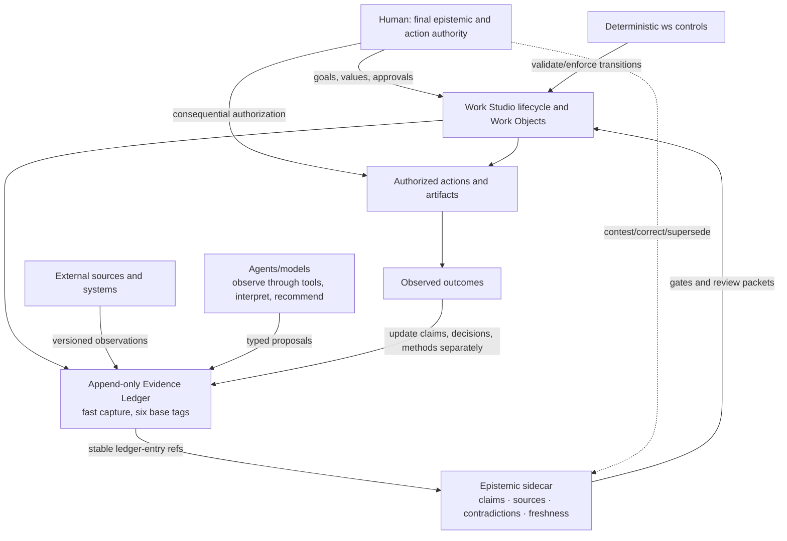
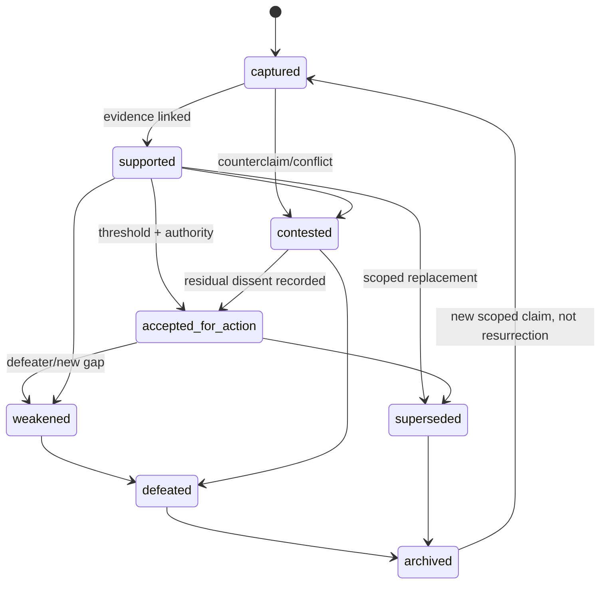
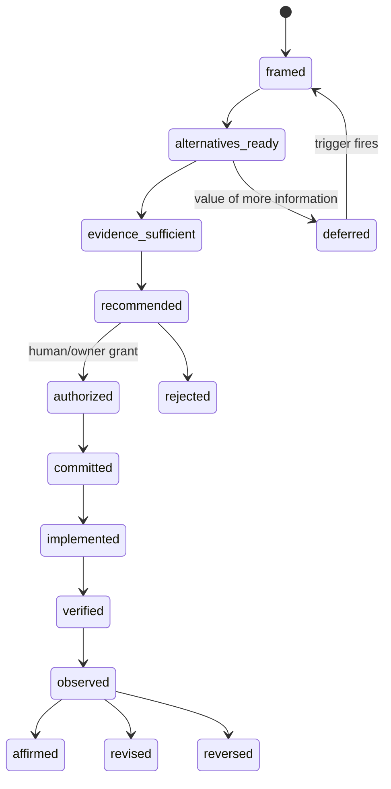
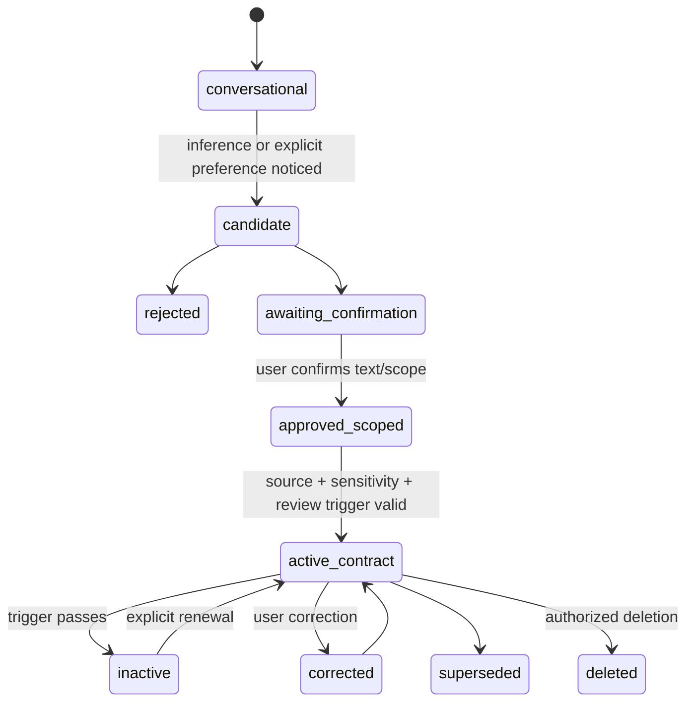
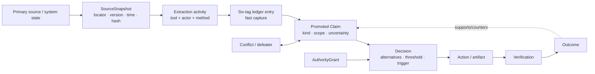
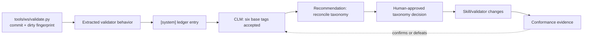
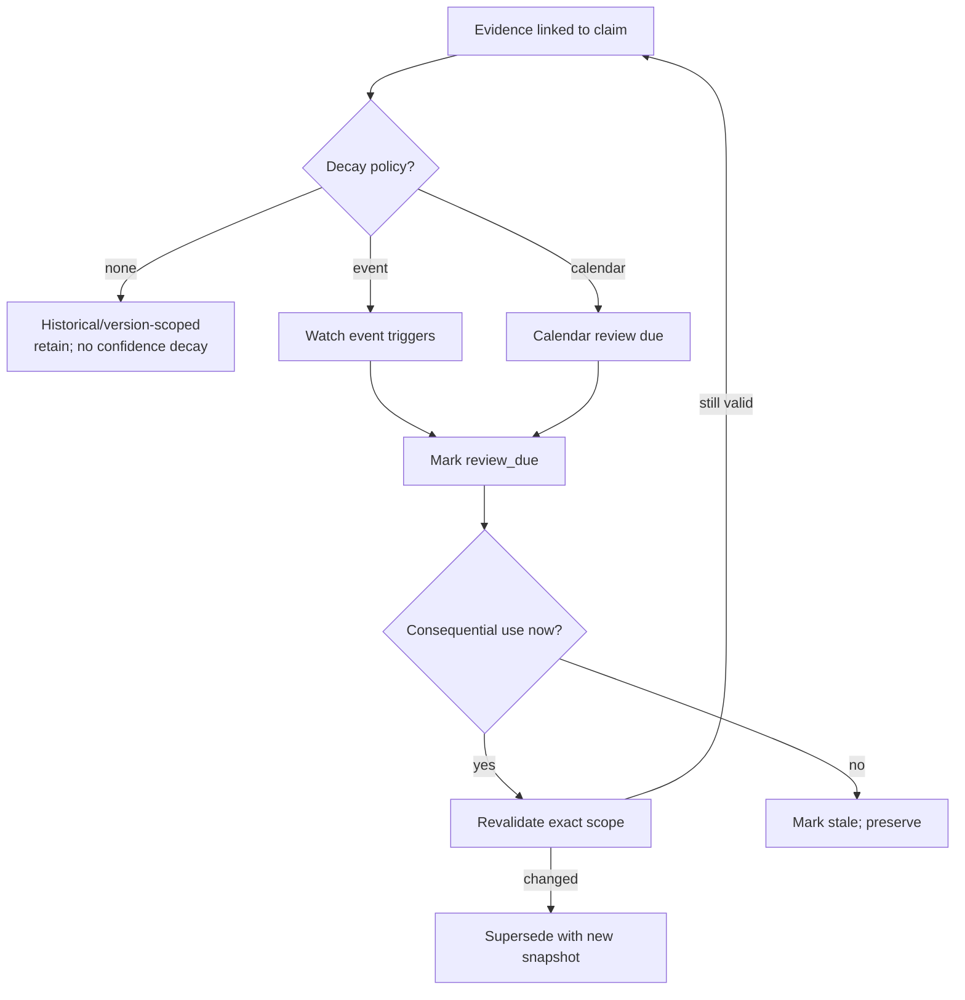
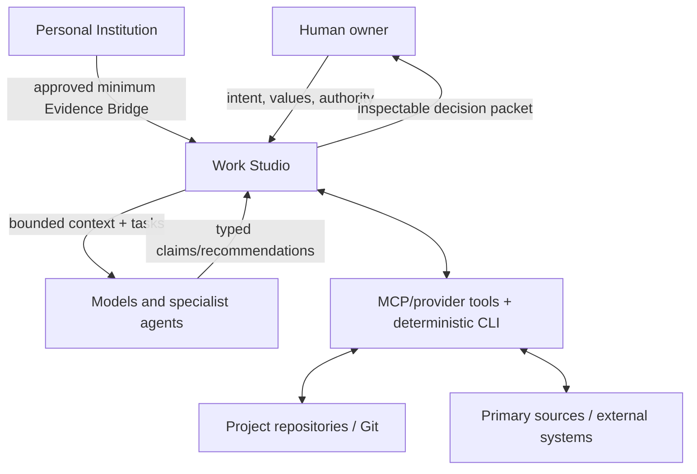
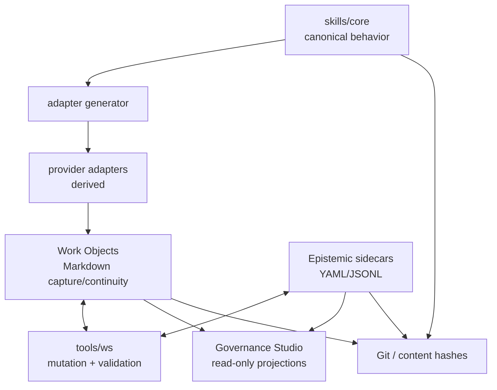
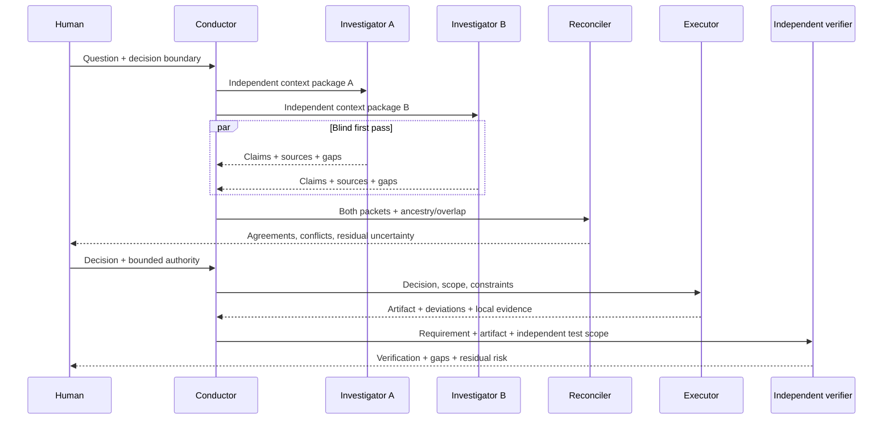

# Epistemic Engineering for Work Studio

**Research and applied architecture**  
**Repository observation date:** 2026-07-27 (Asia/Manila)  
**Scope:** the checked-out Work Studio working tree, not an asserted clean release baseline  
**Epistemic labels:** `[source-supported]`, `[widely established]`, `[emerging]`, `[contested]`, `[inferred]`, `[recommended]`, `[open]`

> This report distinguishes evidence about the repository from recommendations for it. A repository observation means “present in the inspected working tree at the time above,” not “accepted architecture” or “stable release behavior.” The tree contained substantial uncommitted work; derived adapters and tests disagreed with parts of that work. Those conditions are evidence for configuration-aware verification, not grounds for judging the project’s quality.

## 1. Executive synthesis

**Conclusion.** `[recommended]` Work Studio should treat epistemic engineering as a **cross-cutting control layer over its existing Work Object and governance lifecycle**, implemented first as a small, deterministic sidecar register for consequential claims and conflicts. It should not replace the append-only Markdown Evidence Ledger, create a universal knowledge graph, or make agents arbiters of truth.

The proposed working definition is useful but too broad to name an established discipline. `[source-supported]` The phrase “epistemic engineering” has limited scholarly use—for example, Cowley and Gahrn-Andersen use it for systemic production of functionality construed as valid knowledge—but it lacks a stable canon, shared methods, or professional standards comparable with knowledge engineering or systems engineering ([Cowley & Gahrn-Andersen, 2023](https://pmc.ncbi.nlm.nih.gov/articles/PMC9941702/)). It is best used here as a **design label for a synthesis** of social epistemology, provenance, argumentation, decision science, assurance, human factors, organizational learning, and AI risk management.

The architecture should preserve what Work Studio already does well:

- `[source-supported:repository]` canonical skills in `skills/core/`, generated provider adapters, deterministic validation, repository-local Work Objects, append-only evidence/history, explicit decision records, consequence/sensitivity gates, and separated Personal Institution memory;
- `[source-supported:repository]` a deliberately low-friction Evidence Ledger with exactly six capture-time provenance lanes: `[system]`, `[decision]`, `[inference]`, `[gap]`, `[testimony]`, `[memory]`;
- `[source-supported:repository]` decisions already separated from evidence and carrying rationale, alternatives, confidence, and revisit triggers;
- `[source-supported:repository]` human authority gates and explicit non-authority of specialist skills.

The principal gap is not lack of a graph. It is lack of a **machine-checkable bridge from ledger entries to consequential claims, their exact sources, scope, freshness, dependencies, contradictions, and use in decisions**. W3C PROV supplies a proportionate conceptual core—Entity, Activity, Agent, derivation, attribution, and generation—without requiring RDF or PROV-O storage ([W3C PROV-O Recommendation](https://www.w3.org/TR/prov-o/)). NIST similarly treats trustworthiness as a property of a socio-technical system across its lifecycle, with differentiated roles and documented knowledge limits ([NIST AI RMF 1.0](https://www.nist.gov/publications/artificial-intelligence-risk-management-framework-ai-rmf-10), [AI RMF Core](https://airc.nist.gov/airmf-resources/airmf/5-sec-core/)).

The strongest immediate repository finding is a live semantic contradiction:

1. `references/EVIDENCE-MODEL.md`, `references/AGREEMENT-LOOP.md`, `references/epistemic/epistemic-rules-full.md`, and the validator specify the six base tags.
2. Several design skills use subtype-looking tokens such as `[system:discovery]` and `[system:verification-report]`.
3. Other skills use undeclared tags such as `[source]`, `[lived]`, and `[unresolved]`.
4. Some ADR prose states that a deterministic CLI does not yet exist, while `python3 -m tools.ws --help` exposes `init`, `create`, `members`, `set-campaign`, `transition`, `close`, `activate`, `append-evidence`, `append-history`, and `validate`.

`[source-supported:repository]` This is the ideal first tracer: documentation, skill instructions, validator semantics, and executable behavior disagree while each remains inspectable. The system should open a contradiction, block only affected evidence mutations, and require an accountable resolution. It should not silently choose “newest,” “code wins,” or “docs win.”

### Recommended model



### Build decision

| Component | Disposition | Reason |
|---|---|---|
| Reconcile tag contract and add deterministic semantic lint | **build now** | Existing contradiction affects capture integrity |
| Claim/Source/Conflict sidecar for meaningful/high consequence work | **build now** | Smallest bridge to traceability and correction |
| Freshness/revisit checks | **test first** | Domain rules vary; universal decay is misleading |
| Multi-agent independence metadata | **test first** | Useful only when aggregation matters |
| Structured assurance case | **test first** for high-consequence gates | NASA-style assurance is valuable only where risk warrants burden |
| Universal knowledge graph | **reject** | Duplicates repository truth and raises ontology burden |
| Global numeric confidence engine | **reject** | Collapses distinct uncertainties and manufactures precision |
| Autonomous multi-agent debate platform | **defer** | Agreement can reflect correlated error; value is unproven here |

## 2. Definition and boundaries of epistemic engineering

### Work Studio definition

> **Epistemic engineering for Work Studio is the risk-proportionate design of records, transformations, roles, interfaces, and enforceable transitions by which claims acquire status and provenance; evidence retains scope and temporal validity; contradictions and uncertainty remain contestable; decisions receive accountable authorization; and outcomes can separately revise claims, decisions, and governing methods.**

This revises the prompt’s definition in four ways:

1. **Risk-proportionate:** routine reversible work must remain light.
2. **Claims, not “knowledge,” are the operational primitive:** the system cannot mechanically certify philosophical knowledge or truth.
3. **Contestability and authority are explicit:** traceability alone does not legitimate action.
4. **Separate update targets:** a bad outcome may implicate execution, decision, evidence process, or method differently.

### Field status

- `[source-supported]` **Established foundations:** epistemology, social epistemology, argumentation, provenance, decision analysis, systems/safety engineering, HCI, organizational learning, and knowledge representation.
- `[emerging]` **Epistemic engineering as a field:** the label appears in scattered work but lacks settled boundaries or a standards body ([Cowley & Gahrn-Andersen](https://pmc.ncbi.nlm.nih.gov/articles/PMC9941702/)).
- `[recommended]` **Best naming:** retain “epistemic engineering” as an internal synthesis label; use established terms in external contracts: provenance, assurance, evidence management, decision traceability, human authority, and configuration management.

### What it is not

- not truth determination by majority vote;
- not a synonym for knowledge engineering or ontology construction;
- not a database of everything said;
- not a requirement that every sentence become a claim object;
- not model confidence, chain-of-thought capture, or automated fact scoring;
- not AI governance in full—fairness, privacy, security, and legal compliance extend beyond epistemic quality;
- not information security, although the layers interact: security asks whether information or authority was improperly accessed or altered; epistemic security additionally asks whether an input deserves to change belief, recommendation, memory, or action.

## 3. Research landscape and major disciplines

| Discipline | Established contribution | Work Studio translation | Boundary/limitation |
|---|---|---|---|
| Classical epistemology | justification, evidence, defeat, luck, scope | claims remain defeasible; provenance is necessary but not sufficient | no consensus algorithm for “knowledge” |
| Social epistemology | testimony, expertise, disagreement, cognitive division of labor | record who knows/observed what; separate expertise from authority | agreement is not automatically independent evidence ([SEP Social Epistemology](https://plato.stanford.edu/entries/epistemology-social/)) |
| Virtue epistemology | reliability/competence of inquiry processes matters | evaluate investigation methods and calibration, not only outputs | competence does not eliminate testimonial dependence ([SEP Virtue Epistemology](https://plato.stanford.edu/entries/epistemology-virtue/)) |
| Philosophy/sociology of science | hypotheses, measurement, reproducibility, replication, revision | executable checks, source versions, falsifiers, outcome observation | everyday choices rarely support controlled replication |
| Argumentation | claims, grounds, warrants, qualifiers, rebuttals | lightweight claim-evidence-defeater records | no one graph fits code verification, preference, testimony, and forecasts |
| Belief revision/TMS | retain reasons and revise when assumptions are contradicted | dependency trace and supersession rather than overwrite | formal closure is too costly for ordinary work ([Doyle, 1979](https://www.sciencedirect.com/science/article/abs/pii/0004370279900080)) |
| Knowledge engineering | structured entities, relations, rules, schema evolution | minimal typed records and validators | universal ontology would outrun current needs |
| Provenance | entities, activities, agents, derivation, attribution | content hashes, source versions, transformation records | provenance can faithfully trace falsehood ([W3C PROV](https://www.w3.org/TR/prov-overview/)) |
| Decision science | probabilities, calibration, value of information, reversibility | separate belief/evidence/decision/urgency/consequence fields | not every uncertainty is quantifiable |
| Safety/assurance engineering | claim-argument-evidence, hazards, residual risk, IV&V | high-consequence assurance packet and independent verifier | formality can become theatre; NASA ties risk tolerance to the decision authority ([NASA System Safety Handbook](https://ntrs.nasa.gov/archive/nasa/casi.ntrs.nasa.gov/20120003291.pdf)) |
| Intelligence analysis | source quality, uncertainty language, alternatives, key assumptions | competing-hypothesis matrix, indicators, confidence rationale | structured dissent can be ritualized ([ODNI ICD 203 overview](https://www.odni.gov/index.php/how-we-work/objectivity), [CIA Tradecraft Primer](https://www.cia.gov/resources/csi/static/955180a45afe3f5013772c313b16face/Tradecraft-Primer-apr09.pdf)) |
| Human–AI interaction | calibrated reliance, mixed initiative, contestability | progressive disclosure; recommendations never imply authority | subjective trust is not technical trustworthiness ([NIST AI User Trust](https://www.nist.gov/news-events/news/2021/05/nist-proposes-method-evaluating-user-trust-artificial-intelligence-systems)) |
| Organizational learning | AARs, outcome review, method change | separate execution/decision/evidence/method diagnoses | “lesson captured” is not “lesson institutionalized” ([U.S. Army TC 7-0.1](https://rdl.train.army.mil/catalog-ws/view/100.ATSC/A6C09408-2436-47A4-93A3-6684A1B59042-1739993594606/TC7_0x1.pdf)) |
| AI risk/security | confabulation, poisoning, misuse, monitoring | treat model output and retrieved content as untrusted until grounded | mitigations remain incomplete ([NIST GAI Profile](https://nvlpubs.nist.gov/nistpubs/ai/NIST.AI.600-1.pdf), [NIST AML taxonomy](https://www.nist.gov/publications/adversarial-machine-learning-taxonomy-and-terminology-attacks-and-mitigations)) |

### Major disagreements and design consequences

- `[contested]` **Foundationalism vs coherence:** Work Studio should store direct observations and source links, but a coherent narrative is not itself evidence.
- `[contested]` **Bayesian precision vs qualitative judgment:** use probabilities only for genuinely forecastable, repeatable events; otherwise use bounded qualitative confidence with reasons. Bayesian epistemology is influential, not a mandate that all beliefs receive point probabilities ([SEP Bayesian Epistemology](https://plato.stanford.edu/entries/epistemology-bayesian/)).
- `[contested]` **Conciliation vs steadfastness under disagreement:** preserve the disagreement and identify competence, information, and independence rather than enforcing equal-weight averaging ([SEP Disagreement](https://plato.stanford.edu/entries/disagreement/)).
- `[widely established]` **Reproducibility vs replication:** repeating the same code/data and independently testing with new data answer different questions; neither a successful replication guarantees truth nor one failure conclusively defeats a claim ([National Academies, 2019](https://www.nationalacademies.org/news/new-report-examines-reproducibility-and-replicability-in-science-recommends-ways-to-improve-transparency-and-rigor-in-research)).

### Research gaps

- `[open]` validated measures of epistemic quality for personal multi-agent work;
- `[open]` reliable methods to estimate independence among LLM reviewers;
- `[open]` useful freshness policies across heterogeneous evidence;
- `[open]` whether added metadata improves decisions enough to justify burden;
- `[open]` post-deployment monitoring methods for human–AI feedback loops remain immature ([NIST AI 800-4, 2026](https://nvlpubs.nist.gov/nistpubs/ai/NIST.AI.800-4.pdf)).

## 4. Core epistemic principles

### Epistemic constitution

| Rule | Status and refinement |
|---|---|
| Preserve the original signal before interpretation. | `[recommended]` Immutable capture or content hash; inferred goal is separate. |
| Every consequential claim has an epistemic kind and scope. | `[recommended]` Do not burden routine prose. |
| No consequential claim becomes decision evidence without stable provenance. | `[recommended]` Provenance may still be weak or false. |
| No inference is represented as an observation. | `[widely established]` Enforce type-preserving transforms. |
| Repetition is not corroboration; agent count is not evidence count. | `[source-supported]` Crowd accuracy depends on error dependence; social influence can cause herding ([Toyokawa et al., 2019](https://www.nature.com/articles/s41562-018-0518-x), [Becker et al., 2017](https://pubmed.ncbi.nlm.nih.gov/28607070/)). |
| Confidence decomposes; it does not authorize. | `[recommended]` Keep source reliability, sufficiency, inference, and decision readiness separate. |
| Accepted claims remain defeasible and supersedable. | `[source-supported]` Truth-maintenance systems record reasons so assumptions can be revised after contradiction ([Doyle, 1979](https://www.sciencedirect.com/science/article/abs/pii/0004370279900080)). |
| Contradictions are durable until disposition; reconciliation never deletes dissent. | `[recommended]` Resolution links prior records and rationale. |
| Evidence has scope and temporal validity appropriate to its domain. | `[recommended]` No universal numerical decay. |
| Recommendation, permission, expertise, accountability, and final authority are distinct. | `[widely established]` NIST calls for differentiated human–AI roles and responsibilities ([AI RMF Core](https://airc.nist.gov/airmf-resources/airmf/5-sec-core/)). |
| Models propose; deterministic tools enforce machine-checkable transitions. | `[recommended]` Humans authorize consequential value/risk judgments. |
| Important verification is independent in the dimensions that matter. | `[source-supported]` NASA identifies technical, managerial, and financial independence for IV&V ([NASA SWE-141](https://swehb.nasa.gov/spaces/SWEHBVB/pages/32604595/SWE-141%2B-%2BSoftware%2BIndependent%2BVerification%2Band%2BValidation)). |
| Durable personal memory requires an explicit promotion path. | `[recommended]` Inferences about the user are candidates, never facts by default. |
| Outcomes update claims, decisions, execution assessments, and methods separately. | `[source-supported]` Outcome knowledge biases retrospective ratings of decision quality ([Baron & Hershey, 1988](https://bear.warrington.ufl.edu/brenner/mar7588/Papers/baron-hershey-jpsp1988.pdf)). |
| Visualizations are projections, never a second source of truth. | `[recommended]` Every node/edge resolves to canonical records. |

### Research-to-system translation

| Finding | Discipline / strength | Work Studio problem | Architectural implication | Counterargument / recommendation / confidence |
|---|---|---|---|---|
| Justified belief can be defeated by later evidence. | epistemology; `[widely established]` | accepted claims become sticky | explicit defeater and supersession links | overhead: track only consequential claims; **high** |
| Testimony is a legitimate but disputed basis of justification. | social epistemology; `[source-supported]` ([SEP Testimony](https://plato.stanford.edu/entries/testimony-episprob/)) | `[testimony]` may be mistaken for direct observation | retain speaker, scope, basis, and access path | privacy: minimum necessary attribution; **high** |
| Shared context creates correlated error. | collective intelligence; `[source-supported]` | many agents appear to corroborate | independence is a property of evidence lineage, not headcount | metadata can be costly: only consequential aggregation; **high** |
| Provenance supports assessment but does not prove quality. | provenance; `[source-supported]` | citation ritualism | evaluate relevance/sufficiency separately | direct sources can still be wrong; **high** |
| Structured alternatives reduce premature closure. | intelligence analysis; `[source-supported]` | pressure tests converge on first framing | use ACH only for competing causal hypotheses | matrices can imply false comparability; **medium-high** |
| Assurance connects claims, evidence, assumptions, and risk authority. | safety engineering; `[source-supported]` | release evidence may be a checklist | assurance packet for high consequence | bureaucracy for low consequence; **high** |
| Trust must be calibrated to task and risk. | HCI; `[source-supported]` | fluent outputs gain invisible authority | show uncertainty/limits at decision point | too many warnings cause fatigue; progressive disclosure; **high** |

### Lifecycle revision

The proposed lifecycle is mostly sound but should add **scope**, **decision framing**, **authorization evidence**, **post-action monitoring**, and **separate update targets**:

```text
Preserve signal → frame question/decision and consequence
→ register consequential claims with scope/status
→ plan discriminating evidence and admissibility
→ acquire observations/sources with provenance
→ evaluate quality, freshness, contradiction, independence
→ generate interpretations and alternatives
→ record residual uncertainty and decision threshold
→ obtain bounded authority → act → independently verify where needed
→ observe outcomes → update claims / decision assessment / execution / method separately
```

Do not require “epistemic status assigned” before every exploratory note; classify at promotion to consequential use.

## 5. Failure and threat taxonomy

### Threat catalogue

| Layer | Failure mechanism | Detection | Prevention | Recovery and escalation |
|---|---|---|---|---|
| Input | original signal distorted into an inferred goal | diff signal vs activation record | immutable original wording/hash | restore signal; human resolves material goal drift |
| Retrieval | fabricated, circular, poisoned, or source-laundered evidence | URL/version/hash checks; citation graph; primary-source check | trust-boundary labels; fetch content as data, not instruction | quarantine source; re-research; escalate if decision-critical |
| Reasoning | inference presented as observation; base-rate neglect; spurious coherence | type-lint; alternative check; prediction log | structured claim kind and warrant | weaken/reopen claim |
| Social | false consensus, reviewer anchoring, authority/status bias, epistemic injustice | source/prompt/model overlap; minority finding retention | blind independent first pass; explicit expertise scope | preserve branches; human reconciliation |
| Memory | unconfirmed inference promoted, stale preference reused, context collapse | promotion audit; source/scope/expiry checks | Evidence Bridge and Personalization Contract | correct/supersede/delete; notify dependent decisions |
| Authority | recommendation becomes approval; capability mistaken for permission | authority-check against action/scope | explicit grant records; deny by default at gates | stop action; incident review for breach |
| Execution | implementation drifts from authorized decision | decision-to-diff trace; tests | bounded write set and preconditions | rollback; accepted deviation or new decision |
| Verification | self-verification; test proves behavior but not requirement | producer/verifier identity; requirement coverage | risk-based independent verifier | rerun independently; block release if consequential |
| Learning | outcome bias; premature method generalization; score gaming | decision-time record; contrary cases; metric audit | separate quality axes and bounded trials | revert method; reopen scorecard |

NIST’s GAI profile explicitly treats confident erroneous content and fabricated justifications/citations as “confabulation,” especially hazardous in consequential decisions ([NIST AI 600-1](https://nvlpubs.nist.gov/nistpubs/ai/NIST.AI.600-1.pdf)). NIST’s AML taxonomy covers poisoning, evasion, privacy, and misuse across lifecycle stages and states that defenses remain incomplete ([NIST AI 100-2](https://www.nist.gov/publications/adversarial-machine-learning-taxonomy-and-terminology-attacks-and-mitigations)). OWASP documents indirect prompt injection through webpages, documents, code comments, retrieval stores, and agent tools; Work Studio should therefore treat retrieved natural language as untrusted evidence content, never executable instruction ([OWASP Prompt Injection Prevention](https://cheatsheetseries.owasp.org/cheatsheets/LLM_Prompt_Injection_Prevention_Cheat_Sheet.html)).

### Detection and controls matrix

| Failure | Prevent | Detect | Contain | Recover | Human escalation |
|---|---|---|---|---|---|
| Unsupported consequential claim | schema requires evidence refs | `epistemic audit` | mark non-operational | attach evidence or downgrade | used by meaningful/high decision |
| Wrong epistemic tag | one canonical tag spec | validator compares base/subtype | reject append | correct via new append event | taxonomy change required |
| Source laundering | relation distinguishes quote/summary/inference | transformation chain inspection | quarantine derived claims | reacquire primary source | primary unavailable and decision material |
| Stale evidence | type-specific validity rule | due/stale report | block only governed use | revalidate/supersede | high-consequence stale dependency |
| Contradiction erased | conflict object required before disposition | opposing active claims query | preserve both branches | resolution with rationale | authority/domain conflict |
| False consensus | independent-first collection | overlap and ancestry report | no confidence uplift | obtain different evidence/tool/expert | consequential disagreement remains |
| Prompt/retrieval poisoning | instruction/data separation, allowlists | suspicious instruction/content scan | sandbox tool/output | refetch, revoke source, audit dependents | attempted external action/data exposure |
| Authority drift | typed grants and scopes | pre-action check | deny action | obtain new grant; record breach | always for destructive/external/high |
| Self-verification | role/producer metadata | independence check | label verification dependent | independent rerun | release gate requires independence |
| Memory contamination | candidate-only inference | promotion-path lint | do not expose cross-project | correct/delete/supersede | sensitive or identity-affecting entry |
| Outcome bias | freeze decision-time basis | review compares ex ante record | separate outcome from quality | revise correct layer only | method/policy change proposed |
| Scorecard gaming | non-compensable gates; narrative exceptions | metric drift and sampled audit | suspend automation | revise metric and backtest | score controls authority/action |

## 6. Work Studio gap analysis

### Current strengths

- `[source-supported:repository]` `skills/core/` is canonical and adapters are generated, which is a strong source/derivation boundary.
- `[source-supported:repository]` `.work-studio` mutations are intended to pass through `tools/ws`, with optimistic concurrency and validators.
- `[source-supported:repository]` Work Objects distinguish intent, evidence, current hypothesis, decisions, verification, outcomes, and history.
- `[source-supported:repository]` consequence and sensitivity are separate, and Personal Institution data enters only through an approved Evidence Bridge.
- `[source-supported:repository]` ADRs and Git SHA references already support explicit architectural rationale and lightweight configuration identity.

### Gaps and contradictions observed

| Observation | Epistemic status | Risk | Recommendation |
|---|---|---|---|
| Six base evidence tags are canonical, while skills use base-plus-subtype and undeclared tags. | `[system observation]` from current files | append failures, silent semantic drift, inconsistent agents | first implementation unit: define base tag + optional controlled `kind`, migrate skill prose or validator atomically |
| ADR 0015 language says no CLI exists; executable CLI exists. | `[system observation]` | documentation misleads architecture decisions | register doc-code conflict; amend/supersede ADR wording after clean-baseline verification |
| Evidence entries are intentionally unstructured at capture time. | `[decision]` ADR 0016/0017/0022 | rich epistemic schema could undermine usability | preserve ledger; add optional sidecar only on promotion |
| Decisions have confidence and revisit triggers, but evidence freshness is not generally machine-readable. | `[system observation]` | stale evidence can remain active | type-specific sidecar validity rules |
| Verification records do not uniformly expose independence dimensions. | `[inferred]` from skill/schema review | producer may verify own work without visible qualification | verifier/producer/method/environment fields for consequential verification |
| Provider/model/source overlap is not represented. | `[system observation]` | multiple agents may look independent | record ancestry only for aggregated consequential review |
| Working tree and generated/test artifacts currently disagree. | `[system observation]`, scoped to 2026-07-27 dirty tree | cannot infer release condition | every verification snapshot records commit SHA + dirty-state hash; test from a clean baseline before disposition |

### Lifecycle fit

Epistemic controls should be embedded at **promotion and transition points**, not every sentence:

- Signal → Work Object: preserve original signal; label inferred intent.
- Explore/investigate: lightweight six-tag capture.
- Decision: promote cited consequential claims to sidecar, expose contradiction and freshness.
- Build: trace authorized decision and accepted deviations.
- Verify/release: require requirement coverage, environment identity, residual uncertainty, independence appropriate to consequence.
- Observe/adapt: freeze ex ante basis and update four axes separately.

## 7. Minimal epistemic ontology

### Universal objects

Only six new/normalized universal records are justified:

| Object | Purpose / required fields | Authority and lifecycle | Failure modes / view |
|---|---|---|---|
| **Claim** | `id`, exact text, kind, scope, status, evidence refs, author, created, freshness state | agent may propose; authorized reviewer accepts/defeats/supersedes | over-atomization; claim-evidence view |
| **SourceSnapshot** | locator, version/commit, retrieved/observed time, hash where possible, source kind, actor/tool | tool/human observes; immutable snapshot | false authority; lineage view |
| **EvidenceLink** | claim, source/ledger ref, relation (`supports`,`counters`,`qualifies`), relevance, extraction mode | agent proposes; review can challenge; append-only | “citation equals support”; inspect passage/context |
| **Conflict** | parties, conflict type, materiality, status, opened by, disposition/reason | any actor opens; authorized owner resolves | premature closure; contradiction map |
| **AuthorityGrant** | action, subject, scope, constraints, evidence reviewed, grantor, time, expiry/revocation | human/accountable system only; immutable + revoke event | scope creep; authority map |
| **Review/Verification** | target, criteria profile, methods, results, gaps, producer/verifier, environment, independence, residual risk | verifier records; authority owner accepts | checklist theatre; assurance view |

Reuse existing **Decision**, **Work Object**, **Outcome Review**, **ADR**, **Accepted Deviation**, and **Personalization Contract** rather than duplicating them.

### Not universal

- Question/Hypothesis/Assumption/Forecast are **claim kinds**, not separate storage types initially.
- Observation, Interpretation, Recommendation, Preference, and Value Judgment are also claim kinds.
- “Uncertainty” is a structured attribute/set of reasons, not a freestanding object unless shared by several claims.
- Lesson is a candidate claim linked to an Outcome Review; it becomes a Working Method only through existing governance.
- Revisit Trigger is a typed field/event condition, not an object.

### Machine-readable contract

```yaml
schema_version: ws.epistemic/v0.1
claim:
  id: CLM-2026-07-27-001
  work_object_id: 2026-07-27-XXX
  text: "The evidence validator accepts only the six base provenance tags."
  kind: observation         # observation|source_report|inference|hypothesis|assumption
                            # forecast|recommendation|preference|value_judgment|verified_result
  scope:
    repository: andrelawas-work-studio
    git_commit: "<sha>"
    dirty_tree_fingerprint: "<hash-or-null>"
    paths: ["tools/ws/validate.py", "references/EVIDENCE-MODEL.md"]
  state: supported          # captured|supported|contested|accepted_for_action
                            # weakened|defeated|superseded|archived
  decision_use: material    # none|informational|material|authorizing
  freshness: current        # current|review_due|stale|superseded|unknown
  created_at: 2026-07-27T00:00:00+08:00
  created_by: {actor_type: agent, actor_id: "<run-id>"}
  evidence_links: [EVL-001, EVL-002]
  uncertainty:
    type: [configuration]
    statement: "Observation is from a dirty working tree, not a clean release."
  revisit:
    on: ["validator-changed", "evidence-taxonomy-changed", "clean-baseline-tested"]
```

### Relationships

```text
SourceSnapshot --supports/counters/qualifies--> Claim
Claim --depends_on/assumes/supersedes--> Claim
Claim <--party-- Conflict --party--> Claim|Artifact|HumanPosition
Decision --relies_on--> Claim
AuthorityGrant --authorizes--> Decision|Action
Verification --tests--> Claim|Artifact|Requirement
OutcomeReview --updates--> Claim|DecisionAssessment|ExecutionAssessment|MethodCandidate
```

## 8. Claim, evidence, decision, and memory lifecycles

State is separate from confidence, evidence strength, decision use, authority, freshness, and scope. Thus a claim may be accepted for action but contested, well-supported but stale, or low-confidence but decision-critical.

### Claim state machine



### Evidence lifecycle

```text
observed/retrieved → snapshotted → linked → evaluated
→ current → review_due → revalidated | stale → superseded → retained
```

Evidence is never “accepted as true”; a link is accepted as relevant support/counterevidence within scope.

### Decision state machine



### Assumption lifecycle

```text
declared → materiality assessed → accepted-for-test
→ corroborated | challenged → discharged | violated | superseded
```

An assumption never silently becomes an observation.

### Memory-promotion state machine



### Contradiction lifecycle

```text
detected → opened → materiality classified
→ [non-material: retain + close]
→ [material: branch + investigate]
→ resolved-by-scope | resolved-by-supersession | accepted-deviation
→ monitored → reopened if trigger fires
```

### Verification lifecycle

```text
planned → prerequisites checked → executed
→ passed | failed | inconclusive | unavailable
→ independently reviewed where required
→ accepted/rejected by authority → expires/revalidate
```

## 9. Provenance and temporal-validity architecture

### Proportionate provenance

Use W3C PROV as a conceptual mapping, not a storage mandate:

| W3C PROV | Work Studio |
|---|---|
| Entity | source snapshot, artifact version, claim record |
| Activity | retrieval, extraction, summarization, inference, implementation, verification |
| Agent | human, model run, tool, external service |
| `wasDerivedFrom` | claim/summary lineage |
| `wasAttributedTo` | accountable producer/source |
| `wasGeneratedBy` | transformation activity |
| `wasRevisionOf` | supersession/version relation |

`[source-supported]` PROV is designed for interoperable provenance and explicitly supports incremental use of a small starting set; it does not claim that provenance establishes truth or reliability ([W3C PROV-O](https://www.w3.org/TR/prov-o/), [PROV Overview](https://www.w3.org/TR/prov-overview/)).

### Epistemic data flow



### Claim lineage graph



### Temporal fields

```yaml
observed_at: 2026-07-27T00:00:00+08:00
valid_from: 2026-07-27T00:00:00+08:00
valid_until: null
revalidate_after: null
decay_policy:
  kind: event_triggered       # none|event_triggered|calendar|probabilistic
  triggers:
    - path_changed: tools/ws/validate.py
    - git_baseline_changed
revisit_trigger: "before evidence-taxonomy ADR acceptance"
```

Use:

- **event-triggered** validity for code, schemas, requirements, and design snapshots;
- **calendar review** for external policies, credentials/capabilities, provider APIs, and operational runbooks;
- **validity intervals** for contracts, grants, releases, and time-bounded observations;
- **probabilistic decay** only when empirically calibrated for that domain;
- **no decay** for historical facts about a specific version, while their relevance may expire.

### Evidence-decay flow



### Content addressing and Git

`[recommended]` Record repository-relative path, commit SHA, and dirty-tree fingerprint. A commit SHA is a version reference, not the embedded artifact itself. External sources should record URL/identifier, publication/version date, retrieval time, and hash where legally/practically appropriate. Signed attestations are deferred until adversarial or inter-organizational exchange justifies key management.

## 10. Authority and multi-agent architecture

### Capability is not authority

| Dimension | Meaning | Example |
|---|---|---|
| Capability | can perform operation | model can generate patch |
| Permission | may perform operation in scope | grant covers files A/B |
| Expertise | competence relevant to judgment | security specialist evaluates threat |
| Accountability | answerable for consequences | project owner accepts residual risk |
| Final authority | may bind action/value choice | human approves deployment |

### Authority map

| Actor | Observe | Interpret | Recommend | Revise durable memory | Approve | Act | Verify | Supersede | Change criteria |
|---|---|---|---|---|---|---|---|---|---|
| Human owner | yes | yes | yes | **final** | **final** | yes/delegate | yes | **final** | **final** |
| Conductor | tools only | yes | yes | propose only | no | route only | orchestration only | propose | propose |
| Specialist agent | bounded tools | domain-scoped | yes | no | no | only explicit operational grant | no self-certification | no | no |
| Implementation agent | repo/tool observations | implementation-scoped | deviations | no | no | bounded grant | local checks, labeled dependent | no | no |
| Verification agent | test observations | against criteria | accept/reject recommendation | no | no | test actions in scope | yes | no | no |
| Deterministic tool | establish declared computation/result | no semantic judgment | no | enforce transition only | no | execute validated command | deterministic checks | no | enforce schema version |
| External service | source testimony/system result | no | no | no | no | API behavior only | service-specific | no | no |

### System context view



### Container view



### Multi-agent boundaries

Use one strong agent when the task is low consequence, sources are inspectable, and deterministic verification dominates. Use specialists when genuine domain competence differs. Use independent providers/reviewers only when correlated error is material and the independence hypothesis is recorded. Use adversarial review for a named claim or hazard, not generic “be skeptical.” Use human experts where tacit/contextual judgment or accountability cannot be delegated.



Majority voting is not the default. Multiple agents using the same context, sources, model family, or upstream summary are not independent confirmations. Social-learning experiments show that increased interaction can improve or degrade collective accuracy depending on task and copying dynamics ([Toyokawa et al.](https://www.nature.com/articles/s41562-018-0518-x)); Work Studio should measure source/ancestry overlap rather than infer independence from agent identity.

