# Epistemic Engineering for Work Studio

**Research and applied architecture**  
**Repository observation date:** 2026-07-27 (Asia/Manila)  
**Scope:** the checked-out Work Studio working tree, not an asserted clean release baseline  
**Epistemic labels:** `[source-supported]`, `[widely established]`, `[emerging]`, `[contested]`, `[inference]`, `[decision]`, `[open]`

> This report distinguishes evidence about the repository from recommendations for it. A repository observation means “present in the inspected working tree at the time above,” not “accepted architecture” or “stable release behavior.” The tree contained substantial uncommitted work; derived adapters and tests disagreed with parts of that work. Those conditions are evidence for configuration-aware verification, not grounds for judging the project’s quality.

## 1. Executive synthesis

**Conclusion.** `[decision]` Work Studio should treat epistemic engineering as a **cross-cutting control layer over its existing Work Object and governance lifecycle**, implemented first as a small, deterministic sidecar register for consequential claims and conflicts. It should not replace the append-only Markdown Evidence Ledger, create a universal knowledge graph, or make agents arbiters of truth.

The proposed working definition is useful but too broad to name an established discipline. `[source-supported]` The phrase “epistemic engineering” has limited scholarly use—for example, Cowley and Gahrn-Andersen use it for systemic production of functionality construed as valid knowledge—but it lacks a stable canon, shared methods, or professional standards comparable with knowledge engineering or systems engineering ([Cowley & Gahrn-Andersen, 2023](https://pmc.ncbi.nlm.nih.gov/articles/PMC9941702/)). It is best used here as a **design label for a synthesis** of social epistemology, provenance, argumentation, decision science, assurance, human factors, organizational learning, and AI risk management.

The architecture should preserve what Work Studio already does well:

- `[source-supported:repository]` canonical skills in `skills/core/`, generated provider adapters, deterministic validation, repository-local Work Objects, append-only evidence/history, explicit decision records, consequence/sensitivity gates, and separated Personal Institution memory;
- `[source-supported:repository]` a deliberately low-friction Evidence Ledger with exactly six capture-time provenance lanes: `[system]`, `[decision]`, `[inference]`, `[gap]`, `[testimony]`, `[memory]`;
- `[source-supported:repository]` decisions already separated from evidence and carrying rationale, alternatives, confidence, and revisit triggers;
- `[source-supported:repository]` human authority gates and explicit non-authority of specialist skills.

The principal gap is not lack of a graph. It is lack of a **machine-checkable bridge from ledger entries to consequential claims, their exact sources, scope, freshness, dependencies, contradictions, and use in decisions**. W3C PROV supplies a proportionate conceptual core—Entity, Activity, Agent, derivation, attribution, and generation—without requiring RDF or PROV-O storage ([W3C PROV-O Recommendation](https://www.w3.org/TR/prov-o/)). NIST similarly treats trustworthiness as a property of a socio-technical system across its lifecycle, with differentiated roles and documented knowledge limits ([NIST AI RMF 1.0](https://www.nist.gov/publications/artificial-intelligence-risk-management-framework-ai-rmf-10), [AI RMF Core](https://airc.nist.gov/airmf-resources/airmf/5-sec-core/)).

The strongest immediate repository finding is a live semantic contradiction:

1. `references/EVIDENCE-MODEL.md`, `references/AGREEMENT-LOOP.md`, `references/epistemic/epistemic-rules-full.md`, and the validator specify the six base tags.
2. Several design skills use subtype-looking tokens such as `[system:discovery]` and `[system:verification-report]`.
3. Other skills use undeclared tags such as `[system]`, `[testimony]`, and `[gap]`.
4. Some ADR prose states that a deterministic CLI does not yet exist, while `python3 -m tools.ws --help` exposes `init`, `create`, `members`, `set-campaign`, `transition`, `close`, `activate`, `append-evidence`, `append-history`, and `validate`.

`[source-supported:repository]` This is the ideal first tracer: documentation, skill instructions, validator semantics, and executable behavior disagree while each remains inspectable. The system should open a contradiction, block only affected evidence mutations, and require an accountable resolution. It should not silently choose “newest,” “code wins,” or “docs win.”

### Recommended model

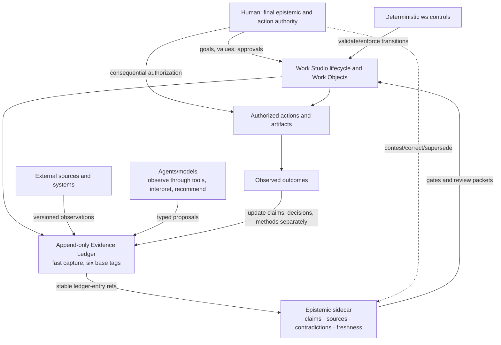

### Build decision

| Component | Disposition | Reason |
|---|---|---|
| Reconcile tag contract and add deterministic semantic lint | **build now** | Existing contradiction affects capture integrity |
| Claim/Source/Conflict sidecar for meaningful/high consequence work | **build now** | Smallest bridge to traceability and correction |
| Freshness/revisit checks | **test first** | Domain rules vary; universal decay is misleading |
| Multi-agent independence metadata | **test first** | Useful only when aggregation matters |
| Structured assurance case | **test first** for high-consequence gates | NASA-style assurance is valuable only where risk warrants burden |
| Universal knowledge graph | **reject** | Duplicates repository truth and raises ontology burden |
| Global numeric confidence engine | **reject** | Collapses distinct uncertainties and manufactures precision |
| Autonomous multi-agent debate platform | **defer** | Agreement can reflect correlated error; value is unproven here |

## 2. Definition and boundaries of epistemic engineering

### Work Studio definition

> **Epistemic engineering for Work Studio is the risk-proportionate design of records, transformations, roles, interfaces, and enforceable transitions by which claims acquire status and provenance; evidence retains scope and temporal validity; contradictions and uncertainty remain contestable; decisions receive accountable authorization; and outcomes can separately revise claims, decisions, and governing methods.**

This revises the prompt’s definition in four ways:

1. **Risk-proportionate:** routine reversible work must remain light.
2. **Claims, not “knowledge,” are the operational primitive:** the system cannot mechanically certify philosophical knowledge or truth.
3. **Contestability and authority are explicit:** traceability alone does not legitimate action.
4. **Separate update targets:** a bad outcome may implicate execution, decision, evidence process, or method differently.

### Field status

- `[source-supported]` **Established foundations:** epistemology, social epistemology, argumentation, provenance, decision analysis, systems/safety engineering, HCI, organizational learning, and knowledge representation.
- `[emerging]` **Epistemic engineering as a field:** the label appears in scattered work but lacks settled boundaries or a standards body ([Cowley & Gahrn-Andersen](https://pmc.ncbi.nlm.nih.gov/articles/PMC9941702/)).
- `[decision]` **Best naming:** retain “epistemic engineering” as an internal synthesis label; use established terms in external contracts: provenance, assurance, evidence management, decision traceability, human authority, and configuration management.

### What it is not

- not truth determination by majority vote;
- not a synonym for knowledge engineering or ontology construction;
- not a database of everything said;
- not a requirement that every sentence become a claim object;
- not model confidence, chain-of-thought capture, or automated fact scoring;
- not AI governance in full—fairness, privacy, security, and legal compliance extend beyond epistemic quality;
- not information security, although the layers interact: security asks whether information or authority was improperly accessed or altered; epistemic security additionally asks whether an input deserves to change belief, recommendation, memory, or action.

## 3. Research landscape and major disciplines

| Discipline | Established contribution | Work Studio translation | Boundary/limitation |
|---|---|---|---|
| Classical epistemology | justification, evidence, defeat, luck, scope | claims remain defeasible; provenance is necessary but not sufficient | no consensus algorithm for “knowledge” |
| Social epistemology | testimony, expertise, disagreement, cognitive division of labor | record who knows/observed what; separate expertise from authority | agreement is not automatically independent evidence ([SEP Social Epistemology](https://plato.stanford.edu/entries/epistemology-social/)) |
| Virtue epistemology | reliability/competence of inquiry processes matters | evaluate investigation methods and calibration, not only outputs | competence does not eliminate testimonial dependence ([SEP Virtue Epistemology](https://plato.stanford.edu/entries/epistemology-virtue/)) |
| Philosophy/sociology of science | hypotheses, measurement, reproducibility, replication, revision | executable checks, source versions, falsifiers, outcome observation | everyday choices rarely support controlled replication |
| Argumentation | claims, grounds, warrants, qualifiers, rebuttals | lightweight claim-evidence-defeater records | no one graph fits code verification, preference, testimony, and forecasts |
| Belief revision/TMS | retain reasons and revise when assumptions are contradicted | dependency trace and supersession rather than overwrite | formal closure is too costly for ordinary work ([Doyle, 1979](https://www.sciencedirect.com/science/article/abs/pii/0004370279900080)) |
| Knowledge engineering | structured entities, relations, rules, schema evolution | minimal typed records and validators | universal ontology would outrun current needs |
| Provenance | entities, activities, agents, derivation, attribution | content hashes, source versions, transformation records | provenance can faithfully trace falsehood ([W3C PROV](https://www.w3.org/TR/prov-overview/)) |
| Decision science | probabilities, calibration, value of information, reversibility | separate belief/evidence/decision/urgency/consequence fields | not every uncertainty is quantifiable |
| Safety/assurance engineering | claim-argument-evidence, hazards, residual risk, IV&V | high-consequence assurance packet and independent verifier | formality can become theatre; NASA ties risk tolerance to the decision authority ([NASA System Safety Handbook](https://ntrs.nasa.gov/archive/nasa/casi.ntrs.nasa.gov/20120003291.pdf)) |
| Intelligence analysis | source quality, uncertainty language, alternatives, key assumptions | competing-hypothesis matrix, indicators, confidence rationale | structured dissent can be ritualized ([ODNI ICD 203 overview](https://www.odni.gov/index.php/how-we-work/objectivity), [CIA Tradecraft Primer](https://www.cia.gov/resources/csi/static/955180a45afe3f5013772c313b16face/Tradecraft-Primer-apr09.pdf)) |
| Human–AI interaction | calibrated reliance, mixed initiative, contestability | progressive disclosure; recommendations never imply authority | subjective trust is not technical trustworthiness ([NIST AI User Trust](https://www.nist.gov/news-events/news/2021/05/nist-proposes-method-evaluating-user-trust-artificial-intelligence-systems)) |
| Organizational learning | AARs, outcome review, method change | separate execution/decision/evidence/method diagnoses | “lesson captured” is not “lesson institutionalized” ([U.S. Army TC 7-0.1](https://rdl.train.army.mil/catalog-ws/view/100.ATSC/A6C09408-2436-47A4-93A3-6684A1B59042-1739993594606/TC7_0x1.pdf)) |
| AI risk/security | confabulation, poisoning, misuse, monitoring | treat model output and retrieved content as untrusted until grounded | mitigations remain incomplete ([NIST GAI Profile](https://nvlpubs.nist.gov/nistpubs/ai/NIST.AI.600-1.pdf), [NIST AML taxonomy](https://www.nist.gov/publications/adversarial-machine-learning-taxonomy-and-terminology-attacks-and-mitigations)) |

### Major disagreements and design consequences

- `[contested]` **Foundationalism vs coherence:** Work Studio should store direct observations and source links, but a coherent narrative is not itself evidence.
- `[contested]` **Bayesian precision vs qualitative judgment:** use probabilities only for genuinely forecastable, repeatable events; otherwise use bounded qualitative confidence with reasons. Bayesian epistemology is influential, not a mandate that all beliefs receive point probabilities ([SEP Bayesian Epistemology](https://plato.stanford.edu/entries/epistemology-bayesian/)).
- `[contested]` **Conciliation vs steadfastness under disagreement:** preserve the disagreement and identify competence, information, and independence rather than enforcing equal-weight averaging ([SEP Disagreement](https://plato.stanford.edu/entries/disagreement/)).
- `[widely established]` **Reproducibility vs replication:** repeating the same code/data and independently testing with new data answer different questions; neither a successful replication guarantees truth nor one failure conclusively defeats a claim ([National Academies, 2019](https://www.nationalacademies.org/news/new-report-examines-reproducibility-and-replicability-in-science-recommends-ways-to-improve-transparency-and-rigor-in-research)).

### Research gaps

- `[open]` validated measures of epistemic quality for personal multi-agent work;
- `[open]` reliable methods to estimate independence among LLM reviewers;
- `[open]` useful freshness policies across heterogeneous evidence;
- `[open]` whether added metadata improves decisions enough to justify burden;
- `[open]` post-deployment monitoring methods for human–AI feedback loops remain immature ([NIST AI 800-4, 2026](https://nvlpubs.nist.gov/nistpubs/ai/NIST.AI.800-4.pdf)).

### Source quality register

| Source (date) | Field / quality | What it supports | Limitation |
|---|---|---|---|
| [W3C PROV-O](https://www.w3.org/TR/prov-o/) (2013) | provenance; normative W3C Recommendation | Entity/Activity/Agent and derivation mapping | interchange standard, not truth or credibility model |
| [NIST AI RMF 1.0](https://www.nist.gov/publications/artificial-intelligence-risk-management-framework-ai-rmf-10) (2023) | AI governance; official consensus-informed framework | socio-technical lifecycle, roles, trustworthiness tradeoffs | voluntary and intentionally non-prescriptive |
| [NIST GAI Profile](https://nvlpubs.nist.gov/nistpubs/ai/NIST.AI.600-1.pdf) (2024) | generative-AI risk; official profile | confabulation, fabricated citations, consequential-use risk | risk guidance, not incidence estimate for Work Studio |
| [NIST AML taxonomy](https://www.nist.gov/publications/adversarial-machine-learning-taxonomy-and-terminology-attacks-and-mitigations) (2024; updated program) | AI security; official taxonomy/literature synthesis | poisoning, evasion, privacy, misuse and incomplete mitigations | broader than retrieval/agent workflows |
| [National Academies reproducibility report](https://www.nationalacademies.org/read/25303) (2019) | science; independently reviewed consensus report | reproduction/replication distinction and epistemic limits | scientific studies differ from one-off product decisions |
| [NASA System Safety Handbook](https://ntrs.nasa.gov/archive/nasa/casi.ntrs.nasa.gov/20120003291.pdf) (2011) | safety/assurance; first-party technical handbook | claims, evidence, objectives, risk tolerance | designed for safety-critical systems |
| [NASA IV&V guidance](https://swehb.nasa.gov/spaces/SWEHBVB/pages/32604595/SWE-141%2B-%2BSoftware%2BIndependent%2BVerification%2Band%2BValidation) (official handbook) | software assurance; first-party guidance | technical/managerial/financial independence | formal NASA context; must be scaled down |
| [ODNI ICD 203 overview](https://www.odni.gov/index.php/how-we-work/objectivity) (2015 revision described) | intelligence analysis; official analytic standard | source quality and explicit uncertainty | national-intelligence incentives/context differ |
| [CIA Tradecraft Primer](https://www.cia.gov/resources/csi/static/955180a45afe3f5013772c313b16face/Tradecraft-Primer-apr09.pdf) (2009) | structured analysis; first-party practitioner doctrine | ACH, alternatives, disconfirmation | technique effectiveness is context-dependent |
| [Doyle, “A truth maintenance system”](https://www.sciencedirect.com/science/article/abs/pii/0004370279900080) (1979) | AI reasoning; original peer-reviewed paper | reasons/dependencies and belief revision | symbolic idealization, not natural-language adjudication |
| [Dung, abstract argumentation](https://www.sciencedirect.com/science/article/pii/000437029400041X) (1995) | argumentation; original peer-reviewed paper | durable attack/conflict relations | abstracts away internal argument quality |
| [SEP Social Epistemology](https://plato.stanford.edu/entries/epistemology-social/) (rev. 2024) | philosophy; expert-authored scholarly synthesis | testimony, disagreement, group/institutional knowledge | secondary synthesis; philosophical disputes remain |
| [Toyokawa et al.](https://www.nature.com/articles/s41562-018-0518-x) (2019) | collective behavior; peer-reviewed experiment, n=699 | social learning can produce wisdom or herding | human online experiment, not LLM-agent validation |
| [Baron & Hershey](https://bear.warrington.ufl.edu/brenner/mar7588/Papers/baron-hershey-jpsp1988.pdf) (1988) | judgment; original multi-study paper | outcome bias in decision evaluation | older laboratory scenarios; mechanism/generalization limited |
| [U.S. Army TC 7-0.1](https://rdl.train.army.mil/catalog-ws/view/100.ATSC/A6C09408-2436-47A4-93A3-6684A1B59042-1739993594606/TC7_0x1.pdf) (2025) | organizational learning; official doctrine | structured after-action review | training doctrine, not evidence of Work Studio outcome gain |

## 4. Core epistemic principles

### Epistemic constitution

| Rule | Status and refinement |
|---|---|
| Preserve the original signal before interpretation. | `[decision]` Immutable capture or content hash; inferred goal is separate. |
| Every consequential claim has an epistemic kind and scope. | `[decision]` Do not burden routine prose. |
| No consequential claim becomes decision evidence without stable provenance. | `[decision]` Provenance may still be weak or false. |
| No inference is represented as an observation. | `[widely established]` Enforce type-preserving transforms. |
| Repetition is not corroboration; agent count is not evidence count. | `[source-supported]` Crowd accuracy depends on error dependence; social influence can cause herding ([Toyokawa et al., 2019](https://www.nature.com/articles/s41562-018-0518-x), [Becker et al., 2017](https://pubmed.ncbi.nlm.nih.gov/28607070/)). |
| Confidence decomposes; it does not authorize. | `[decision]` Keep source reliability, sufficiency, inference, and decision readiness separate. |
| Accepted claims remain defeasible and supersedable. | `[source-supported]` Truth-maintenance systems record reasons so assumptions can be revised after contradiction ([Doyle, 1979](https://www.sciencedirect.com/science/article/abs/pii/0004370279900080)). |
| Contradictions are durable until disposition; reconciliation never deletes dissent. | `[decision]` Resolution links prior records and rationale. |
| Evidence has scope and temporal validity appropriate to its domain. | `[decision]` No universal numerical decay. |
| Recommendation, permission, expertise, accountability, and final authority are distinct. | `[widely established]` NIST calls for differentiated human–AI roles and responsibilities ([AI RMF Core](https://airc.nist.gov/airmf-resources/airmf/5-sec-core/)). |
| Models propose; deterministic tools enforce machine-checkable transitions. | `[decision]` Humans authorize consequential value/risk judgments. |
| Important verification is independent in the dimensions that matter. | `[source-supported]` NASA identifies technical, managerial, and financial independence for IV&V ([NASA SWE-141](https://swehb.nasa.gov/spaces/SWEHBVB/pages/32604595/SWE-141%2B-%2BSoftware%2BIndependent%2BVerification%2Band%2BValidation)). |
| Durable personal memory requires an explicit promotion path. | `[decision]` Inferences about the user are candidates, never facts by default. |
| Outcomes update claims, decisions, execution assessments, and methods separately. | `[source-supported]` Outcome knowledge biases retrospective ratings of decision quality ([Baron & Hershey, 1988](https://bear.warrington.ufl.edu/brenner/mar7588/Papers/baron-hershey-jpsp1988.pdf)). |
| Visualizations are projections, never a second source of truth. | `[decision]` Every node/edge resolves to canonical records. |

### Epistemic concepts that change the design

| Concept | System implication / Work Studio mechanism |
|---|---|
| Knowledge / justified belief | Do not label records “knowledge” merely because true-looking; store claims and their basis, then expose acceptance policy. |
| Truth | Remains a regulative aim, not a database state agents can grant. `verified_result` means a declared test passed in scope. |
| Justification / evidence | Link evidence and the warrant by which it bears on a claim; a source link alone is not justification. |
| Defeasibility | Accepted claims retain defeaters, counterevidence, and reopen/supersession transitions. |
| Testimony | Record speaker/source, access basis, scope, and attribution; testimony is neither direct system observation nor automatically weak. |
| Reliability | Track method/source performance only where outcomes permit; never infer reliability from fluent output. |
| Coherence | Use contradictions to inspect coherence, but never let narrative consistency substitute for external evidence. |
| Foundationalism | Preserve direct observations/source snapshots as anchors without pretending they are infallible. |
| Bayesian epistemology | Use updates/ranges for repeated forecastable events; do not impose point probabilities on preferences or one-off design judgment. |
| Virtue epistemology | Review inquiry competence—care, source selection, openness to defeat—not just whether an answer happened to be correct. |
| Pragmatic encroachment | Raise the decision threshold with consequence/irreversibility without claiming the proposition itself changed truth value. |
| Epistemic luck | Separate a lucky good outcome from a well-grounded decision via frozen ex ante records. |
| Underdetermination | Preserve rival explanations when the same evidence fits several hypotheses; use discriminating tests. |
| Higher-order evidence | Evidence that an agent/method is unreliable can weaken reliance without directly refuting the object-level claim. |
| Peer disagreement | Record competence, information, and independence; do not average mechanically. |
| Epistemic dependence | Preserve upstream evidence ancestry and expert scope; no agent is epistemically self-sufficient. |
| Epistemic injustice | Allow minority/testimonial findings to remain visible; audit whether identity/status, rather than evidence, controls credibility. |
| Preference/value judgment | Typed as owner-governed inputs; never promoted to fact through repetition or personalization. |

### Research-to-system translation

| Finding | Discipline / strength | Work Studio problem | Architectural implication | Counterargument / recommendation / confidence |
|---|---|---|---|---|
| Justified belief can be defeated by later evidence. | epistemology; `[widely established]` | accepted claims become sticky | explicit defeater and supersession links | overhead: track only consequential claims; **high** |
| Testimony is a legitimate but disputed basis of justification. | social epistemology; `[source-supported]` ([SEP Testimony](https://plato.stanford.edu/entries/testimony-episprob/)) | `[testimony]` may be mistaken for direct observation | retain speaker, scope, basis, and access path | privacy: minimum necessary attribution; **high** |
| Shared context creates correlated error. | collective intelligence; `[source-supported]` | many agents appear to corroborate | independence is a property of evidence lineage, not headcount | metadata can be costly: only consequential aggregation; **high** |
| Provenance supports assessment but does not prove quality. | provenance; `[source-supported]` | citation ritualism | evaluate relevance/sufficiency separately | direct sources can still be wrong; **high** |
| Structured alternatives reduce premature closure. | intelligence analysis; `[source-supported]` | pressure tests converge on first framing | use ACH only for competing causal hypotheses | matrices can imply false comparability; **medium-high** |
| Assurance connects claims, evidence, assumptions, and risk authority. | safety engineering; `[source-supported]` | release evidence may be a checklist | assurance packet for high consequence | bureaucracy for low consequence; **high** |
| Trust must be calibrated to task and risk. | HCI; `[source-supported]` | fluent outputs gain invisible authority | show uncertainty/limits at decision point | too many warnings cause fatigue; progressive disclosure; **high** |

### Lifecycle revision

The proposed lifecycle is mostly sound but should add **scope**, **decision framing**, **authorization evidence**, **post-action monitoring**, and **separate update targets**:

```text
Preserve signal → frame question/decision and consequence
→ register consequential claims with scope/status
→ plan discriminating evidence and admissibility
→ acquire observations/sources with provenance
→ evaluate quality, freshness, contradiction, independence
→ generate interpretations and alternatives
→ record residual uncertainty and decision threshold
→ obtain bounded authority → act → independently verify where needed
→ observe outcomes → update claims / decision assessment / execution / method separately
```

Do not require “epistemic status assigned” before every exploratory note; classify at promotion to consequential use.

## 5. Failure and threat taxonomy

### Threat catalogue

| Layer | Failure mechanism | Detection | Prevention | Recovery and escalation |
|---|---|---|---|---|
| Input | original signal distorted into an inferred goal | diff signal vs activation record | immutable original wording/hash | restore signal; human resolves material goal drift |
| Retrieval | fabricated, circular, poisoned, or source-laundered evidence | URL/version/hash checks; citation graph; primary-source check | trust-boundary labels; fetch content as data, not instruction | quarantine source; re-research; escalate if decision-critical |
| Reasoning | inference presented as observation; base-rate neglect; spurious coherence | type-lint; alternative check; prediction log | structured claim kind and warrant | weaken/reopen claim |
| Social | false consensus, reviewer anchoring, authority/status bias, epistemic injustice | source/prompt/model overlap; minority finding retention | blind independent first pass; explicit expertise scope | preserve branches; human reconciliation |
| Memory | unconfirmed inference promoted, stale preference reused, context collapse | promotion audit; source/scope/expiry checks | Evidence Bridge and Personalization Contract | correct/supersede/delete; notify dependent decisions |
| Authority | recommendation becomes approval; capability mistaken for permission | authority-check against action/scope | explicit grant records; deny by default at gates | stop action; incident review for breach |
| Execution | implementation drifts from authorized decision | decision-to-diff trace; tests | bounded write set and preconditions | rollback; accepted deviation or new decision |
| Verification | self-verification; test proves behavior but not requirement | producer/verifier identity; requirement coverage | risk-based independent verifier | rerun independently; block release if consequential |
| Learning | outcome bias; premature method generalization; score gaming | decision-time record; contrary cases; metric audit | separate quality axes and bounded trials | revert method; reopen scorecard |

### Epistemic-security failure matrix

The following are failure modes, not assertions that an adversary is present.

| Threat | Mechanism / affected layer | Detect | Prevent | Recover / escalate | Required evidence |
|---|---|---|---|---|---|
| Hallucination/fabrication | model generates unsupported content / reasoning | resolve citations; compare primary source | model output defaults to inference | retract dependents; human if consequential | source snapshot or direct system observation |
| Opaque provenance | transformation loses origin / record | unresolved-ref audit | provenance travels with promotion | reacquire source; block authorizing use | locator, version, actor/tool, transform |
| Source laundering | summary cited as primary / retrieval | lineage and quote-context review | typed `summary_of` vs `primary_source` | replace link, revisit dependents | exact passage plus upstream source |
| Authority drift | recommender acts/approves / authority | grant-scope comparison | typed roles, pre-action check | stop/revoke/review; always escalate gated breach | active grant and scope |
| Spurious coherence | fluent narrative hides weak links / reasoning/UI | claim decomposition and warrant review | claim/recommendation separation | reopen claim | evidence links, alternatives, gaps |
| Error amplification | derived artifacts repeat one error / lineage | dependency reach and shared ancestor | no confidence uplift from repetition | supersede ancestor; notify dependents | derivation graph |
| Circular citation | claims ultimately support themselves / lineage | cycle detection | require external/observational anchor where material | break cycle, downgrade | acyclic path to admissible source |
| Retrieval poisoning | manipulated indexed content / retrieval/security | source reputation/version anomalies; content scan | allowlists, sandbox, data/instruction separation | quarantine/refetch; human if action affected | raw retrieved snapshot and tool log |
| Prompt injection | content issues instructions / tool boundary | instruction-pattern/tool-call audit | external content never changes authority/system rules | terminate call, audit actions | retrieved content and attempted action trace |
| Memory contamination | inference becomes durable context / memory | promotion-path audit | candidate state + confirmation | correct/delete/supersede; escalate sensitivity | user confirmation, source, scope |
| Context collapse | scope/version distinctions lost / delegation | compare package to canonical record | bounded context manifest | reconstruct package, reopen results | package manifest and omitted fields |
| Stale evidence | changed world/code invalidates relevance / temporal | trigger and due checks | domain validity policy | revalidate/supersede; escalate authorizing use | current snapshot/test |
| Uncertainty suppression | qualifiers/gaps removed in summary / transformation | source-output field comparison | required uncertainty passthrough | restore qualifier; re-review decision | before/after transformation |
| False consensus | correlated agents counted independently / social | ancestry/source/model overlap | blind passes; no majority default | obtain independent evidence/human reconcile | each packet and overlap report |
| Model collusion/conformity | agents imitate shared transcript / social | compare blind vs shared outputs | independent first pass | discard contaminated aggregation | context and message ancestry |
| Reward/score hacking | optimize metric, not quality / governance | sampled semantic audit; metric/outcome divergence | non-compensable gates; rotate metrics | suspend/revise/backtest | raw cases and metric history |
| Selective evidence | contrary evidence omitted / investigation | search log, known-counterclaim check | counterevidence obligation by profile | reopen search | search boundary and exclusion rationale |
| Motivated reasoning | preferred outcome shapes warrants / human-agent | blind review, precommit criteria | decision-time criteria and alternatives | independent challenge/human review | ex ante criteria and full evidence set |
| Confirmation bias | seek supporting tests only / reasoning | discriminating-test review | falsifier/ACH-lite | run disconfirming test | rival hypotheses and test predictions |
| Automation bias | human over-relies on model / interaction | disagreement/override and comprehension studies | visible limits; require authorization | restore human review; retrain interface | user decision packet and interaction record |
| Epistemic capture | criteria/sources controlled by one authority / governance | source/criteria ownership map | contestability, plural review, change authority | reopen criteria; independent oversight | criteria lineage and dissent |

NIST’s GAI profile explicitly treats confident erroneous content and fabricated justifications/citations as “confabulation,” especially hazardous in consequential decisions ([NIST AI 600-1](https://nvlpubs.nist.gov/nistpubs/ai/NIST.AI.600-1.pdf)). NIST’s AML taxonomy covers poisoning, evasion, privacy, and misuse across lifecycle stages and states that defenses remain incomplete ([NIST AI 100-2](https://www.nist.gov/publications/adversarial-machine-learning-taxonomy-and-terminology-attacks-and-mitigations)). OWASP documents indirect prompt injection through webpages, documents, code comments, retrieval stores, and agent tools; Work Studio should therefore treat retrieved natural language as untrusted evidence content, never executable instruction ([OWASP Prompt Injection Prevention](https://cheatsheetseries.owasp.org/cheatsheets/LLM_Prompt_Injection_Prevention_Cheat_Sheet.html)).

### Detection and controls matrix

| Failure | Prevent | Detect | Contain | Recover | Human escalation |
|---|---|---|---|---|---|
| Unsupported consequential claim | schema requires evidence refs | `epistemic audit` | mark non-operational | attach evidence or downgrade | used by meaningful/high decision |
| Wrong epistemic tag | one canonical tag spec | validator compares base/subtype | reject append | correct via new append event | taxonomy change required |
| Source laundering | relation distinguishes quote/summary/inference | transformation chain inspection | quarantine derived claims | reacquire primary source | primary unavailable and decision material |
| Stale evidence | type-specific validity rule | due/stale report | block only governed use | revalidate/supersede | high-consequence stale dependency |
| Contradiction erased | conflict object required before disposition | opposing active claims query | preserve both branches | resolution with rationale | authority/domain conflict |
| False consensus | independent-first collection | overlap and ancestry report | no confidence uplift | obtain different evidence/tool/expert | consequential disagreement remains |
| Prompt/retrieval poisoning | instruction/data separation, allowlists | suspicious instruction/content scan | sandbox tool/output | refetch, revoke source, audit dependents | attempted external action/data exposure |
| Authority drift | typed grants and scopes | pre-action check | deny action | obtain new grant; record breach | always for destructive/external/high |
| Self-verification | role/producer metadata | independence check | label verification dependent | independent rerun | release gate requires independence |
| Memory contamination | candidate-only inference | promotion-path lint | do not expose cross-project | correct/delete/supersede | sensitive or identity-affecting entry |
| Outcome bias | freeze decision-time basis | review compares ex ante record | separate outcome from quality | revise correct layer only | method/policy change proposed |
| Scorecard gaming | non-compensable gates; narrative exceptions | metric drift and sampled audit | suspend automation | revise metric and backtest | score controls authority/action |

## 6. Work Studio gap analysis

### Current strengths

- `[source-supported:repository]` `skills/core/` is canonical and adapters are generated, which is a strong source/derivation boundary.
- `[source-supported:repository]` `.work-studio` mutations are intended to pass through `tools/ws`, with optimistic concurrency and validators.
- `[source-supported:repository]` Work Objects distinguish intent, evidence, current hypothesis, decisions, verification, outcomes, and history.
- `[source-supported:repository]` consequence and sensitivity are separate, and Personal Institution data enters only through an approved Evidence Bridge.
- `[source-supported:repository]` ADRs and Git SHA references already support explicit architectural rationale and lightweight configuration identity.

### Gaps and contradictions observed

| Observation | Epistemic status | Risk | Recommendation |
|---|---|---|---|
| Six base evidence tags are canonical, while skills use base-plus-subtype and undeclared tags. | `[system observation]` from current files | append failures, silent semantic drift, inconsistent agents | first implementation unit: define base tag + optional controlled `kind`, migrate skill prose or validator atomically |
| ADR 0015 language says no CLI exists; executable CLI exists. | `[system observation]` | documentation misleads architecture decisions | register doc-code conflict; amend/supersede ADR wording after clean-baseline verification |
| Evidence entries are intentionally unstructured at capture time. | `[decision]` ADR 0016/0017/0022 | rich epistemic schema could undermine usability | preserve ledger; add optional sidecar only on promotion |
| Decisions have confidence and revisit triggers, but evidence freshness is not generally machine-readable. | `[system observation]` | stale evidence can remain active | type-specific sidecar validity rules |
| Verification records do not uniformly expose independence dimensions. | `[inference]` from skill/schema review | producer may verify own work without visible qualification | verifier/producer/method/environment fields for consequential verification |
| Provider/model/source overlap is not represented. | `[system observation]` | multiple agents may look independent | record ancestry only for aggregated consequential review |
| Working tree and generated/test artifacts currently disagree. | `[system observation]`, scoped to 2026-07-27 dirty tree | cannot infer release condition | every verification snapshot records commit SHA + dirty-state hash; test from a clean baseline before disposition |

### Lifecycle fit

Epistemic controls should be embedded at **promotion and transition points**, not every sentence:

- Signal → Work Object: preserve original signal; label inferred intent.
- Explore/investigate: lightweight six-tag capture.
- Decision: promote cited consequential claims to sidecar, expose contradiction and freshness.
- Build: trace authorized decision and accepted deviations.
- Verify/release: require requirement coverage, environment identity, residual uncertainty, independence appropriate to consequence.
- Observe/adapt: freeze ex ante basis and update four axes separately.

## 7. Minimal epistemic ontology

### Universal objects

Only six new/normalized universal records are justified:

| Object | Purpose / required fields | Authority and lifecycle | Failure modes / view |
|---|---|---|---|
| **Claim** | `id`, exact text, kind, scope, status, evidence refs, author, created, freshness state | agent may propose; authorized reviewer accepts/defeats/supersedes | over-atomization; claim-evidence view |
| **SourceSnapshot** | locator, version/commit, retrieved/observed time, hash where possible, source kind, actor/tool | tool/human observes; immutable snapshot | false authority; lineage view |
| **EvidenceLink** | claim, source/ledger ref, relation (`supports`,`counters`,`qualifies`), relevance, extraction mode | agent proposes; review can challenge; append-only | “citation equals support”; inspect passage/context |
| **Conflict** | parties, conflict type, materiality, status, opened by, disposition/reason | any actor opens; authorized owner resolves | premature closure; contradiction map |
| **AuthorityGrant** | action, subject, scope, constraints, evidence reviewed, grantor, time, expiry/revocation | human/accountable system only; immutable + revoke event | scope creep; authority map |
| **Review/Verification** | target, criteria profile, methods, results, gaps, producer/verifier, environment, independence, residual risk | verifier records; authority owner accepts | checklist theatre; assurance view |

Reuse existing **Decision**, **Work Object**, **Outcome Review**, **ADR**, **Accepted Deviation**, and **Personalization Contract** rather than duplicating them.

### Not universal

- Question/Hypothesis/Assumption/Forecast are **claim kinds**, not separate storage types initially.
- Observation, Interpretation, Recommendation, Preference, and Value Judgment are also claim kinds.
- “Uncertainty” is a structured attribute/set of reasons, not a freestanding object unless shared by several claims.
- Lesson is a candidate claim linked to an Outcome Review; it becomes a Working Method only through existing governance.
- Revisit Trigger is a typed field/event condition, not an object.

### Representation selection

| Representation | Use | Do not use it for |
|---|---|---|
| Toulmin-like claim/grounds/warrant/qualifier/rebuttal | human-readable consequential argument packet | every evidence entry |
| Dung-style attack relation | durable contradiction/defeater topology; Dung’s framework formalizes arguments and attacks ([Dung, 1995](https://www.sciencedirect.com/science/article/pii/000437029400041X)) | evaluating source truth or warrant quality |
| Truth-maintenance dependency | propagating weakened/superseded assumptions to dependents | closed-world automated belief revision |
| Bayesian network | bounded causal/forecast domains with defensible probabilities | preferences, values, sparse one-off judgments |
| Provenance graph | lineage and transformation queries | confidence aggregation |
| Append-only events | corrections, grants, state transitions, audit | default reading interface |
| Narrative Markdown | context, reasoning summary, dissent, human comprehension | deterministic constraint enforcement |

### Machine-readable contract

```yaml
schema_version: ws.epistemic/v0.1
claim:
  id: CLM-2026-07-27-001
  work_object_id: 2026-07-27-XXX
  text: "The evidence validator accepts only the six base provenance tags."
  kind: observation         # observation|source_report|inference|hypothesis|assumption
                            # forecast|recommendation|preference|value_judgment|verified_result
  scope:
    repository: andrelawas-work-studio
    git_commit: "<sha>"
    dirty_tree_fingerprint: "<hash-or-null>"
    paths: ["tools/ws/validate.py", "references/EVIDENCE-MODEL.md"]
  state: supported          # captured|supported|contested|accepted_for_action
                            # weakened|defeated|superseded|archived
  decision_use: material    # none|informational|material|authorizing
  freshness: current        # current|review_due|stale|superseded|unknown
  created_at: 2026-07-27T00:00:00+08:00
  created_by: {actor_type: agent, actor_id: "<run-id>"}
  evidence_links: [EVL-001, EVL-002]
  uncertainty:
    type: [configuration]
    statement: "Observation is from a dirty working tree, not a clean release."
  revisit:
    on: ["validator-changed", "evidence-taxonomy-changed", "clean-baseline-tested"]
```

### Relationships

```text
SourceSnapshot --supports/counters/qualifies--> Claim
Claim --depends_on/assumes/supersedes--> Claim
Claim <--party-- Conflict --party--> Claim|Artifact|HumanPosition
Decision --relies_on--> Claim
AuthorityGrant --authorizes--> Decision|Action
Verification --tests--> Claim|Artifact|Requirement
OutcomeReview --updates--> Claim|DecisionAssessment|ExecutionAssessment|MethodCandidate
```

## 8. Claim, evidence, decision, and memory lifecycles

State is separate from confidence, evidence strength, decision use, authority, freshness, and scope. Thus a claim may be accepted for action but contested, well-supported but stale, or low-confidence but decision-critical.

### Claim state machine

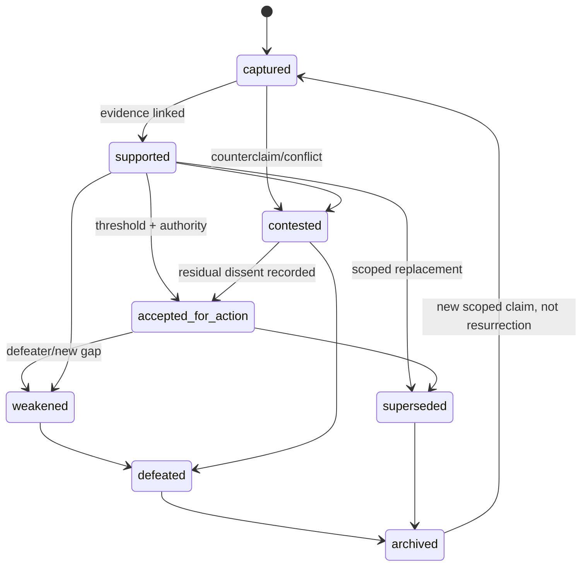

### Evidence lifecycle

```text
observed/retrieved → snapshotted → linked → evaluated
→ current → review_due → revalidated | stale → superseded → retained
```

Evidence is never “accepted as true”; a link is accepted as relevant support/counterevidence within scope.

### Decision state machine

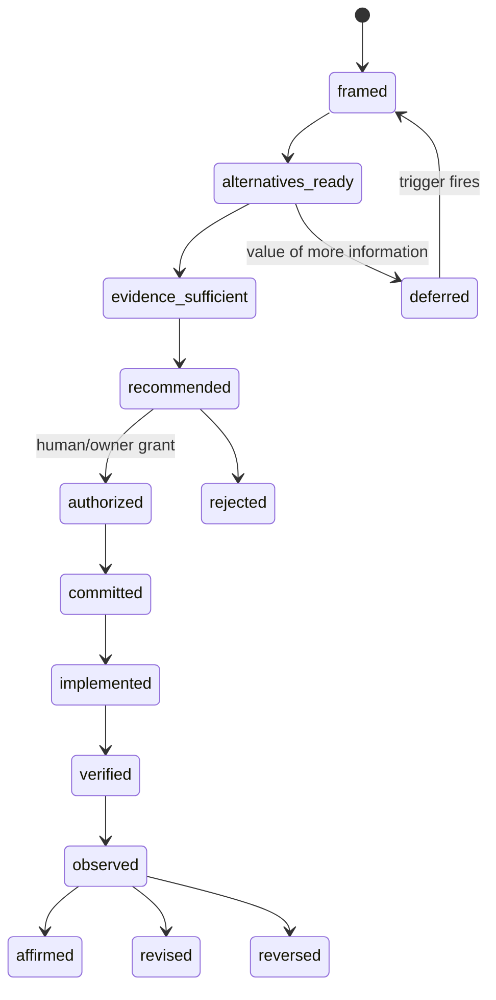

### Assumption lifecycle

```text
declared → materiality assessed → accepted-for-test
→ corroborated | challenged → discharged | violated | superseded
```

An assumption never silently becomes an observation.

### Memory-promotion state machine

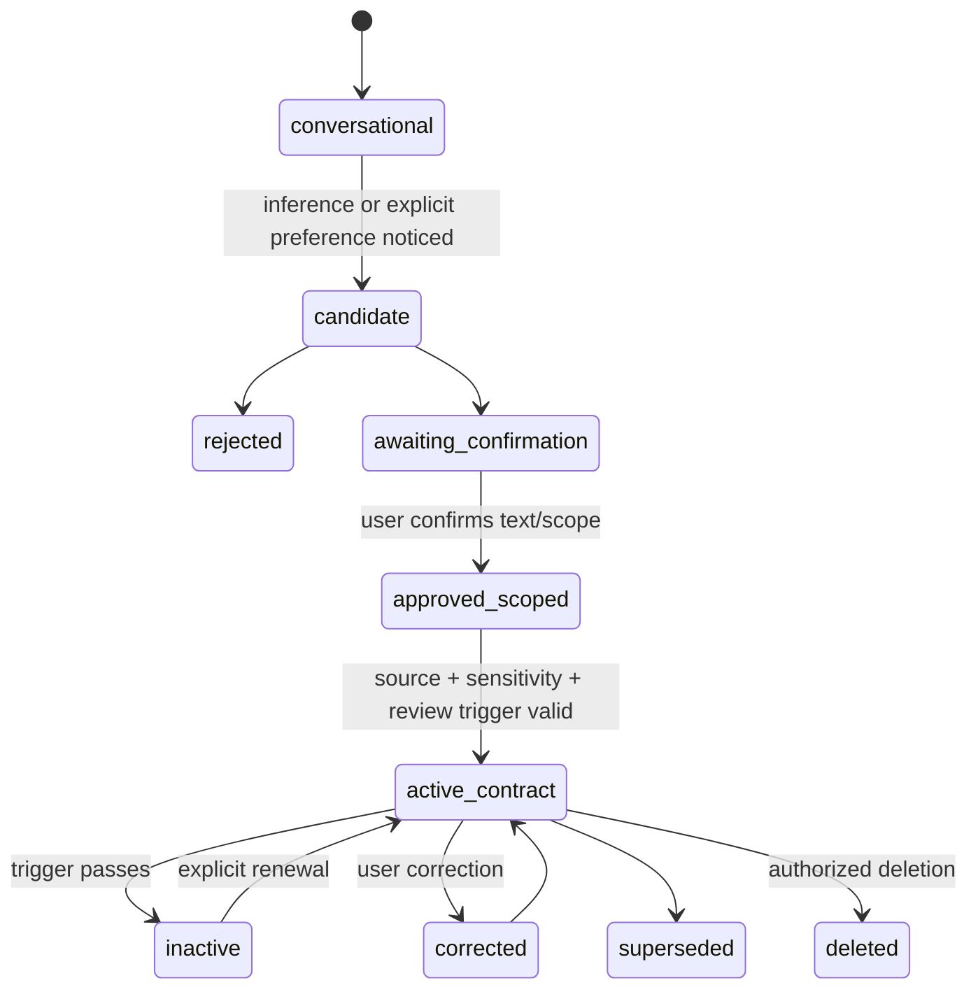

### Contradiction lifecycle

```text
detected → opened → materiality classified
→ [non-material: retain + close]
→ [material: branch + investigate]
→ resolved-by-scope | resolved-by-supersession | accepted-deviation
→ monitored → reopened if trigger fires
```

### Verification lifecycle

```text
planned → prerequisites checked → executed
→ passed | failed | inconclusive | unavailable
→ independently reviewed where required
→ accepted/rejected by authority → expires/revalidate
```

## 9. Provenance and temporal-validity architecture

### Proportionate provenance

Use W3C PROV as a conceptual mapping, not a storage mandate:

| W3C PROV | Work Studio |
|---|---|
| Entity | source snapshot, artifact version, claim record |
| Activity | retrieval, extraction, summarization, inference, implementation, verification |
| Agent | human, model run, tool, external service |
| `wasDerivedFrom` | claim/summary lineage |
| `wasAttributedTo` | accountable producer/source |
| `wasGeneratedBy` | transformation activity |
| `wasRevisionOf` | supersession/version relation |

`[source-supported]` PROV is designed for interoperable provenance and explicitly supports incremental use of a small starting set; it does not claim that provenance establishes truth or reliability ([W3C PROV-O](https://www.w3.org/TR/prov-o/), [PROV Overview](https://www.w3.org/TR/prov-overview/)).

### Epistemic data flow

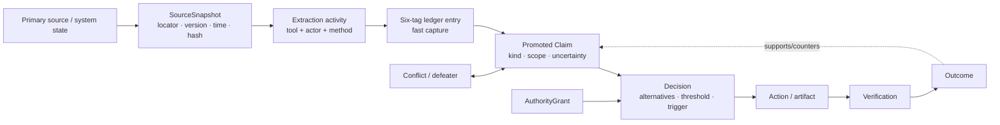

### Claim lineage graph

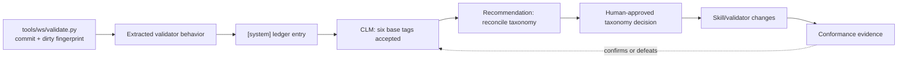

### Temporal fields

```yaml
observed_at: 2026-07-27T00:00:00+08:00
valid_from: 2026-07-27T00:00:00+08:00
valid_until: null
revalidate_after: null
decay_policy:
  kind: event_triggered       # none|event_triggered|calendar|probabilistic
  triggers:
    - path_changed: tools/ws/validate.py
    - git_baseline_changed
revisit_trigger: "before evidence-taxonomy ADR acceptance"
```

Use:

- **event-triggered** validity for code, schemas, requirements, and design snapshots;
- **calendar review** for external policies, credentials/capabilities, provider APIs, and operational runbooks;
- **validity intervals** for contracts, grants, releases, and time-bounded observations;
- **probabilistic decay** only when empirically calibrated for that domain;
- **no decay** for historical facts about a specific version, while their relevance may expire.

### Evidence-decay flow

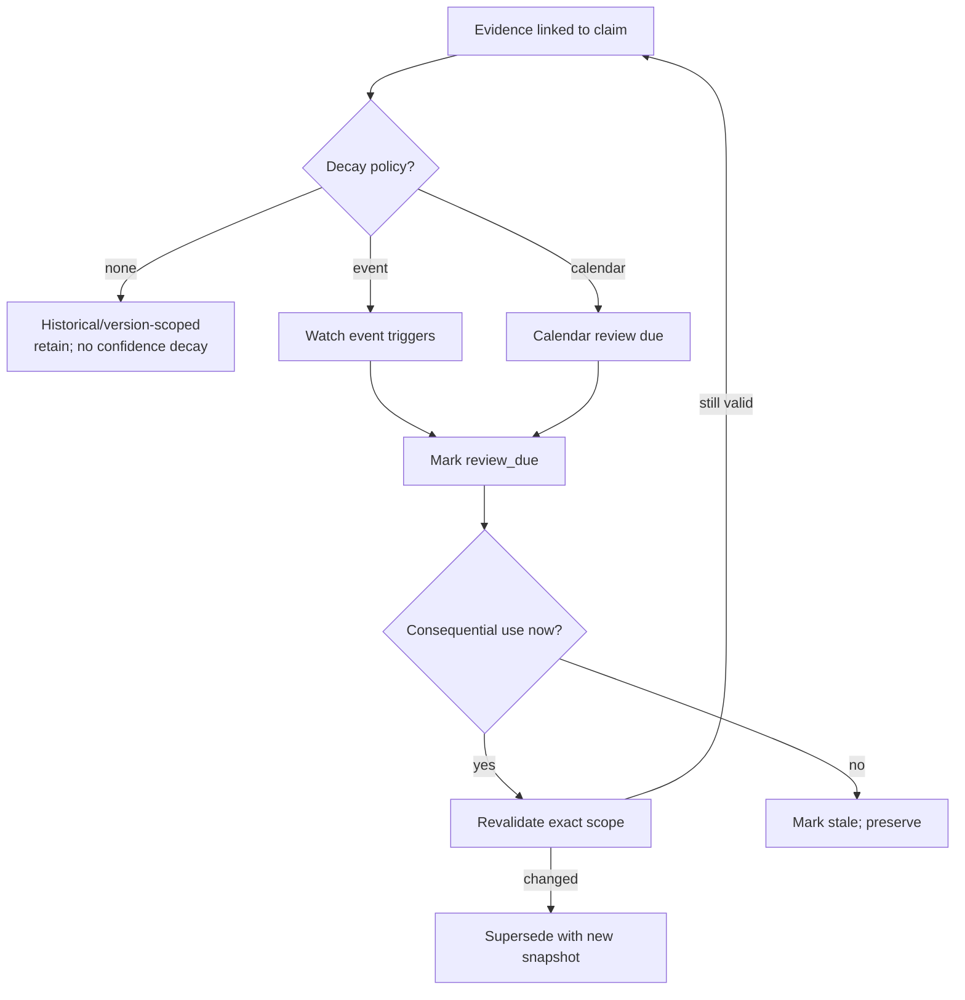

### Content addressing and Git

`[decision]` Record repository-relative path, commit SHA, and dirty-tree fingerprint. A commit SHA is a version reference, not the embedded artifact itself. External sources should record URL/identifier, publication/version date, retrieval time, and hash where legally/practically appropriate. Signed attestations are deferred until adversarial or inter-organizational exchange justifies key management.

## 10. Authority and multi-agent architecture

### Capability is not authority

| Dimension | Meaning | Example |
|---|---|---|
| Capability | can perform operation | model can generate patch |
| Permission | may perform operation in scope | grant covers files A/B |
| Expertise | competence relevant to judgment | security specialist evaluates threat |
| Accountability | answerable for consequences | project owner accepts residual risk |
| Final authority | may bind action/value choice | human approves deployment |

### Authority map

| Actor | Observe | Interpret | Recommend | Revise durable memory | Approve | Act | Verify | Supersede | Change criteria |
|---|---|---|---|---|---|---|---|---|---|
| Human owner | yes | yes | yes | **final** | **final** | yes/delegate | yes | **final** | **final** |
| Conductor | tools only | yes | yes | propose only | no | route only | orchestration only | propose | propose |
| Specialist agent | bounded tools | domain-scoped | yes | no | no | only explicit operational grant | no self-certification | no | no |
| Implementation agent | repo/tool observations | implementation-scoped | deviations | no | no | bounded grant | local checks, labeled dependent | no | no |
| Verification agent | test observations | against criteria | accept/reject recommendation | no | no | test actions in scope | yes | no | no |
| Deterministic tool | establish declared computation/result | no semantic judgment | no | enforce transition only | no | execute validated command | deterministic checks | no | enforce schema version |
| External service | source testimony/system result | no | no | no | no | API behavior only | service-specific | no | no |

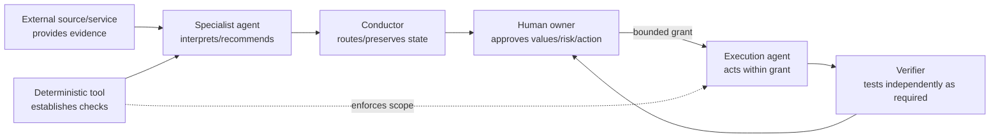

### System context view

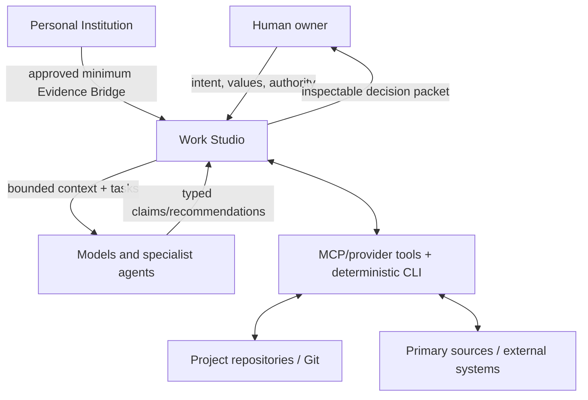

### Container view

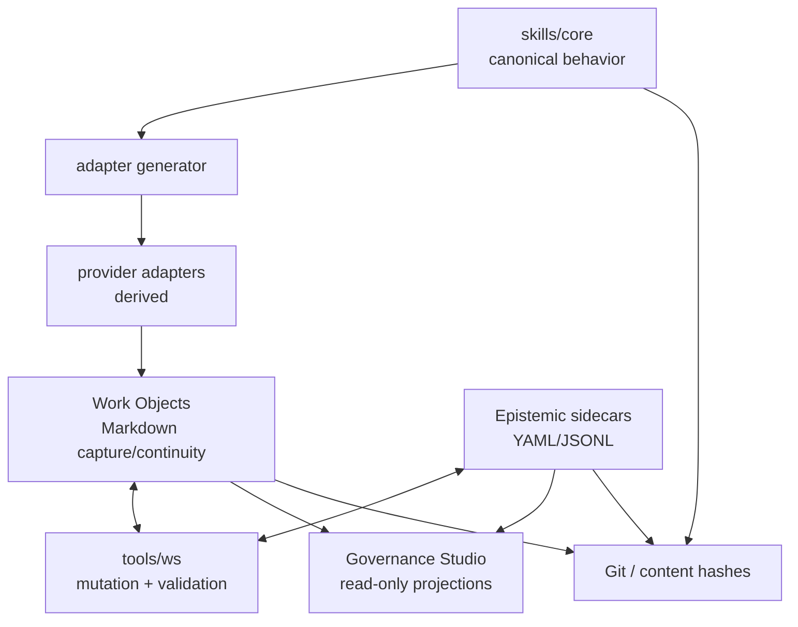

### Multi-agent boundaries

Use one strong agent when the task is low consequence, sources are inspectable, and deterministic verification dominates. Use specialists when genuine domain competence differs. Use independent providers/reviewers only when correlated error is material and the independence hypothesis is recorded. Use adversarial review for a named claim or hazard, not generic “be skeptical.” Use human experts where tacit/contextual judgment or accountability cannot be delegated.

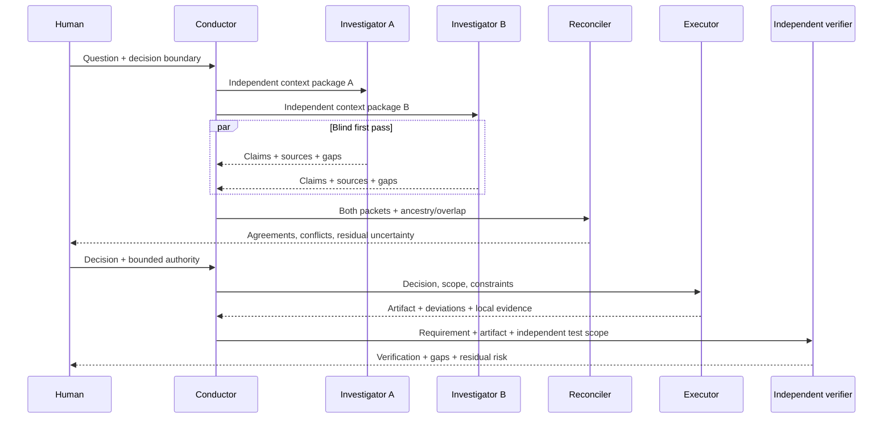

Majority voting is not the default. Multiple agents using the same context, sources, model family, or upstream summary are not independent confirmations. Social-learning experiments show that increased interaction can improve or degrade collective accuracy depending on task and copying dynamics ([Toyokawa et al.](https://www.nature.com/articles/s41562-018-0518-x)); Work Studio should measure source/ancestry overlap rather than infer independence from agent identity.

## 11. Review criteria and assurance mechanisms

### Universal review profile

| Lens | Questions | Required evidence | Failure patterns / severity | Deterministic check | Human escalation |
|---|---|---|---|---|---|
| Provenance | What exact source/version and transform? | stable ref, snapshot, actor/tool | missing on authorizing claim = blocker | refs resolve; hashes/SHAs parse | primary source unavailable |
| Status | Is observation/inference/preference/decision correctly typed? | source and transformation | laundering = high | kind-transition rules | disputed material classification |
| Scope | Where/when/for whom is it asserted? | scope fields | universalized local result = high | required scope by kind | consequence depends on scope |
| Freshness | What would invalidate it? | observed time + policy/trigger | stale authorizing evidence = high | due/trigger evaluation | high consequence |
| Relevance | Does evidence bear on this claim? | explicit relation + rationale | citation ritual = medium/high | relation present, not semantics | reviewer disputes warrant |
| Sufficiency | What material evidence is missing? | gaps and counterevidence search | single-source dependence = variable | minimum count only where policy says | residual gap crosses threshold |
| Contradiction | What conflicts remain? | conflict records | erased dissent = high | no resolved-without-disposition | material unresolved conflict |
| Alternatives | What plausible rival explanation/choice? | alternative or reason N/A | performative single option = medium | required for named profiles | irreversible decision |
| Independence | Did verifier share producer/data/model/source? | ancestry metadata | self-verification hidden = high | producer/verifier compare | release requires independence |
| Authority | Who may recommend/approve/act? | scoped grant | authority drift = blocker | grant covers action/scope/time | always on explicit gate |
| Testability | What would falsify or weaken it? | test/observation/trigger | unfalsifiable operational claim = high | trigger or exemption | action depends on it |
| Contestability | Can user inspect, challenge, correct? | source link + correction path | opaque synthesis = medium/high | links resolve | affected person contests |
| Memory safety | Was durable promotion approved? | confirmation, sensitivity, scope | inferred identity stored = blocker | promotion lineage | sensitive personal claim |

### Domain profiles

| Profile | Additional criteria |
|---|---|
| Research | search boundary, primary-source priority, publication/version date, negative search, evidence gap, claim/recommendation separation |
| Software/design | repository SHA + dirty status, requirement/decision reference, diff scope, executable evidence, viewport/environment, docs-code conflict |
| Incident | timeline integrity, observation vs hypothesis vs cause, affected-path evidence, containment authority, competing causal hypotheses |
| Release | requirement coverage, environment representativeness, recovery evidence, residual risk, verifier independence |
| Memory | explicit user wording, inference flag, sensitivity, purpose/scope, contrary evidence, correction/deletion, expiry |
| Method/scorecard | multiple bounded cases, contrary cases, gaming analysis, subgroup effects, non-compensable criteria |

### Assurance mechanisms

For **low** consequence, the Work Object plus direct check is enough. For **meaningful**, require a decision record, promoted authorizing claims, contradiction/freshness check, and verification evidence. For **high**, use a compact assurance case:

```yaml
assurance_case:
  claim: "Release X is acceptably ready for target Y."
  context: ["target/environment", "requirements version"]
  argument:
    - subclaim: "Required behavior is verified."
      evidence: [VER-001]
    - subclaim: "Known hazards have controls and recovery."
      evidence: [HAZ-001, ROLLBACK-001]
  assumptions: [ASM-001]
  defeaters: [DEF-001]
  residual_risk: "..."
  authority_grant: AUT-001
```

NASA’s system safety approach ties safety claims to evidence, organizational objectives, and the decision maker’s risk tolerance; it does not imply that a diagram itself proves safety ([NASA System Safety Handbook](https://ntrs.nasa.gov/archive/nasa/casi.ntrs.nasa.gov/20120003291.pdf)). NASA IV&V distinguishes technical, managerial, and financial independence ([NASA SWE-141](https://swehb.nasa.gov/spaces/SWEHBVB/pages/32604595/SWE-141%2B-%2BSoftware%2BIndependent%2BVerification%2Band%2BValidation)). Work Studio should scale independence to the relevant risk rather than demand a different person/provider for every check.

Safety methods should be selected by question, not accumulated:

| Method | Work Studio fit |
|---|---|
| FMEA/FMECA | high-consequence component/change: enumerate failure modes, effects, controls, detectability; maintain as design changes. NASA explicitly treats FMECA as a living risk assessment ([NASA GSFC-HDBK-8004](https://standards.nasa.gov/node/12367)). |
| Fault-tree analysis | top-event analysis when combinations of failures matter; NASA recommends validating cut sets against system diagrams/experience ([NASA Fault Tree Handbook](https://s3vi.ndc.nasa.gov/ssri-kb/static/resources/Fault%20Tree%20Handbook_NASA.pdf)). |
| STAMP/STPA | complex control/feedback hazards where component reliability alone misses unsafe interactions; begin with losses, control structure, unsafe control actions, and causal scenarios ([MIT STPA Handbook](https://psas.scripts.mit.edu/home/get_file.php?name=STPA_handbook.pdf)). |
| Defense in depth | independent preventive/detective/recovery controls across prompt, tool, CLI, Git, and human gates. |
| Configuration/change control | baseline exact artifact/source versions before verification; ISO/IEC/IEEE 15288 provides a lifecycle process framework but does not prescribe one lifecycle model ([ISO/IEC/IEEE 15288:2023](https://www.iso.org/standard/81702.html)). |

For routine Work Objects these methods are hidden. Invoke one only when a named hazard/claim and consequence justify it.

### Confidence and uncertainty contract

Do not compute one “epistemic score.”

```yaml
assessment:
  source_reliability: {label: high, basis: "official executable source"}
  evidence_relevance: {label: direct, basis: "validator defines accepted tokens"}
  evidence_sufficiency: {label: moderate, gaps: ["clean baseline not tested"]}
  inference_confidence: {label: high, basis: "direct contradiction in inspected files"}
  model_self_confidence: null   # not evidence; omit unless calibrated for task
  decision_readiness: {label: ready_for_bounded_tracer}
  uncertainty_types: [configuration, temporal]
  unknown_unknown_exposure: {label: moderate, basis: "dirty tree + generated artifacts"}
```

Default UI: claim, status, scope, strongest evidence/counterevidence, freshness, decision use, and unresolved conflict. On demand: full lineage, model/tool metadata, source reliability rationale, transformations, and calibration history.

Probabilities and Brier scores are appropriate only for repeated forecasts with observable outcomes. A single score can obscure calibration, resolution, base rates, and decision utility; recent theory shows optimizing one scoring rule need not serve all decision agents ([Kleinberg et al., 2023](https://proceedings.mlr.press/v195/kleinberg23a.html)). Use qualitative labels for one-off architectural judgment, always with a reason and a revisit condition.

### Governance integration view

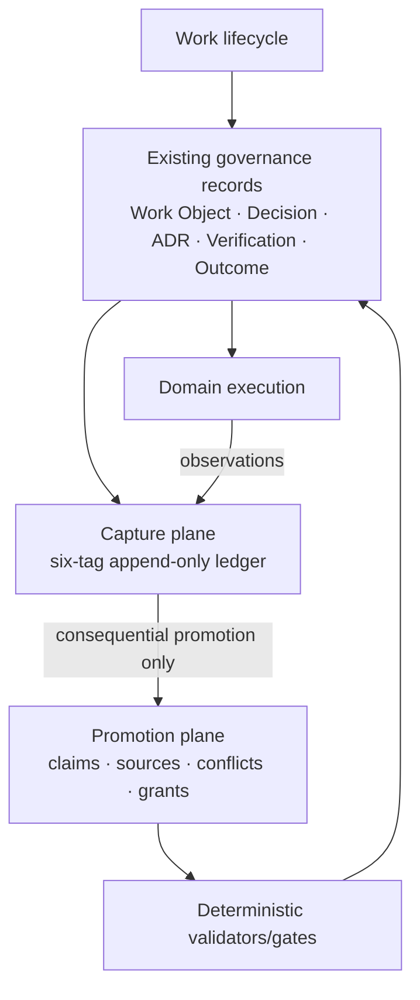

This combined model is less duplicative than a separate epistemic subsystem and safer than embedding rich metadata inside every object. Epistemic rules are cross-cutting; the sidecar is an implementation detail for claims that cross a promotion threshold.

## 12. Governance Studio visualizations

Every visualization is a read-only projection of canonical records. A missing edge means “not recorded,” not “false.”

| View | User question answered | Canonical records | Interaction | Misinterpretation risk | Hide when |
|---|---|---|---|---|---|
| Claim–evidence graph | Why is this claim accepted/contested? | Claim, EvidenceLink, Conflict | expand sources/counterevidence; filter scope | graph density appears rigorous | no promoted claims or trivial decision |
| Evidence lineage | Where did this statement come from and how was it transformed? | SourceSnapshot, activities, ledger refs | step-through exact version/extract | provenance mistaken for truth | low-impact prose |
| Confidence decomposition | What is strong or weak? | assessment fields | compare dimensions, open rationales | labels seen as arithmetic | fields lack explicit basis |
| Contradiction map | What materially disagrees and who must resolve it? | Conflict + party records | branch by scope; show minority findings | all disagreement appears equally serious | conflicts are non-material/closed by scope |
| Temporal validity | What is current, due, stale, or superseded? | validity policies/events | timeline and “revalidate now” | age mistaken for falsity | historical version claim |
| Authority map | Who may observe, recommend, approve, execute, verify? | roles + grants | select action to reveal scope | capability mistaken for permission | no gated action |
| Decision dependency graph | What would change if this claim fails? | Decisions, Claims, Artifacts, Outcomes | impact traversal | correlation mistaken for causation | dependency capture incomplete |
| Epistemic pressure dashboard | Where is review attention needed? | unresolved checks/events | prioritize by consequence and dependency reach | metric becomes target | sample too small or burden exceeds value |

### Component view

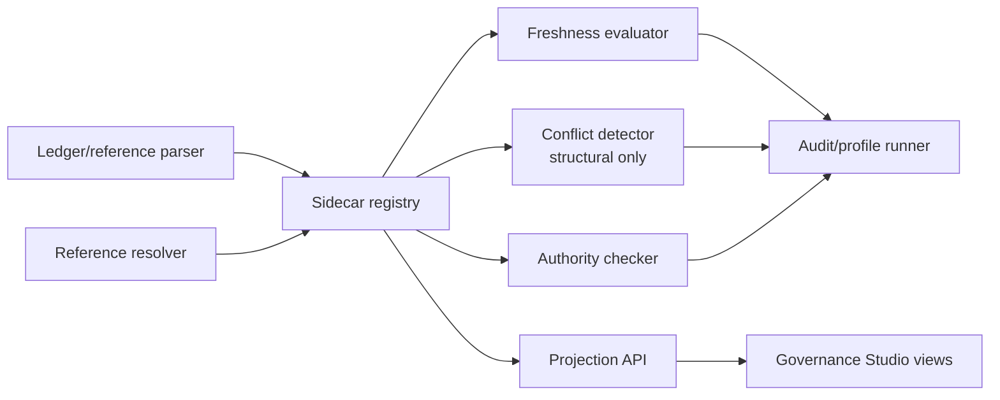

### Contradiction-resolution flow

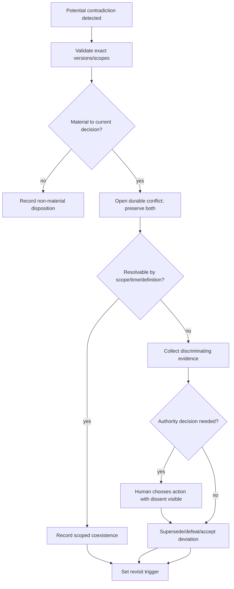

### Epistemic pressure dashboard signals

Show counts only as attention cues, never grades:

- unsupported authorizing claims;
- unresolved material conflicts;
- stale decision dependencies;
- single-source dependencies;
- provenance/authority resolution failures;
- reviewer-producer overlap;
- repeated memory corrections;
- open accepted deviations past trigger.

## 13. Current-skill impact analysis

No current core skill should be retired solely for epistemic engineering. Most need bounded amendments; two responsibilities should be supplemented by deterministic services rather than new conversational ceremony.

| Skill | Epistemic role | Claims produced | Evidence required | Authority risk | Recommended change |
|---|---|---|---|---|---|
| `turn-signal-into-work` | preserve and classify signal | classification, inferred goal | immutable original wording/hash; source channel | inferred goal becomes user intent | **amend:** separate `signal_text` from `interpreted_goal`; no durable activation without authority |
| `conduct-work-object` | custody, routing, transitions | state/routing/prerequisite claims | current object, registry, validator output | conductor accumulates specialist/decision authority | **amend:** explain routing basis; call deterministic authority/epistemic checks; never reconcile material conflict |
| `grilling-session` | elicit assumptions and decision frontier | user testimony, inferred tensions, convergence | accepted answer, unresolved branches, inspected evidence | leading questions and false confidence; COMP-001 history | **amend:** label question premise; preserve rejected/unknown assumptions; convergence must cite coverage proof |
| `investigate-live-question` | gather discriminating evidence | source reports, observations, inferences, recommendation | search boundary, exact sources/versions, contradictions/gaps | persuasive synthesis becomes decision | **amend:** emit claim table separately from recommendation; record negative search and transformation mode |
| `pressure-test-decision` | compare alternatives and defeaters | alternatives, forecasts, recommendation | decision-time evidence, key assumptions, counterevidence | ritual dissent or recommendation becomes authority | **amend:** use named failure hypothesis; preserve minority branch; detect shared source/model ancestry |
| `design-tracer-bullet` | reduce a named uncertainty | design hypothesis, predicted observation | authorizing decision, falsifier, rollback | tracer becomes architecture commitment | **amend:** require `uncertainty_reduced`, falsifying observation, and evidence gain |
| `implement-bounded-change` | realize authorized decision | implementation/diff and local behavior claims | grant, decision, clean/dirty baseline, tests | hidden design decisions and scope drift | **amend:** decision-to-diff trace; surface new choices as deviations; record configuration fingerprint |
| `verify-release-evidence` | test requirement/readiness claims | verification result, gap, residual uncertainty | requirements, method, environment, raw outputs | dependent verification appears independent/release-authorizing | **amend:** verifier/producer relation, environment identity, requirement coverage; never infer release approval |
| `deploy-with-recovery` | execute authorized release | readiness check, deployment observation | explicit grant, verification, rollback proof, target identity | urgency broadens scope | **amend:** run authority check immediately before effect; record accepted residual uncertainty |
| `diagnose-production-incident` | separate symptom, hypothesis, cause | observations, ranked hypotheses, causal conclusion | timeline, affected-path data, tests, competing hypotheses | mitigation becomes root-cause claim | **amend:** ACH-lite for material causes; cause requires mechanism + counterfactual/discriminating evidence |
| `review-outcome-and-adapt` | compare ex ante hypothesis to outcome | outcome, attribution, lesson candidate | frozen decision-time basis, actual shipped state, subgroup outcomes | outcome bias | **amend:** rate evidence/decision/execution/outcome/method separately |
| `maintain-working-method` | generalize bounded learning | method candidate, scope, exceptions | multiple attributable trials, contrary evidence | exception becomes universal rule | **amend:** minimum diversity of cases or explicit “single-case trial”; sunset trigger |
| `govern-scorecards` | expose quality tensions | dimension assessments | sources, exceptions, subgroup/contrary evidence | Goodhart gaming and aggregate authority | **retain/amend:** no aggregate automatic transition; sample audit; non-compensable criteria |
| `track-components` | component lineage/health | status, dependency, health recommendation | version, owner, criteria, current verification | stale “healthy” label | **amend:** split operational health from epistemic coverage/freshness; no single score |

Additional currently implemented skills (`develop-idea` and the newer design audit/foundation/direction/verification family) should follow the same base-tag contract. In particular, subtype-looking tokens such as `[system:discovery]` should become either plain `[system]` ledger entries with a structured sidecar `kind: discovery`, or a formally adopted subtype syntax supported by validator, references, adapters, and fixtures together.

### Dispositions

- **Retain and amend:** all fourteen requested skills.
- **Supplement:** `conduct-work-object`, `investigate-live-question`, `verify-release-evidence`, `govern-scorecards` with deterministic commands/review profiles.
- **Split:** no skill yet. Split only if evaluation shows a conversational skill repeatedly combines evidence adjudication with authority enforcement.
- **Combine:** none; current stage roles are meaningfully distinct.
- **Retire:** none.

### New-skill assessment

| Candidate | Decision |
|---|---|
| `prepare-epistemic-review` | **defer**; a profile renderer/CLI command is sufficient |
| `audit-claim-provenance` | **reject as skill initially**; implement `ws epistemic audit` |
| `reconcile-epistemic-conflict` | **test first** as a high-consequence facilitation profile; human owns disposition |
| `assess-evidence-freshness` | **reject as skill**; deterministic rules + domain owner judgment |
| `govern-memory-promotion` | **retain in Personal Institution / Evidence Bridge governance**, not duplicate |
| `construct-assurance-case` | **test first** as a profile invoked by release/decision skills |

## 14. Required deterministic services

Extend `python3 -m tools.ws`; do not create a parallel platform.

| Command | Tier | Behavior |
|---|---|---|
| `ws epistemic lint` | build now | validate canonical base tags, optional kinds, forbidden transforms, stable refs |
| `ws claim register` | build now | promote one consequential ledger statement to sidecar |
| `ws claim inspect` | build now | show state, scope, evidence/counterevidence, dependencies, freshness |
| `ws evidence attach` | build now | create immutable EvidenceLink to ledger/source snapshot |
| `ws conflict open` | build now | preserve exact parties/versions/materiality |
| `ws conflict disposition` | build now | scope/supersede/accept deviation with authority |
| `ws decision trace` | test first | traverse claim → decision → artifact → outcome |
| `ws authority check` | build now | verify action/scope/time against grant; deny on ambiguity |
| `ws evidence due` | test first | evaluate event/calendar freshness policies |
| `ws memory promote` | reject here | belongs to Personal Institution boundary |
| `ws assurance validate` | test first | structural validation only; never certify safety/readiness |
| `ws epistemic audit` | build now after register | run consequence-selected review profile |

Deterministic checks can establish syntax, reference resolution, hashes, dates, role separation metadata, state transitions, and test results. They cannot establish source credibility, inference validity, acceptable residual risk, values, or final authority.

### Service API boundary

```json
{
  "check": "authority",
  "action": "deploy",
  "scope": {"target": "production", "artifact": "sha256:..."},
  "at": "2026-07-27T12:00:00+08:00",
  "result": "deny",
  "reasons": ["no active grant covers target=production"],
  "evidence_refs": ["AUT-..."]
}
```

The tool returns facts about the declared record. It never manufactures a grant, chooses risk tolerance, or converts a recommendation into approval.

## 15. Proposed repository architecture

```text
references/epistemic/
  epistemic-contract.md              # canonical semantics, human-readable
  epistemic-engineering-research-and-applied-architecture.md
schemas/epistemic/
  claim.schema.json
  source-snapshot.schema.json
  evidence-link.schema.json
  conflict.schema.json
  authority-grant.schema.json
  review.schema.json
profiles/epistemic/
  universal.yaml
  research.yaml
  software-change.yaml
  incident.yaml
  release.yaml
tools/ws/
  epistemic.py                       # commands + validation
tests/epistemic/
  fixtures/
```

Project-local instances:

```text
.work-studio/
  objects/...                        # unchanged canonical Work Objects
  epistemic/
    claims.jsonl                     # append-only events or one record/file
    sources.jsonl
    conflicts.jsonl
    reviews/
```

### Storage decision

- Keep narrative and rapid evidence capture in Work Objects.
- Store only promoted consequential records in JSONL/YAML sidecars.
- Prefer append-only events plus deterministic projections where update history matters.
- Use relational/graph queries as computed indexes later; canonical storage remains files/Git.
- Do not store hidden reasoning, full prompts, chain-of-thought, or copied sensitive source bodies.
- Schema migration requires existing explicit authority and an ADR.

### API contracts

`ledger_entry_ref` must resolve by Work Object ID plus immutable entry timestamp/ordinal or content hash. The current whole-second uniqueness rule should be validated under rapid agent writes; if collisions are possible, add a deterministic suffix without rewriting prior entries.

```yaml
ledger_entry_ref:
  work_object_id: 2026-07-27-XXX
  section: evidence-ledger
  entry_id: "2026-07-27T12:34:56+08:00#01"
  content_sha256: "..."
```

## 16. ADR candidates

Avoid one ADR per schema.

1. **Adopt a two-plane epistemic model: low-friction ledger capture plus consequential sidecar promotion.**
   Resolves tension with ADR 0016/0017/0022; defines promotion threshold and canonical ownership.

2. **Define one evidence taxonomy: six base provenance lanes plus optional controlled semantic kinds.**
   Resolves current skill/validator/reference drift and states whether subtype syntax is forbidden or normalized.

3. **Adopt event-triggered temporal validity and durable conflict objects for promoted claims.**
   Defines state axes, supersession, and “stale is not false.”

4. **Define epistemic role and independence metadata for consequential verification and multi-agent aggregation.**
   Separates capability, expertise, permission, accountability, and final authority.

5. **Govern epistemic projections as non-canonical views.**
   Needed only when Governance Studio visualization work begins; may be combined with ADR 1 if timing aligns.

Do not write ADRs yet for a knowledge graph, confidence engine, signatures, multi-agent debate, or probabilistic decay.

## 17. Tracer bullets

### Tracer 1 — Repository-grounded architectural claim

- **Hypothesis:** a sidecar conflict plus lint can expose tag-contract drift without replacing the Evidence Ledger.
- **Scope:** six-tag spec, skill tag uses, validator, relevant ADR statements; capture commit SHA and dirty fingerprint.
- **Steps:** register exact claims from docs/code; run current validator; open conflicts; produce human disposition packet; change nothing outside a disposable branch/fixture.
- **Artifacts:** SourceSnapshots, two Claims, Conflict, validator output, proposed taxonomy ADR outline.
- **Success:** exact versions preserved; neither docs nor code silently wins; affected mutation blocks; unrelated Work Object operations continue.
- **Failure:** conflict is flattened into one claim, dirty tree is treated as release truth, or remediation requires universal ontology.
- **Evidence:** resolved refs, before/after lint output, user comprehension check.
- **Rollback:** delete experimental sidecar/command branch; ledger unchanged.
- **Uncertainty resolved:** whether promotion/lint adds value at acceptable burden.

### Tracer 2 — Multi-agent research question

- **Hypothesis:** blind independent first passes plus ancestry metadata reveal disagreement/overlap better than a shared debate.
- **Scope:** one consequential but bounded live question; two investigators; no shared intermediate output.
- **Steps:** give separate context packages; record model/provider/prompt family/source ancestry; compare claims/sources; reconcile only afterward; human decides.
- **Artifacts:** two claim packets, overlap matrix, Conflict records, reconciliation packet.
- **Success:** source overlap and minority findings remain visible; agreement receives no automatic confidence uplift.
- **Failure:** reviewer anchors on first packet, shared source is counted twice, or majority decides.
- **Evidence:** claim/source Jaccard overlap, independent novel evidence, human-rated clarity.
- **Rollback:** use the stronger single-agent packet; archive experiment.
- **Uncertainty resolved:** whether agent diversity buys independent evidence in Work Studio.

### Tracer 3 — Memory promotion

- **Hypothesis:** inferred user preference cannot become durable guidance without confirmation, scope, source, sensitivity, and correction/deletion paths.
- **Scope:** benign working preference, no sensitive identity claim.
- **Steps:** agent records candidate as inference; request exact confirmation; create scoped Personalization Contract only if approved; test correction, expiry, deletion, and cross-project denial.
- **Artifacts:** candidate, confirmation/grant, contract entry, correction/supersession events.
- **Success:** unconfirmed candidate is absent from durable active memory; user can inspect/correct/delete; expired entry stops guiding.
- **Failure:** repeated model inference counts as confirmation or private source is copied into Work Studio.
- **Evidence:** promotion audit and behavior before/after expiry.
- **Rollback:** delete authorized record; retain only minimum audit event if policy permits.
- **Uncertainty resolved:** whether promotion governance preserves agency without excessive friction.

### Tracer 4 — Decision and outcome

- **Hypothesis:** separate ex ante and ex post assessments prevent outcome bias and identify the right repair layer.
- **Scope:** bounded reversible technical choice with observable acceptance test.
- **Steps:** freeze evidence/alternatives/forecast; authorize; implement; independently verify; observe; score evidence, decision, execution, outcome, and method separately.
- **Artifacts:** Decision, AuthorityGrant, diff, Verification, Outcome Review, method candidate if justified.
- **Success:** a bad outcome can coexist with a reasonable ex ante decision; changes target only evidenced failure layer.
- **Failure:** outcome alone rewrites decision quality or one case becomes a permanent method.
- **Evidence:** blinded reviewer comparison of ex ante quality before/after outcome disclosure.
- **Rollback:** revert technical change; retain learning records.
- **Uncertainty resolved:** practical usefulness of the five-way quality separation.

### Tracer 5 — Evidence freshness

- **Hypothesis:** event-triggered freshness catches stale repository evidence with less noise than calendar TTLs.
- **Scope:** one code-grounded claim and one external-policy claim.
- **Steps:** attach different decay policies; change dependency fixture; advance review date; run `evidence due`; revalidate.
- **Success:** code change triggers only dependents; policy becomes review-due, not false.
- **Failure:** confidence decays numerically without evidence or all records become stale together.
- **Rollback:** remove experimental policies.
- **Uncertainty resolved:** rule usability and false-positive rate.

## 18. Evaluation framework

### Measures

| Metric | Type | Definition / guard |
|---|---|---|
| Provenance coverage | leading, process | consequential claims with resolvable source/ledger refs; sample semantic relevance separately |
| Unsupported-claim rate | epistemic quality | authorizing claims lacking adequate evidence; reviewer-labeled sample |
| Claim-status accuracy | epistemic quality | blind human agreement on observation/inference/etc.; do not optimize label frequency |
| Contradiction detection recall/precision | epistemic quality | seeded + naturally occurring conflicts; separate materiality |
| Stale-evidence detection | leading | due dependencies found vs false alerts |
| Confidence calibration | lagging | only repeatable forecasts; reliability curve/Brier components, not one score |
| Decision traceability | process | sampled decisions with evidence, authority, artifact, outcome chain |
| Verification independence | process | consequential verifications declaring producer/data/method/environment overlap |
| Memory correction latency | human agency | request-to-effective correction/deletion |
| Authority-gate violations | operational/agency | attempted and completed out-of-scope actions; zero completed is non-compensable |
| False consensus | epistemic quality | agreements attributable to duplicated evidence/ancestry |
| Human comprehension | human agency | owner can explain claim basis, uncertainty, and authority from default view |
| Decision time | operational | compare like consequence classes; prevent analysis paralysis |
| Governance burden | operational | capture/review minutes and abandoned flows |
| Review fatigue | human agency | ignored warnings, override rate, subjective burden |
| Outcome improvement | lagging | matched/repeated cases; avoid attributing all outcomes to epistemic layer |

### Evaluation design

1. Establish a baseline from 10–20 representative Work Objects, stratified by consequence.
2. Run the four required tracers before expanding schemas.
3. Use seeded faults for unsupported claims, tag laundering, stale dependencies, conflict, and authority scope.
4. Blind reviewers to outcomes when scoring decision-time quality.
5. Measure human comprehension and burden, not only machine completeness.
6. Compare minimum viable layer against current flow for at least one month or sufficient case count.
7. Stop or simplify if metadata time rises without improved detection, correction, traceability, or comprehension.

### Learning diagnosis

Outcome review should produce one or more explicitly evidenced diagnoses:

| Diagnosis | Update target |
|---|---|
| Execution failed against an otherwise reasonable decision | implementation/recovery practice |
| Decision was poor given evidence available at the time | decision criteria or alternative generation |
| Decision was reasonable but outcome was unfavorable | forecast calibration/residual risk, not retrospective blame |
| Evidence process was defective | source strategy, measurement, review, or freshness control |
| Governing method/scorecard was wrong | Working Method/scorecard candidate through bounded revalidation |

This corresponds to single-loop repair of action, double-loop review of governing assumptions/criteria, and a cautious “triple-loop” review of how methods themselves are authorized and learned. The labels are less important than preventing a bad outcome from indiscriminately rewriting every layer.

### Scorecard governance

Maintain criteria for provenance, status, contradiction, freshness, traceability, independence, correction, and authority preservation, but do not reduce them to a weighted total. Authority violations, sensitive-memory violations, and fabricated evidence are non-compensable. Goodhart risk is controlled through rotating sampled audits, narrative exceptions, outcome validation, and periodic retirement of metrics that drive ritual behavior.

## 19. Migration roadmap

### Tier 1 — Minimum viable epistemic layer

| Component | Disposition |
|---|---|
| Capture clean baseline identity (commit + dirty fingerprint) | **build now** |
| Resolve six-tag/subtype/undeclared-tag contract | **build now** |
| `ws epistemic lint` and fixtures | **build now** |
| Claim/SourceSnapshot/EvidenceLink/Conflict schemas | **build now**, v0.1 |
| Promote only meaningful/high authorizing claims | **build now** |
| Default claim/conflict/authority inspection output | **test first** |

Exit evidence: Tracer 1 passes; existing low-friction ledger remains valid; no unrelated skill/adapters are hand-edited; generated artifacts and fixtures align from a clean baseline.

### Tier 2 — Governed operational layer

| Component | Disposition |
|---|---|
| AuthorityGrant normalization/check | **build now after Tier 1** |
| Event/calendar freshness policies | **test first**, then build |
| Decision trace and verification independence fields | **build now after tracer** |
| Domain review profiles and compact assurance packet | **test first** |
| Governance Studio projections | **test first** |
| Outcome five-axis review | **build by amending existing skill** |

Exit evidence: several meaningful/high Work Objects demonstrate fewer unresolved provenance/freshness/authority defects without unacceptable burden.

### Tier 3 — Advanced epistemic infrastructure

| Component | Disposition |
|---|---|
| Indexed graph projection across projects | **defer** |
| Cryptographic attestations/signatures | **defer** until adversarial exchange |
| Cross-provider independence estimator | **defer/test first** |
| Calibrated probabilistic forecasting service | **defer** until enough outcomes |
| Automated contradiction suggestions | **defer**; never auto-resolve |
| Universal ontology / autonomous debate / global confidence engine | **reject** absent new evidence |

### Migration rules

- no silent rewrite of existing ledgers;
- parser tolerates historical records and reports unknowns;
- sidecar promotion is opt-in by consequence/use threshold;
- schema versions are explicit; migrations require authority and dry-run;
- regenerate adapters from canonical core only;
- every evaluation records repository baseline and working-tree state.

## 20. Risks, tradeoffs, and deferred complexity

| Risk of epistemic engineering | Mitigation |
|---|---|
| Epistemic bureaucracy | promotion thresholds; low-consequence bypass; measure minutes per case |
| False precision | reasoned labels; probabilities only with calibration data |
| Metadata overload | progressive disclosure; six universal records only |
| Ritualized citation | sample relevance/warrant, not URL presence |
| Scorecard gaming | no aggregate authority score; rotating audits |
| Analysis paralysis | value-of-information stop rule and reversible-action bias |
| Excessive skepticism | accept action under recorded uncertainty when threshold met |
| Authority centralization | bounded grants, role transparency, correction/appeal |
| Suppression of intuition/tacit knowledge | allow testimony/lived experience as typed evidence; do not pretend it is direct system observation |
| Slower creative work | epistemic promotion after exploration, not during ideation |
| Premature formalization | tracer-first, schema v0.1, deferred graph |
| Overconfidence in provenance | display quality, relevance, sufficiency, and counterevidence separately |

### Proportional governance profile

| Consequence / reversibility / novelty / uncertainty / external impact / sensitivity | Burden |
|---|---|
| low, reversible, familiar, private | ledger tag + direct check; no claim sidecar by default |
| meaningful or externally visible | promoted authorizing claims, decision trace, conflict/freshness check, verification |
| high, irreversible, novel, uncertain, safety/privacy/money/identity | compact assurance case, explicit authority, relevant independence, recovery, post-action observation |

Scientific practices do not transfer wholesale. Registered reports, replication, confidence intervals, and meta-analysis require repeatable hypotheses, stable measures, and samples that many software/product decisions lack. Transfer the underlying functions—precommit key tests, preserve raw evidence, distinguish reproduction from independent verification, state uncertainty—not the ceremony.

## 21. Recommended first implementation unit

### Epistemic Contract Reconciliation Slice

**Goal:** make evidence classification and repository-grounded claims internally coherent before adding new ontology.

**Why first:** the current working tree demonstrates an actual contradiction at the exact boundary epistemic engineering is meant to govern. Building claim graphs before defining what the capture tags mean would encode uncertainty as infrastructure.

### Scope

1. Capture a clean comparison baseline (commit SHA) and separate dirty-tree fingerprint.
2. Decide and document one canonical rule:
   - preferred: exactly six **base provenance tags** in ledger syntax;
   - semantic subtypes become structured sidecar `kind` or normalized text, not new bracket tokens.
3. Add a single-source machine-readable taxonomy consumed by:
   - `references/EVIDENCE-MODEL.md` generation/check;
   - `tools/ws` validator;
   - canonical core skill lint;
   - adapter generation/conformance fixtures.
4. Add `ws epistemic lint` that reports:
   - undeclared base tags;
   - subtype-looking bracket tokens;
   - claim-kind laundering patterns where structurally detectable;
   - docs/code/fixture contract mismatch.
5. Create one Conflict fixture for the current `[system:*]`, `[system]`, `[testimony]`, `[gap]` examples.
6. Run from a clean worktree or disposable branch/worktree so user changes are not mischaracterized or overwritten.

### Acceptance criteria

- one canonical taxonomy file and no competing normative definition;
- all canonical core skill evidence examples either use the six tags or a formally supported separate `kind`;
- validator, docs, generator, adapters, and fixtures agree from a clean baseline;
- legacy ledger entries remain readable and append-only;
- lint reports exact file/line and proposed non-destructive disposition;
- no claim is made that a passing lint proves evidence truth;
- full test result is attributed to commit/dirty state and failures are not generalized beyond it.

### Non-goals

- no knowledge graph;
- no migration of all historical prose;
- no numeric confidence;
- no multi-agent debate;
- no new conversational skill;
- no changes to Personal Institution memory boundary.

### First-sidecar example

```yaml
schema_version: ws.epistemic/v0.1
conflict:
  id: CNF-2026-07-27-001
  type: schema_implementation
  parties:
    - {kind: document, ref: references/EVIDENCE-MODEL.md, assertion: "six base tags only"}
    - {kind: skill, ref: skills/core/design-audit-product-interface/SKILL.md, assertion: "[system:discovery]"}
    - {kind: validator, ref: tools/ws/validate.py, assertion: "six base tags accepted"}
  observed_scope:
    commit: "<sha>"
    dirty_tree_fingerprint: "<hash>"
  materiality: meaningful
  state: open
  blocks:
    - "evidence mutation using noncanonical bracket token"
  does_not_block:
    - "read-only investigation"
    - "unrelated six-tag evidence append"
  resolution_authority: "repository owner"
```

### Decision rule

Proceed to the broader claim register only if this slice:

- catches the seeded/current drift;
- leaves ordinary capture no slower in the common case;
- improves the owner’s ability to understand and resolve the conflict; and
- does not create a second canonical truth source.

## 22. Open research questions

1. What exact promotion threshold best predicts “consequential claim” without relying only on Work Object consequence?
2. Should `kind` live in a sidecar, in constrained ledger text, or as an optional CLI argument that still renders plain `[system]`?
3. How should stable ledger entry IDs evolve beyond whole-second timestamps while preserving existing append-only records?
4. Which repository events should automatically mark code/design/verification evidence review-due?
5. What empirical evidence would justify cross-project indexing or a graph projection?
6. Which independence dimensions matter by domain: model family, provider, prompt, context, source, tool, author, organization, or verifier incentives?
7. Can blind independent review improve Work Studio decisions enough to offset cost, or is one strong agent plus deterministic checks superior?
8. How should tacit/lived evidence be preserved without overstating generalizability or exporting sensitive context?
9. What interface exposes residual uncertainty without warning fatigue?
10. Which claims should remain plural interpretations rather than converge on a single accepted state?
11. How should accepted deviations expire and trigger re-review?
12. Can source reliability labels be applied consistently enough to help, or will they become pseudo-quantitative authority scores?
13. How should error correction propagate to dependent decisions without automatically reversing authorized action?
14. What minimum case count supports changing a Working Method or scorecard?
15. What clean-baseline behavior do the current dirty-tree adapter/test disagreements reduce to?

---

### Final implementation guidance

**Minimum viable epistemic layer:** **build now** the clean-baseline identity, evidence-tag contract reconciliation, lint, and four-record sidecar core (Claim, SourceSnapshot, EvidenceLink, Conflict) for promoted consequential claims.

**Governed operational layer:** **test first**, then add authority checks, temporal rules, decision trace, independence metadata, review profiles, and compact high-consequence assurance packets.

**Advanced epistemic infrastructure:** **defer** graph indexes, cryptographic attestations, probabilistic calibration services, and cross-provider independence estimation; **reject** a universal ontology, global confidence score, or autonomous debate platform without tracer evidence.

The repository should remain canonical for project truth; Git and content hashes identify versions; the Evidence Ledger remains the fast capture plane; sidecars govern only promotion and consequential use; agents interpret and recommend; deterministic tools enforce declared structure; and the human retains final authority over values, residual risk, memory, and action.
